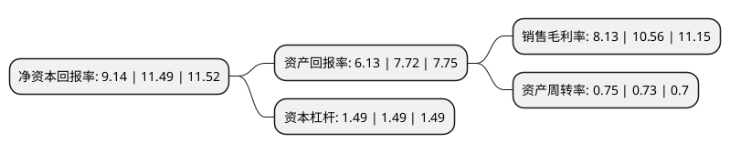

> 本页面由自动化程序生成于 2022年5月20日 01:08
> 内容可能存在错误，如有bug请提交issue至：https://github.com/Eroleice/doc-pi/issues
{.is-warning}

# 上市公司基本情况

## 基本资料

北京利尔高温材料股份有限公司（以下简称“北京利尔”）成立于2000年11月08日，北京市。于2010年04月23日在深交所中小板上市。

北京利尔注册资本119,049.084万元，主要产品:不定形耐火材料，机压定型耐火制品，耐火预制件，功能耐火材料陶瓷纤维制品等五大系列耐火材料产品主营业务:钢铁，有色，石化，建材等工业用耐火材料的生产和销售，并承担高温热工窑炉和装备的耐火材料设计，研发，配置，制造，配套，安装，施工，使用，维护与技术服务为一体的“全程在线服务”的整体承包业务。以下是详细信息：

- 公司名称: 北京利尔高温材料股份有限公司
- 股票代码: 002392.SZ
- 所在地: 北京 - 北京市
- 成立日期: 2000年11月08日
- 注册资本: 119,049.084万元
- 法定代表人: 赵继增
- 主营业务: 主要产品:不定形耐火材料，机压定型耐火制品，耐火预制件，功能耐火材料陶瓷纤维制品等五大系列耐火材料产品主营业务:钢铁，有色，石化，建材等工业用耐火材料的生产和销售，并承担高温热工窑炉和装备的耐火材料设计，研发，配置，制造，配套，安装，施工，使用，维护与技术服务为一体的“全程在线服务”的整体承包业务
- 公司官网: www.bjlirr.com
- 公司介绍: 公司从事钢铁、有色、石化、建材等高温工业用耐火材料的开发、生产、销售等，并承担高温热工装备用耐火材料的整体设计、配置配套、安装施工、使用维护与技术服务为一体的整体承包业务。主导产品包括不定形耐火材料、机压定型耐火制品、耐火预制件、连铸功能耐火材料、钢包透气功能元件、优质尖晶石耐火制品、钢包滑动水口、陶瓷纤维制品、水煤浆气化炉用高铬耐火材料等多种系列品种。公司设有专门从事新产品开发的研发中心，拥有一支强大的技术开发队伍，研发中心装备有扫描电子显微镜等先进的实验检验仪器设备，检测中心已通过中国合格评定国家认可委员会认可，拥有自主知识产权的核心技术多项。公司是国内钢铁工业用耐火材料整体承包经营模式的先行者，是国内大型钢铁工业用耐火材料整体承包商，同时也是产品品种最全、整体承包范围最广的大型耐火材料制造商之一。

## 股东及高管情况

上市公司第一大股东为赵继增，持股287,183,872股，占比24.12%，**疑似为**上市公司实际控制人。

截至2022年03月31日，上市公司的前十大股东中，共有8名自然人股东，2个产品账户，其中5%以上大股东共有1名。上市公司前十大股东明细如下：

> 未能通过持股比例判定出上市公司实际控制人（持股30%以上）
> 可能存在通过间接持股、联合持股、协议控制等方式拥有实际控制权的主体，具体请参考上市公司定期公告！
{.is-warning}

> 截至2022年03月31日，上市公司前十大股东信息如下：

| 股东名称 | 持股数量（股） | 持股比例 |
| --- | --- | --- |
| 赵继增 | 287,183,872 | 24.12% |
| 牛俊高 | 41,896,018 | 3.52% |
| 张广智 | 36,034,376 | 3.03% |
| 李苗春 | 26,659,686 | 2.24% |
| 北京利尔高温材料股份有限公司-第一期员工持股计划 | 23,600,000 | 1.98% |
| 赵世杰 | 17,773,600 | 1.49% |
| 郝不景 | 15,926,136 | 1.34% |
| 中国工商银行股份有限公司-广发价值增长混合型证券投资基金 | 14,006,332 | 1.18% |
| 程国安 | 13,479,491 | 1.13% |
| 汪正峰 | 12,134,196 | 1.02% |

## 杜邦分析

> 数据列示周期：2021年 | 2020年 | 2019年
{.is-info}

上市公司的净资产收益率在近一年有所下降，下降幅度为-20.45%，其变化情况分解如下：
- 上市公司的销售毛利率在近一年下降了-23.01%，可能是生产效率的下降、商品原材料价格上涨或商品价格的下跌所致。
- 上市公司的资产周转率在近一年上升了2.74%，可能是源自于更快的销售回款或库存管理效果提升。
- 上市公司的财务杠杆比率在近一年下降了0%，可能是减少负债降低财务费用。

