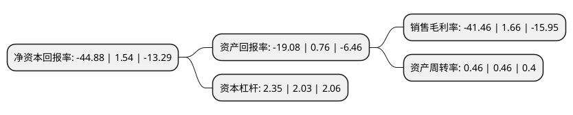

> 本页面由自动化程序生成于 2022年5月20日 01:10
> 内容可能存在错误，如有bug请提交issue至：https://github.com/Eroleice/doc-pi/issues
{.is-warning}

# 上市公司基本情况

## 基本资料

海南瑞泽新型建材股份有限公司（以下简称“海南瑞泽”）成立于2002年04月27日，三亚市。于2011年07月07日在深交所中小板上市。

海南瑞泽注册资本114,758.052万元，主营业务:商品混凝土的生产与销售，水泥的生产与销售以及园林绿化业务。以下是详细信息：

- 公司名称: 海南瑞泽新型建材股份有限公司
- 股票代码: 002596.SZ
- 所在地: 海南 - 三亚市
- 成立日期: 2002年04月27日
- 注册资本: 114,758.052万元
- 法定代表人: 张海林
- 主营业务: 主营业务:商品混凝土的生产与销售，水泥的生产与销售以及园林绿化业务
- 公司官网: www.hnruize.com
- 公司介绍: 公司是海南省最早从事商品混凝土生产的企业。凭借中小企业板提供的融资渠道和发展平台，公司先后收购了肇庆市金岗水泥有限公司、三亚新大兴园林生态有限公司以及广东绿润环境管理有限公司，完善了公司产业链，促进了公司业务规模的快速发展。目前，海南瑞泽已由创建初期的单一商品混凝土生产与配送企业发展成为一家拥有规格品种齐全的商品混凝土生产与配送、新型干法水泥生产与配送、新型环保建材、园林设计及施工、市政环卫、垃圾清运等丰富产业链的大型股份制集团企业。海南瑞泽目前拥有四大业务板块，各业务板块整体运行、协同发展，基本实现“大基建、大生态”的产业布局。

## 股东及高管情况

上市公司第一大股东为张海林，持股139,920,000股，占比12.19%，**疑似为**上市公司实际控制人。

截至2022年03月31日，上市公司的前十大股东中，共有8名自然人股东，2名机构股东，其中5%以上大股东共有3名。上市公司前十大股东明细如下：

> 未能通过持股比例判定出上市公司实际控制人（持股30%以上）
> 可能存在通过间接持股、联合持股、协议控制等方式拥有实际控制权的主体，具体请参考上市公司定期公告！
{.is-warning}

> 截至2022年03月31日，上市公司前十大股东信息如下：

| 股东名称 | 持股数量（股） | 持股比例 |
| --- | --- | --- |
| 张海林 | 139,920,000 | 12.19% |
| 冯活灵 | 129,510,000 | 11.29% |
| 三亚大兴集团有限公司 | 95,132,742 | 8.29% |
| 张艺林 | 53,249,900 | 4.64% |
| 三亚厚德投资管理有限公司 | 11,061,948 | 0.96% |
| 徐湛元 | 7,644,341 | 0.67% |
| 孙林 | 5,978,200 | 0.52% |
| 张少光 | 5,874,586 | 0.51% |
| 杨巍巍 | 5,705,500 | 0.5% |
| 邓雁栋 | 5,695,545 | 0.5% |

## 利润表分析

上市公司2021年总收入为27.78亿元，净利润为-11.52亿元，**未实现盈利**。

## 杜邦分析

> 数据列示周期：2021年 | 2020年 | 2019年
{.is-info}

上市公司的净资产收益率在近一年有所下降，下降幅度为-3014.29%，其变化情况分解如下：
- 上市公司的销售毛利率在近一年下降了-2597.59%，可能是生产效率的下降、商品原材料价格上涨或商品价格的下跌所致。
- 上市公司的资产周转率在近一年下降了0%，可能是源自于更慢的销售回款或库存管理效果下降。
- 上市公司的财务杠杆比率在近一年上升了15.76%，可能是增加负债扩大生产规模。

