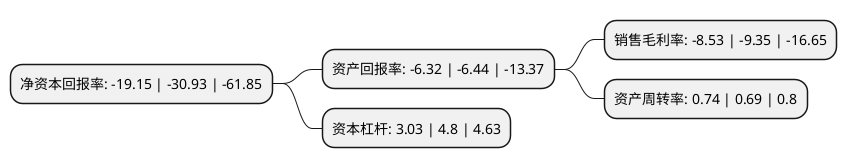

> 本页面由自动化程序生成于 2022年5月20日 01:11
> 内容可能存在错误，如有bug请提交issue至：https://github.com/Eroleice/doc-pi/issues
{.is-warning}

# 上市公司基本情况

## 基本资料

苏州扬子江新型材料股份有限公司（以下简称“扬子新材”）成立于2002年11月27日，苏州市。于2012年01月19日在深交所中小板上市。

扬子新材注册资本51,206.4万元，公司的主营业务为有机涂层板及其基板的研发，生产和销售，主要产品包括有机涂层板系列产品及其基板产品。以下是详细信息：

- 公司名称: 苏州扬子江新型材料股份有限公司
- 股票代码: 002652.SZ
- 所在地: 江苏 - 苏州市
- 成立日期: 2002年11月27日
- 注册资本: 51,206.4万元
- 法定代表人: 王功虎
- 主营业务: 公司的主营业务为有机涂层板及其基板的研发，生产和销售，主要产品包括有机涂层板系列产品及其基板产品
- 公司官网: www.yzjnm.com
- 公司介绍: 公司是一家专业从事功能型有机涂层板及其基板研发、生产和销售的江苏省高新技术企业，主要产品包括有机涂层板系列产品及其基板产品。公司有机涂层板产品目前主要用于新型节能环保墙体材料及家用电器的生产，产品的细分市场侧重于建筑、建筑装饰及家电行业，设计食品、化妆品、医药、医疗、IT、电子、光伏制造等具有高洁净或其他特殊功能要求的生产车间和设施的建设以及家电外观部件的生产。公司拥有一支高素质的技术研发与质量管控团队，全套引进先进的生产、环保设备和操控系统，全面导入CIS、ISO9000质量管理体系，并应用ERP企业资源管理软件系统实现资源共享和远程联网。

## 股东及高管情况

上市公司第一大股东为南宁颐然养老产业合伙企业(有限合伙)，持股153,600,000股，占比30%，**疑似为**上市公司实际控制人。

截至2022年05月16日，上市公司的前十大股东中，共有6名自然人股东，4名机构股东，其中5%以上大股东共有3名。上市公司前十大股东明细如下：

> 截至2022年05月16日，上市公司前十大股东信息如下：

| 股东名称 | 持股数量（股） | 持股比例 |
| --- | --- | --- |
| 南宁颐然养老产业合伙企业(有限合伙) | 153,600,000 | 30% |
| 南宁颐然养老产业合伙企业(有限合伙) | 153,600,000 | 30% |
| 李青松 | 30,137,200 | 5.89% |
| 李青松 | 25,603,200 | 5% |
| 昆山市创业投资有限公司 | 19,895,733 | 3.89% |
| 胡卫林 | 15,000,000 | 2.93% |
| 哈尔滨嘉悦投资有限公司 | 11,150,000 | 2.18% |
| 谭钦 | 11,000,000 | 2.15% |
| 张斌 | 2,959,700 | 0.58% |
| 沈阳 | 1,743,600 | 0.34% |

## 杜邦分析

> 数据列示周期：2021年 | 2020年 | 2019年
{.is-info}

上市公司的净资产收益率在近一年有所下降，下降幅度为-38.09%，其变化情况分解如下：
- 上市公司的销售毛利率在近一年下降了-8.77%，可能是生产效率的下降、商品原材料价格上涨或商品价格的下跌所致。
- 上市公司的资产周转率在近一年上升了7.25%，可能是源自于更快的销售回款或库存管理效果提升。
- 上市公司的财务杠杆比率在近一年下降了-36.87%，可能是减少负债降低财务费用。

