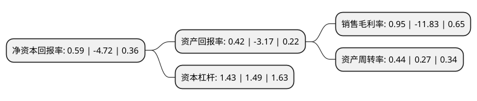

> 本页面由自动化程序生成于 2022年5月20日 01:11
> 内容可能存在错误，如有bug请提交issue至：https://github.com/Eroleice/doc-pi/issues
{.is-warning}

# 上市公司基本情况

## 基本资料

山东龙泉管道工程股份有限公司（以下简称“龙泉股份”）成立于2000年08月22日，淄博市。于2012年04月26日在深交所中小板上市。

龙泉股份注册资本56,651.037万元，公司主营业务为预应力钢筒混凝土管(PCCP)，预应力混凝土管(PCP)，钢筋混凝土排水管(RCP)的生产，销售，安装及售后服务。主要产品为预应力钢筒混凝土管(PCCP)。以下是详细信息：

- 公司名称: 山东龙泉管道工程股份有限公司
- 股票代码: 002671.SZ
- 所在地: 山东 - 淄博市
- 成立日期: 2000年08月22日
- 注册资本: 56,651.037万元
- 法定代表人: 付波
- 主营业务: 公司主营业务为预应力钢筒混凝土管(PCCP)，预应力混凝土管(PCP)，钢筋混凝土排水管(RCP)的生产，销售，安装及售后服务主要产品为预应力钢筒混凝土管(PCCP)
- 公司官网: www.lq-pipe.cn
- 公司介绍: 公司是国内为数不多的几家预应力钢筒混凝土管(PCCP)骨干供应商之一。主营业务为预应力钢筒混凝土管(PCCP)、预应力混凝土管(PCP)、钢筋混凝土排水管(RCP)的生产、销售、安装及售后服务。公司生产的“颜神龙泉”牌PCCP产品被认定为“山东名牌产品”，“颜神龙泉”商标被评定为“山东著名商标”、“中国驰名商标”。公司是中国混凝土与水泥制品协会副会长单位、中国水利企业协会和中国工程建设标准化协会(管道结构)会员单位，参与起草了国家标准《预应力钢筒混凝土管》等，先后荣获了省市先进企业、山东省名牌产品、科技先导型企业等多项荣誉。

## 股东及高管情况

上市公司第一大股东为广东建华企业管理咨询有限公司，持股130,033,668股，占比22.95%，**疑似为**上市公司实际控制人。

截至2022年04月07日，上市公司的前十大股东中，共有5名自然人股东，5名机构股东，其中5%以上大股东共有5名。上市公司前十大股东明细如下：

> 未能通过持股比例判定出上市公司实际控制人（持股30%以上）
> 可能存在通过间接持股、联合持股、协议控制等方式拥有实际控制权的主体，具体请参考上市公司定期公告！
{.is-warning}

> 截至2022年04月07日，上市公司前十大股东信息如下：

| 股东名称 | 持股数量（股） | 持股比例 |
| --- | --- | --- |
| 广东建华企业管理咨询有限公司 | 130,033,668 | 22.95% |
| 建华建材(中国)有限公司 | 94,488,394 | 16.68% |
| 建华建材(中国)有限公司 | 94,488,394 | 16.68% |
| 广东建华企业管理咨询有限公司 | 56,127,800 | 9.91% |
| 王维华 | 50,371,529 | 8.89% |
| 刘洁 | 16,750,000 | 2.96% |
| 王晓军 | 8,412,531 | 1.48% |
| 刘吉康 | 5,593,050 | 0.99% |
| 刘素霞 | 5,000,154 | 0.88% |
| 广东毅马集团有限公司 | 3,682,100 | 0.65% |

## 利润表分析

上市公司2021年总收入为13.75亿元，净利润为0.13亿元，实现盈利。

## 杜邦分析

> 数据列示周期：2021年 | 2020年 | 2019年
{.is-info}

上市公司的净资产收益率在近一年有所下降，下降幅度为-112.5%，其变化情况分解如下：
- 上市公司的销售毛利率在近一年下降了-108.03%，可能是生产效率的下降、商品原材料价格上涨或商品价格的下跌所致。
- 上市公司的资产周转率在近一年上升了62.96%，可能是源自于更快的销售回款或库存管理效果提升。
- 上市公司的财务杠杆比率在近一年下降了-4.03%，可能是减少负债降低财务费用。

