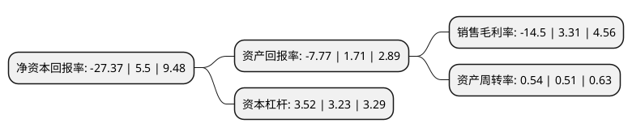

> 本页面由自动化程序生成于 2022年5月20日 01:11
> 内容可能存在错误，如有bug请提交issue至：https://github.com/Eroleice/doc-pi/issues
{.is-warning}

# 上市公司基本情况

## 基本资料

重庆三圣实业股份有限公司（以下简称“三圣股份”）成立于2002年05月10日，重庆市。于2015年02月17日在深交所中小板上市。

三圣股份注册资本43,200万元，主要产品:商品混凝土，减水剂，膨胀剂，硫酸，盐酸普鲁卡因，头孢西丁酸中间体，氯霉素中间体，氨曲南中间体，奥利司他中间体等医药中间体产品，及对乙酰氨基酚，盐酸氯哌丁，甲磺酸左氧氟沙星，贝诺酯，盐酸普鲁卡因，盐酸苯海拉明等原料药及复方氨酚苯海拉明片，盐酸氯哌丁片，克拉霉素缓释片，双氯酚酸钠肠溶片，对乙酰氨基酚片，法莫替丁片等制剂产品以下是详细信息：

- 公司名称: 重庆三圣实业股份有限公司
- 股票代码: 002742.SZ
- 所在地: 重庆 - 重庆市
- 成立日期: 2002年05月10日
- 注册资本: 43,200万元
- 法定代表人: 项立平
- 主营业务: 主要产品:商品混凝土，减水剂，膨胀剂，硫酸，盐酸普鲁卡因，头孢西丁酸中间体，氯霉素中间体，氨曲南中间体，奥利司他中间体等医药中间体产品，及对乙酰氨基酚，盐酸氯哌丁，甲磺酸左氧氟沙星，贝诺酯，盐酸普鲁卡因，盐酸苯海拉明等原料药及复方氨酚苯海拉明片，盐酸氯哌丁片，克拉霉素缓释片，双氯酚酸钠肠溶片，对乙酰氨基酚片，法莫替丁片等制剂产品
- 公司官网: www.cqssgf.com
- 公司介绍: 公司原从事石膏资源综合利用、商品混凝土及外加剂等为主的建材化工业务，取得了区域领先地位。自实施多元化、国际化发展战略以来，通过收购兼并，已初步完成第二产业链医药制药板块的布局，形成了以中间体原料药为基础、以制剂为核心的医药制药业务。公司已形成“建材化工+医药制造”双轮驱动、国内外产业对接协同发展的多元化、国际化优势。公司“三圣”商标为国家驰名商标。

## 股东及高管情况

上市公司第一大股东为潘先文，持股169,865,543股，占比39.32%，为上市公司实际控制人。

截至2022年03月31日，上市公司的前十大股东中，共有10名自然人股东，其中5%以上大股东共有3名。上市公司前十大股东明细如下：

> 截至2022年03月31日，上市公司前十大股东信息如下：

| 股东名称 | 持股数量（股） | 持股比例 |
| --- | --- | --- |
| 潘先文 | 169,865,543 | 39.32% |
| 邓涵尹 | 31,223,816 | 7.23% |
| 潘呈恭 | 26,155,611 | 6.05% |
| 王南彬 | 15,780,000 | 3.65% |
| 吕艳华 | 3,083,360 | 0.71% |
| 丁兰芳 | 2,891,100 | 0.67% |
| 潘先东 | 2,700,000 | 0.63% |
| 周廷国 | 2,700,000 | 0.63% |
| 陆丽红 | 2,680,400 | 0.62% |
| 李青 | 2,100,000 | 0.49% |

## 利润表分析

上市公司2021年总收入为24.89亿元，净利润为-3.61亿元，**未实现盈利**。

## 杜邦分析

> 数据列示周期：2021年 | 2020年 | 2019年
{.is-info}

上市公司的净资产收益率在近一年有所下降，下降幅度为-597.64%，其变化情况分解如下：
- 上市公司的销售毛利率在近一年下降了-538.07%，可能是生产效率的下降、商品原材料价格上涨或商品价格的下跌所致。
- 上市公司的资产周转率在近一年上升了5.88%，可能是源自于更快的销售回款或库存管理效果提升。
- 上市公司的财务杠杆比率在近一年上升了8.98%，可能是增加负债扩大生产规模。

