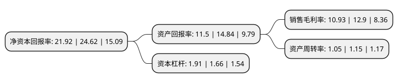

> 本页面由自动化程序生成于 2022年5月20日 01:12
> 内容可能存在错误，如有bug请提交issue至：https://github.com/Eroleice/doc-pi/issues
{.is-warning}

# 上市公司基本情况

## 基本资料

广东坚朗五金制品股份有限公司（以下简称“坚朗五金”）成立于2003年06月26日，东莞市。于2016年03月29日在深交所中小板上市。

坚朗五金注册资本32,154万元，主要从事中高端建筑门窗幕墙五金系统及金属构配件等相关产品的研发，生产和销售。产品以门窗五金系统和点支承玻璃幕墙构配件为基础，并延伸至门控五金系统，不锈钢护栏构配件及其他建筑五金产品。以下是详细信息：

- 公司名称: 广东坚朗五金制品股份有限公司
- 股票代码: 002791.SZ
- 所在地: 广东 - 东莞市
- 成立日期: 2003年06月26日
- 注册资本: 32,154万元
- 法定代表人: 白宝鲲
- 主营业务: 主要从事中高端建筑门窗幕墙五金系统及金属构配件等相关产品的研发，生产和销售产品以门窗五金系统和点支承玻璃幕墙构配件为基础，并延伸至门控五金系统，不锈钢护栏构配件及其他建筑五金产品
- 公司官网: www.kinlong.com
- 公司介绍: 公司是国内建筑五金行业的大型企业，系国内规模最大的门窗幕墙五金生产企业之一，主要从事中高端建筑门窗幕墙五金系统及金属构配件等相关产品的研发、生产和销售。公司在品牌认知度、研发能力、技术水平、销售服务和生产规模等方面均处于行业先进水平。公司拥有众多专家、设计师从事产品开发与革新，保证坚朗的产品始终保持国际先进水平。公司积极实施品牌战略，注重品牌保护。经过多年品牌建设，公司拥有的“坚朗”、“坚宜佳”品牌已经成为建筑五金行业的著名品牌。公司拥有通过中国合格评定国家认可委员会(CNAS)认可的检测实验室。公司设立了专门的研发中心进行研究开发工作，建立了以市场需求为导向的产品开发机制。

## 股东及高管情况

上市公司第一大股东为白宝鲲，持股120,283,973股，占比37.41%，为上市公司实际控制人。

截至2022年03月31日，上市公司的前十大股东中，共有6名自然人股东，1名机构股东，2个产品账户，1个海外主体，其中5%以上大股东共有4名。上市公司前十大股东明细如下：

> 截至2022年03月31日，上市公司前十大股东信息如下：

| 股东名称 | 持股数量（股） | 持股比例 |
| --- | --- | --- |
| 白宝鲲 | 120,283,973 | 37.41% |
| 闫桂林 | 24,999,835 | 7.78% |
| 白宝萍 | 23,874,345 | 7.43% |
| 陈平 | 22,574,345 | 7.02% |
| 王晓丽 | 11,041,370 | 3.43% |
| 香港中央结算有限公司(陆股通) | 6,163,561 | 1.92% |
| 全国社保基金四一三组合 | 4,926,103 | 1.53% |
| 广东坚朗五金制品股份有限公司-第一期员工持股计划 | 4,407,735 | 1.37% |
| 殷建忠 | 3,417,325 | 1.06% |
| 普信投资公司-客户资金 | 3,158,619 | 0.98% |

## 利润表分析

上市公司2021年总收入为88.06亿元，净利润为9.62亿元，实现盈利。

## 杜邦分析

> 数据列示周期：2021年 | 2020年 | 2019年
{.is-info}

上市公司的净资产收益率在近一年有所下降，下降幅度为-10.97%，其变化情况分解如下：
- 上市公司的销售毛利率在近一年下降了-15.27%，可能是生产效率的下降、商品原材料价格上涨或商品价格的下跌所致。
- 上市公司的资产周转率在近一年下降了-8.7%，可能是源自于更慢的销售回款或库存管理效果下降。
- 上市公司的财务杠杆比率在近一年上升了15.06%，可能是增加负债扩大生产规模。

