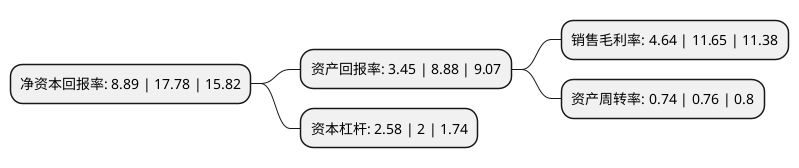

> 本页面由自动化程序生成于 2022年5月20日 01:13
> 内容可能存在错误，如有bug请提交issue至：https://github.com/Eroleice/doc-pi/issues
{.is-warning}

# 上市公司基本情况

## 基本资料

蒙娜丽莎集团股份有限公司（以下简称“蒙娜丽莎”）成立于1998年10月20日，佛山市。于2017年12月19日在深交所中小板上市。

蒙娜丽莎注册资本41,480.739万元，主营业务:致力于高品质建筑陶瓷产品研发，生产和销售。主要产品:可分为陶瓷砖，陶瓷薄板两大类，其中，陶瓷砖产品可分为瓷质有釉砖，瓷质无釉砖和非瓷质有釉砖三类。以下是详细信息：

- 公司名称: 蒙娜丽莎集团股份有限公司
- 股票代码: 002918.SZ
- 所在地: 广东 - 佛山市
- 成立日期: 1998年10月20日
- 注册资本: 41,480.739万元
- 法定代表人: 萧华
- 主营业务: 主营业务:致力于高品质建筑陶瓷产品研发，生产和销售主要产品:可分为陶瓷砖，陶瓷薄板两大类，其中，陶瓷砖产品可分为瓷质有釉砖，瓷质无釉砖和非瓷质有釉砖三类
- 公司官网: www.monalisa.com.cn
- 公司介绍: 公司是集科研开发、专业生产、营销为一体的大型陶瓷企业。公司始终致力于高品质建筑陶瓷产品研发、生产和销售。公司通过“国家认定企业技术中心”、“徐德龙院士工作站”、“博士后科研工作站”、全国轻工行业无机材料重点实验室等科研创新平台，在建筑陶瓷设计、生产、应用和环保治理等多方面，和在生产制造上实现了较高的绿色化程度。公司在建筑陶瓷薄型化的应用方面得到进一步拓展，突破了建筑陶瓷产品的传统应用领域，为国内建筑陶瓷行业进一步转型升级开辟了新的路径。

## 股东及高管情况

上市公司第一大股东为萧华，持股125,080,560股，占比29.88%，**疑似为**上市公司实际控制人。

截至2022年03月31日，上市公司的前十大股东中，共有5名自然人股东，1名机构股东，3个产品账户，1个海外主体，其中5%以上大股东共有4名。上市公司前十大股东明细如下：

> 未能通过持股比例判定出上市公司实际控制人（持股30%以上）
> 可能存在通过间接持股、联合持股、协议控制等方式拥有实际控制权的主体，具体请参考上市公司定期公告！
{.is-warning}

> 截至2022年03月31日，上市公司前十大股东信息如下：

| 股东名称 | 持股数量（股） | 持股比例 |
| --- | --- | --- |
| 萧华 | 125,080,560 | 29.88% |
| 霍荣铨 | 57,328,590 | 13.69% |
| 邓啟棠 | 39,087,675 | 9.34% |
| 张旗康 | 39,087,675 | 9.34% |
| 佛山市美尔奇投资管理合伙企业(有限合伙) | 14,016,899 | 3.35% |
| 香港中央结算有限公司(陆股通) | 11,780,440 | 2.81% |
| 中国建设银行股份有限公司-华夏兴和混合型证券投资基金 | 9,260,057 | 2.21% |
| 毛红实 | 6,414,852 | 1.53% |
| 基本养老保险基金一二零六组合 | 6,234,029 | 1.49% |
| 交通银行-华夏蓝筹核心混合型证券投资基金(LOF) | 4,513,767 | 1.08% |

## 利润表分析

上市公司2021年总收入为69.86亿元，净利润为3.24亿元，实现盈利。

## 杜邦分析

> 数据列示周期：2021年 | 2020年 | 2019年
{.is-info}

上市公司的净资产收益率在近一年有所下降，下降幅度为-50%，其变化情况分解如下：
- 上市公司的销售毛利率在近一年下降了-60.17%，可能是生产效率的下降、商品原材料价格上涨或商品价格的下跌所致。
- 上市公司的资产周转率在近一年下降了-2.63%，可能是源自于更慢的销售回款或库存管理效果下降。
- 上市公司的财务杠杆比率在近一年上升了29%，可能是增加负债扩大生产规模。

