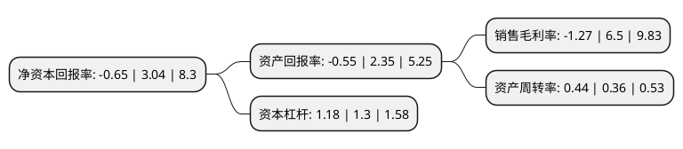

> 本页面由自动化程序生成于 2022年5月20日 01:15
> 内容可能存在错误，如有bug请提交issue至：https://github.com/Eroleice/doc-pi/issues
{.is-warning}

# 上市公司基本情况

## 基本资料

宁波先锋新材料股份有限公司（以下简称“先锋新材”）成立于2003年03月07日，宁波市。于2011年01月13日在深交所创业板上市。

先锋新材注册资本47,400万元，主要产品:遮阳面料(阳光面料，涂层面料，镀铝面料)，遮阳成品(遮阳帘，窗帘窗饰门店定制)。主要业务:高分子复合遮阳材料(阳光面料)产品的研发，生产和销售。以下是详细信息：

- 公司名称: 宁波先锋新材料股份有限公司
- 股票代码: 300163.SZ
- 所在地: 浙江 - 宁波市
- 成立日期: 2003年03月07日
- 注册资本: 47,400万元
- 法定代表人: 白瑞琛
- 主营业务: 主要产品:遮阳面料(阳光面料，涂层面料，镀铝面料)，遮阳成品(遮阳帘，窗帘窗饰门店定制)高分子复合遮阳材料(阳光面料)产品的研发，生产和销售
- 公司官网: www.aplus.cn
- 公司介绍: 公司属于国家大力鼓励发展的新材料行业，主要从事高分子复合遮阳材料(阳光面料)产品的研发、生产和销售。公司的主要产品是由高强度涤纶丝或者玻璃纤维丝外部均匀包覆高分子复合材料后织造而成，具有节能、环保、耐久、阻燃等优点，其产品用于建筑遮阳，具有双效节能效果，可以大幅降低空调用电和照明用电。同时可以广泛应用于建筑工程行业以及其他工业用纺织品。公司在发展过程中，不断整合化工、单丝复合、织造、材料热处理等领域的技术，公司拥有独立的核心技术和专利，独立开发出众多高分子复合遮阳新材料，打破了国外企业在此领域的垄断地位，产品替代进口并大量出口。公司子公司负责遮阳成品在澳洲的销售，已在澳大利亚证券交易所上市，是澳大利亚领先的窗帘制造商及销售商，是澳大利亚制造和销售垂直百叶窗的领先企业。公司不断提高面料质量，减少自然资源的消耗，也是业内第一家获得OHSAS18001专业健康和安全体系认证的公司。

## 股东及高管情况

上市公司第一大股东为卢先锋，持股104,924,203股，占比22.14%，**疑似为**上市公司实际控制人。

截至2022年03月31日，上市公司的前十大股东中，共有10名自然人股东，其中5%以上大股东共有3名。上市公司前十大股东明细如下：

> 未能通过持股比例判定出上市公司实际控制人（持股30%以上）
> 可能存在通过间接持股、联合持股、协议控制等方式拥有实际控制权的主体，具体请参考上市公司定期公告！
{.is-warning}

> 截至2022年03月31日，上市公司前十大股东信息如下：

| 股东名称 | 持股数量（股） | 持股比例 |
| --- | --- | --- |
| 卢先锋 | 104,924,203 | 22.14% |
| 卢先锋 | 99,514,203 | 20.9946% |
| 卢先锋 | 97,354,203 | 20.54% |
| 徐佩飞 | 9,689,300 | 2.04% |
| 常红娥 | 2,983,000 | 0.63% |
| 李霞 | 2,239,100 | 0.47% |
| 林巧玲 | 1,858,500 | 0.39% |
| 林万里 | 1,766,600 | 0.37% |
| 陈峰 | 1,460,000 | 0.31% |
| 白鸿蓉 | 1,300,000 | 0.27% |

## 利润表分析

上市公司2021年总收入为3.06亿元，净利润为-0.04亿元，**未实现盈利**。

## 杜邦分析

> 数据列示周期：2021年 | 2020年 | 2019年
{.is-info}

上市公司的净资产收益率在近一年有所下降，下降幅度为-121.38%，其变化情况分解如下：
- 上市公司的销售毛利率在近一年下降了-119.54%，可能是生产效率的下降、商品原材料价格上涨或商品价格的下跌所致。
- 上市公司的资产周转率在近一年上升了22.22%，可能是源自于更快的销售回款或库存管理效果提升。
- 上市公司的财务杠杆比率在近一年下降了-9.23%，可能是减少负债降低财务费用。

