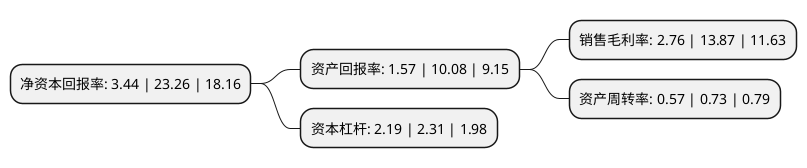

> 本页面由自动化程序生成于 2022年5月20日 01:19
> 内容可能存在错误，如有bug请提交issue至：https://github.com/Eroleice/doc-pi/issues
{.is-warning}

# 上市公司基本情况

## 基本资料

江苏凯伦建材股份有限公司（以下简称“凯伦股份”）成立于2011年07月13日，苏州市。于2017年10月26日在深交所创业板上市。

凯伦股份注册资本38,992.203万元，公司主要从事新型建筑防水材料的研发，生产和销售以下是详细信息：

- 公司名称: 江苏凯伦建材股份有限公司
- 股票代码: 300715.SZ
- 所在地: 江苏 - 苏州市
- 成立日期: 2011年07月13日
- 注册资本: 38,992.203万元
- 法定代表人: 钱林弟
- 主营业务: 公司主要从事新型建筑防水材料的研发，生产和销售
- 公司官网: www.canlon.com.cn
- 公司介绍: 公司是一家制造和应用技术领先的提供系统化服务的建筑防水材料生产商，是建筑防水行业新的产业政策的践行者，公司无论生产规模、技术研发，还是职业培训等方面，都是建筑防水行业中新建和改扩建企业的典范和楷模。凯伦建材秉承绿色工厂、绿色产品、绿色生产和绿色施工的绿色经营理念，在建筑防水行业的技术创新能力、品牌影响力及企业综合实力均排名前列。公司通过了ISO9001-2008质量体系认证、GB/T24001-2004环境体系认证和GB/T28001-2001职业健康安全管理体系认证。公司产品通过CRCC(铁路产品)认证及CTC(中国建材)认证，并获得国标图集。公司自主研发的高分子自粘胶膜防水卷材(MBP)通过住房和城乡建设部科技成果评估，并获得推广证书。

## 股东及高管情况

上市公司第一大股东为凯伦控股投资有限公司，持股168,118,419股，占比43.12%，为上市公司实际控制人。

截至2022年03月31日，上市公司的前十大股东中，共有6名自然人股东，2名机构股东，2个产品账户，其中5%以上大股东共有4名。上市公司前十大股东明细如下：

> 截至2022年03月31日，上市公司前十大股东信息如下：

| 股东名称 | 持股数量（股） | 持股比例 |
| --- | --- | --- |
| 凯伦控股投资有限公司 | 168,118,419 | 43.12% |
| 李忠人 | 28,589,400 | 7.33% |
| 钱林弟 | 25,933,609 | 6.65% |
| 苏州绿融投资合伙企业(有限合伙) | 22,534,200 | 5.78% |
| 中国工商银行-汇添富均衡增长混合型证券投资基金 | 6,187,240 | 1.59% |
| 张勇 | 5,800,140 | 1.49% |
| 姚建新 | 4,993,920 | 1.28% |
| 李静 | 3,324,181 | 0.85% |
| 刘吉明 | 3,061,800 | 0.79% |
| 广州市玄元投资管理有限公司-玄元元君9号私募证券投资基金 | 2,708,750 | 0.69% |

## 利润表分析

上市公司2021年总收入为25.85亿元，净利润为0.71亿元，实现盈利。

## 杜邦分析

> 数据列示周期：2021年 | 2020年 | 2019年
{.is-info}

上市公司的净资产收益率在近一年有所下降，下降幅度为-85.21%，其变化情况分解如下：
- 上市公司的销售毛利率在近一年下降了-80.1%，可能是生产效率的下降、商品原材料价格上涨或商品价格的下跌所致。
- 上市公司的资产周转率在近一年下降了-21.92%，可能是源自于更慢的销售回款或库存管理效果下降。
- 上市公司的财务杠杆比率在近一年下降了-5.19%，可能是减少负债降低财务费用。

