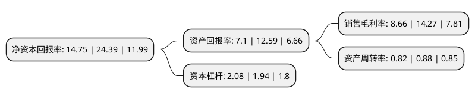

> 本页面由自动化程序生成于 2022年5月20日 01:20
> 内容可能存在错误，如有bug请提交issue至：https://github.com/Eroleice/doc-pi/issues
{.is-warning}

# 上市公司基本情况

## 基本资料

科顺防水科技股份有限公司（以下简称“科顺股份”）成立于1996年10月10日，佛山市。于2018年01月25日在深交所创业板上市。

科顺股份注册资本115,118.658万元，从事新型建筑防水材料研发，生产，销售并提供防水工程施工服务。公司产品涵盖防水卷材，防水涂层两大类。以下是详细信息：

- 公司名称: 科顺防水科技股份有限公司
- 股票代码: 300737.SZ
- 所在地: 广东 - 佛山市
- 成立日期: 1996年10月10日
- 注册资本: 115,118.658万元
- 法定代表人: 陈伟忠
- 主营业务: 从事新型建筑防水材料研发，生产，销售并提供防水工程施工服务公司产品涵盖防水卷材，防水涂层两大类
- 公司官网: www.keshun.com.cn
- 公司介绍: 公司成立于1996年，总部设在广东顺德，是一家集建筑防水材料研发、制造、销售、技术服务和防水工程施工于一体的国家级高新技术企业。目前是中国建筑防水协会副理事长单位，是行业协会认定的建筑防水行业领军企业、行业综合实力前三，连续多年当选“房地产500强首选防水材料品牌”。科顺防水现有工程防水品牌“CKS科顺”、民用建材品牌“ELOKT依来德”及堵漏维修品牌“ZT筑通”。产品涵盖防水卷材、防水涂料、刚性防水材料、止水堵漏材料、干粉砂浆、防排水板等六大类100多个品种，是产品最齐全的防水企业之一，可以为客户提供“一站式”建筑防水解决方案。

## 股东及高管情况

上市公司第一大股东为陈伟忠，持股318,260,462股，占比26.94%，**疑似为**上市公司实际控制人。

截至2022年04月28日，上市公司的前十大股东中，共有6名自然人股东，3个产品账户，1个海外主体，其中5%以上大股东共有4名。上市公司前十大股东明细如下：

> 未能通过持股比例判定出上市公司实际控制人（持股30%以上）
> 可能存在通过间接持股、联合持股、协议控制等方式拥有实际控制权的主体，具体请参考上市公司定期公告！
{.is-warning}

> 截至2022年04月28日，上市公司前十大股东信息如下：

| 股东名称 | 持股数量（股） | 持股比例 |
| --- | --- | --- |
| 陈伟忠 | 318,260,462 | 26.94% |
| 香港中央结算有限公司(陆股通) | 79,386,560 | 6.72% |
| 阮宜宝 | 75,698,622 | 6.41% |
| 陈智忠 | 68,291,110 | 5.78% |
| 中国人寿资管-广发银行-国寿资产-科顺优势甄选2156保险资产管理产品 | 42,655,315 | 3.61% |
| 陈作留 | 37,989,631 | 3.22% |
| 陈华忠 | 18,954,325 | 1.6% |
| 中国工商银行股份有限公司-景顺长城中国回报灵活配置混合型证券投资基金 | 13,984,771 | 1.18% |
| 中国农业银行股份有限公司-景顺长城资源垄断混合型证券投资基金(LOF) | 11,933,460 | 1.01% |
| 方勇 | 11,708,949 | 0.99% |

## 利润表分析

上市公司2021年总收入为77.7亿元，净利润为6.72亿元，实现盈利。

## 杜邦分析

> 数据列示周期：2021年 | 2020年 | 2019年
{.is-info}

上市公司的净资产收益率在近一年有所下降，下降幅度为-39.52%，其变化情况分解如下：
- 上市公司的销售毛利率在近一年下降了-39.31%，可能是生产效率的下降、商品原材料价格上涨或商品价格的下跌所致。
- 上市公司的资产周转率在近一年下降了-6.82%，可能是源自于更慢的销售回款或库存管理效果下降。
- 上市公司的财务杠杆比率在近一年上升了7.22%，可能是增加负债扩大生产规模。

