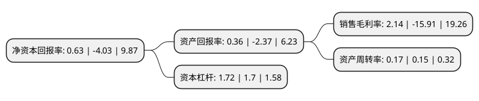

> 本页面由自动化程序生成于 2022年5月20日 01:24
> 内容可能存在错误，如有bug请提交issue至：https://github.com/Eroleice/doc-pi/issues
{.is-warning}

# 上市公司基本情况

## 基本资料

康欣新材料股份有限公司（以下简称“康欣新材”）成立于1993年09月01日，潍坊市。于1997年05月26日在上交所主板上市。

康欣新材注册资本134,454.337万元，主要从事集装箱底板等优质，新型木质复合材料的研发，生产和销售，木结构房屋设计，研发，生产和销售以及营林造林和优质种苗培育，销售。主要产品包括杨木复合集装箱底板，COSB复合集装箱底板，环保板等各类优质，新型木质复合材料，木结构房屋，以及速生杨种苗，石楠，雪松，桂花等多种绿化种苗及景观树等林产品。以下是详细信息：

- 公司名称: 康欣新材料股份有限公司
- 股票代码: 600076.SH
- 所在地: 山东 - 潍坊市
- 成立日期: 1993年09月01日
- 注册资本: 134,454.337万元
- 法定代表人: 邵建东
- 主营业务: 主要从事集装箱底板等优质，新型木质复合材料的研发，生产和销售，木结构房屋设计，研发，生产和销售以及营林造林和优质种苗培育，销售主要产品包括杨木复合集装箱底板，COSB复合集装箱底板，环保板等各类优质，新型木质复合材料，木结构房屋，以及速生杨种苗，石楠，雪松，桂花等多种绿化种苗及景观树等林产品
- 公司官网: www.hbkangxin.com.cn
- 公司介绍: 公司是一家集育苗、造林、木材深加工为一体的国家林业产业化重点龙头企业，主营业务包括集装箱底板、建筑结构材、木结构房屋的研发、设计与生产。公司原主要从事广电网络产品、电子信息产品、光机电一体化设备、通信设备、锂电池的开发、生产、销售、技术服务及提供整体解决方案。经过重大资产重组，置入盈利能力较强、发展前景良好的林板一体化业务。公司致力于成为林产业行业的领跑者，世界领先的可持续生物质新材料及其应用产品提供商。

## 股东及高管情况

上市公司第一大股东为无锡市建设发展投资有限公司，持股516,902,585股，占比38.44%，为上市公司实际控制人。

截至2022年04月21日，上市公司的前十大股东中，共有7名自然人股东，3名机构股东，其中5%以上大股东共有4名。上市公司前十大股东明细如下：

> 截至2022年04月21日，上市公司前十大股东信息如下：

| 股东名称 | 持股数量（股） | 持股比例 |
| --- | --- | --- |
| 无锡市建设发展投资有限公司 | 516,902,585 | 38.44% |
| 无锡市建设发展投资有限公司 | 516,902,585 | 38.44% |
| 李洁 | 123,991,675 | 9.22% |
| 李洁 | 97,100,809 | 7.2218% |
| 郭志先 | 15,142,258 | 1.13% |
| 北京东方国兴科技发展有限公司 | 12,549,900 | 0.93% |
| 周晓璐 | 11,287,122 | 0.84% |
| 庄粤红 | 4,730,200 | 0.35% |
| 裘正理 | 3,630,552 | 0.27% |
| 孙琦 | 3,510,000 | 0.26% |

## 利润表分析

上市公司2021年总收入为12.86亿元，净利润为0.27亿元，实现盈利。

## 杜邦分析

> 数据列示周期：2021年 | 2020年 | 2019年
{.is-info}

上市公司的净资产收益率在近一年有所下降，下降幅度为-115.63%，其变化情况分解如下：
- 上市公司的销售毛利率在近一年下降了-113.45%，可能是生产效率的下降、商品原材料价格上涨或商品价格的下跌所致。
- 上市公司的资产周转率在近一年上升了13.33%，可能是源自于更快的销售回款或库存管理效果提升。
- 上市公司的财务杠杆比率在近一年上升了1.18%，可能是增加负债扩大生产规模。

