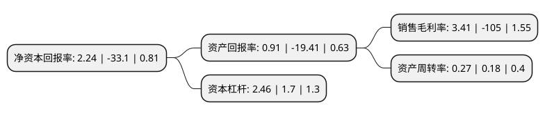

> 本页面由自动化程序生成于 2022年5月20日 01:25
> 内容可能存在错误，如有bug请提交issue至：https://github.com/Eroleice/doc-pi/issues
{.is-warning}

# 上市公司基本情况

## 基本资料

正源控股股份有限公司（以下简称“正源股份”）成立于1993年05月22日，成都市。于2001年05月24日在上交所主板上市。

正源股份注册资本151,055万元，主要业务:工程施工，玻璃深加工和人造板生产。主要产品:中高密度纤维板。以下是详细信息：

- 公司名称: 正源控股股份有限公司
- 股票代码: 600321.SH
- 所在地: 四川 - 成都市
- 成立日期: 1993年05月22日
- 注册资本: 151,055万元
- 法定代表人: 何延龙
- 主营业务: 工程施工，玻璃深加工和人造板生产主要产品:中高密度纤维板
- 公司官网: www.rightwayholdings.com
- 公司介绍: 公司是中国中西南地区最大规模的人造板生产和加工企业。企业涉及领域广泛，旗下设置金融投资、贸易物流、板材木业、开发建设、酒店管理，并相继设立全资子公司，保障企业纵横式发展，并保持持续拓展态势。公司有效利用现有业务的上下游产业链经验及资源渠道优势，涉足大宗粮食贸易、化工贸易、板木贸易、进出口代理、国际货运代理等众多贸易及供应链业务。公司秉承着“客户至上”的理念，坚持将客户利益、企业利益与社会利益有机结合在一起，勇于创新，持续发展。

## 股东及高管情况

上市公司第一大股东为正源房地产开发有限公司，持股375,235,863股，占比24.84%，**疑似为**上市公司实际控制人。

截至2022年03月31日，上市公司的前十大股东中，共有2名自然人股东，8名机构股东，其中5%以上大股东共有2名。上市公司前十大股东明细如下：

> 未能通过持股比例判定出上市公司实际控制人（持股30%以上）
> 可能存在通过间接持股、联合持股、协议控制等方式拥有实际控制权的主体，具体请参考上市公司定期公告！
{.is-warning}

> 截至2022年03月31日，上市公司前十大股东信息如下：

| 股东名称 | 持股数量（股） | 持股比例 |
| --- | --- | --- |
| 正源房地产开发有限公司 | 375,235,863 | 24.84% |
| 四川国栋建设集团有限公司 | 329,670,000 | 21.82% |
| 陕西华圣企业(集团)股份有限公司 | 22,365,000 | 1.48% |
| 海南福瑞源健康管理有限公司 | 14,195,800 | 0.94% |
| 李鹏 | 12,281,000 | 0.81% |
| 陕西华圣果业营销管理有限公司 | 7,932,600 | 0.53% |
| 中信证券股份有限公司 | 6,987,652 | 0.46% |
| 马纪 | 6,350,148 | 0.42% |
| 海南正源幸福健康投资有限公司 | 6,236,400 | 0.41% |
| 华泰证券股份有限公司 | 4,279,306 | 0.28% |

## 利润表分析

上市公司2021年总收入为12.63亿元，净利润为0.43亿元，实现盈利。

## 杜邦分析

> 数据列示周期：2021年 | 2020年 | 2019年
{.is-info}

上市公司的净资产收益率在近一年有所下降，下降幅度为-106.77%，其变化情况分解如下：
- 上市公司的销售毛利率在近一年下降了-103.25%，可能是生产效率的下降、商品原材料价格上涨或商品价格的下跌所致。
- 上市公司的资产周转率在近一年上升了50%，可能是源自于更快的销售回款或库存管理效果提升。
- 上市公司的财务杠杆比率在近一年上升了44.71%，可能是增加负债扩大生产规模。

