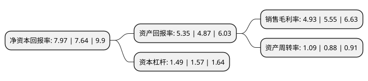

> 本页面由自动化程序生成于 2022年5月20日 01:36
> 内容可能存在错误，如有bug请提交issue至：https://github.com/Eroleice/doc-pi/issues
{.is-warning}

# 上市公司基本情况

## 基本资料

天津银龙预应力材料股份有限公司（以下简称“银龙股份”）成立于1998年03月17日，天津市。于2015年02月27日在上交所主板上市。

银龙股份注册资本84,100万元，公司产品以预应力混凝土用钢丝为主，涵盖了预应力混凝土用钢绞线和预应力混凝土用钢棒等全系列产品。从事预应力混凝土用钢材的研发，生产和销售。以下是详细信息：

- 公司名称: 天津银龙预应力材料股份有限公司
- 股票代码: 603969.SH
- 所在地: 天津 - 天津市
- 成立日期: 1998年03月17日
- 注册资本: 84,100万元
- 法定代表人: 谢志峰
- 主营业务: 公司产品以预应力混凝土用钢丝为主，涵盖了预应力混凝土用钢绞线和预应力混凝土用钢棒等全系列产品从事预应力混凝土用钢材的研发，生产和销售
- 公司官网: www.yinlong.com
- 公司介绍: 公司业从事预应力混凝土用钢材拉拔模具和预应力混凝土用钢材的研发和生产，是中国民营企业的典范，荣获国家级驰名商标和重合同守信用企业。公司产品以预应力混凝土用钢丝为主，涵盖了预应力混凝土用钢绞线和预应力混凝土用钢棒等全系列产品。产品广泛应用于铁路、输配水工程、公路、桥梁、民用建筑、工业建筑、输配电工程及预应力混凝土特种结构工程等多个领域，出口至亚洲、大洋洲、非洲、南美洲、欧洲、北美洲等多个国家和地区，公司已经成为规模较大，产品齐全，专业研发、生产和销售预应力混凝土用钢材的生产商之一。

## 股东及高管情况

上市公司第一大股东为谢志峰，持股180,110,986股，占比21.42%，**疑似为**上市公司实际控制人。

截至2022年03月31日，上市公司的前十大股东中，共有5名自然人股东，5个产品账户，其中5%以上大股东共有3名。上市公司前十大股东明细如下：

> 未能通过持股比例判定出上市公司实际控制人（持股30%以上）
> 可能存在通过间接持股、联合持股、协议控制等方式拥有实际控制权的主体，具体请参考上市公司定期公告！
{.is-warning}

> 截至2022年03月31日，上市公司前十大股东信息如下：

| 股东名称 | 持股数量（股） | 持股比例 |
| --- | --- | --- |
| 谢志峰 | 180,110,986 | 21.42% |
| 谢铁根 | 78,310,135 | 9.31% |
| 谢辉宗 | 57,328,417 | 6.82% |
| 泰达宏利基金-谢志礼-泰达宏利策略增强3号单一资产管理计划 | 34,660,429 | 4.12% |
| 谢昭庭 | 18,922,500 | 2.25% |
| 浙江银万斯特投资管理有限公司-银万全盈36号私募证券投资基金 | 16,820,000 | 2% |
| 上海天倚道投资管理有限公司-天倚道新弘15号私募证券投资基金 | 16,820,000 | 2% |
| 上海通怡投资管理有限公司-通怡芙蓉16号私募证券投资基金 | 16,820,000 | 2% |
| 上海天倚道投资管理有限公司-天倚道圣弘13号私募证券投资基金 | 8,410,000 | 1% |
| 张晓 | 7,191,300 | 0.86% |

## 利润表分析

上市公司2021年总收入为31.49亿元，净利润为1.55亿元，实现盈利。

## 杜邦分析

> 数据列示周期：2021年 | 2020年 | 2019年
{.is-info}

上市公司的净资产收益率在近一年有所上升，上升幅度为4.32%，其变化情况分解如下：
- 上市公司的销售毛利率在近一年下降了-11.17%，可能是生产效率的下降、商品原材料价格上涨或商品价格的下跌所致。
- 上市公司的资产周转率在近一年上升了23.86%，可能是源自于更快的销售回款或库存管理效果提升。
- 上市公司的财务杠杆比率在近一年下降了-5.1%，可能是减少负债降低财务费用。

