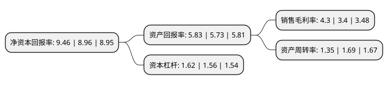

> 本页面由自动化程序生成于 2022年5月20日 01:01
> 内容可能存在错误，如有bug请提交issue至：https://github.com/Eroleice/doc-pi/issues
{.is-warning}

# 上市公司基本情况

## 基本资料

深圳市深粮控股股份有限公司（以下简称“深粮控股”）成立于1981年07月30日，深圳市。于1992年10月12日在深交所主板上市。

深粮控股注册资本115,253.525万元，主营业务在茶及天然植物精深加工为主的食品原料(配料)生产，研发和销售业务的基础上，新增粮油储备，粮油贸易，粮油加工等粮油流通及粮油储备服务业务。以下是详细信息：

- 公司名称: 深圳市深粮控股股份有限公司
- 股票代码: 000019.SZ
- 所在地: 广东 - 深圳市
- 成立日期: 1981年07月30日
- 注册资本: 115,253.525万元
- 法定代表人: 祝俊明
- 主营业务: 主营业务在茶及天然植物精深加工为主的食品原料(配料)生产，研发和销售业务的基础上，新增粮油储备，粮油贸易，粮油加工等粮油流通及粮油储备服务业务
- 公司官网: www.slkg1949.com
- 公司介绍: 公司是中国食品饮料行业首家上市公司，是中国大陆最早生产利乐软包饮料、发酵型乳酸菌饮料的企业之一，公司拥有“深宝”、“三井”、“金雕”等品牌，确立了“天然、绿色、健康”的茶产业为未来发展方向，公司将以茶叶精深加工为核心，以建设天然健康产品和服务一体化的产业链为目标，积极向茶园种植和体验基地以及终端产品两头延伸。公司将集中资源大力发展茶产业，加强在技术研发、市场网络建设、产业链运营和人才聚集等方面的投入和积累，通过建立一支专业化、职业化、高素质的运营团队，提升公司产业运营水平，构建领先于未来的核心能力，巩固和提升行业地位。2018年公司通过重大资产重组收购深粮集团100%股权,公司的主营业务在原有业务基础上增加粮油储备、粮油贸易、粮油加工等粮油流通及粮油储备服务业务，深粮集团在粮油行业深耕数十年，具有一定的品牌和规模优势。

## 股东及高管情况

上市公司第一大股东为深圳市食品物资集团有限公司，持股735,237,253股，占比63.79%，为上市公司实际控制人。

截至2022年03月31日，上市公司的前十大股东中，共有5名自然人股东，3名机构股东，1个产品账户，1个海外主体，其中5%以上大股东共有2名。上市公司前十大股东明细如下：

> 截至2022年03月31日，上市公司前十大股东信息如下：

| 股东名称 | 持股数量（股） | 持股比例 |
| --- | --- | --- |
| 深圳市食品物资集团有限公司 | 735,237,253 | 63.79% |
| 深圳市农产品集团股份有限公司 | 94,832,294 | 8.23% |
| 东莞市果菜副食交易市场有限公司 | 10,198,216 | 0.88% |
| 钟振鑫 | 3,295,500 | 0.29% |
| 孙慧明 | 3,250,062 | 0.28% |
| 林俊波 | 3,000,000 | 0.26% |
| 陈九阳 | 2,956,500 | 0.26% |
| 香港中央结算有限公司(陆股通) | 2,162,656 | 0.19% |
| 徐文星 | 2,028,640 | 0.18% |
| 本溪龙山泉啤酒有限公司 | 1,204,740 | 0.1% |

## 利润表分析

上市公司2021年总收入为101.39亿元，净利润为4.36亿元，实现盈利。

## 杜邦分析

> 数据列示周期：2021年 | 2020年 | 2019年
{.is-info}

上市公司的净资产收益率在近一年有所上升，上升幅度为5.58%，其变化情况分解如下：
- 上市公司的销售毛利率在近一年上升了26.47%，可能是生产效率的提升、商品原材料价格下跌或商品价格的上涨所致。
- 上市公司的资产周转率在近一年下降了-20.12%，可能是源自于更慢的销售回款或库存管理效果下降。
- 上市公司的财务杠杆比率在近一年上升了3.85%，可能是增加负债扩大生产规模。

