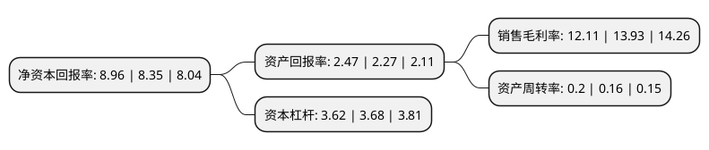

> 本页面由自动化程序生成于 2022年5月20日 01:01
> 内容可能存在错误，如有bug请提交issue至：https://github.com/Eroleice/doc-pi/issues
{.is-warning}

# 上市公司基本情况

## 基本资料

深圳市农产品集团股份有限公司（以下简称“农产品”）成立于1989年01月14日，深圳市。于1997年01月10日在深交所主板上市。

农产品注册资本169,696.413万元，主要业务:农产品批发市场，商场销售，农产品加工生产养殖，农产品配套服务。以下是详细信息：

- 公司名称: 深圳市农产品集团股份有限公司
- 股票代码: 000061.SZ
- 所在地: 广东 - 深圳市
- 成立日期: 1989年01月14日
- 注册资本: 169,696.413万元
- 法定代表人: 黄伟
- 主营业务: 农产品批发市场，商场销售，农产品加工生产养殖，农产品配套服务
- 公司官网: www.szap.com
- 公司介绍: 公司是一家以投资、开发、建设、经营和管理农产品批发市场为核心业务的大型现代化农产品流通企业集团。公司肩负使命、情系民生，始终致力于中国农产品流通领域的发展与进步。率先开创农批市场网络化经营模式，在深圳、北京、上海、天津、成都、西安、长沙、武汉等多个大中城市经营管理了多家综合批发市场和网上交易市场，形成国内最具规模的基于供应链管理的新型农产品流通生态圈。公司率先创导绿色交易，精心打造以保障食品安全、提高流通效率、综合利用资源为核心的海吉星品牌，使得海吉星市场汇集了公司在工程建设、食品安全、信息科技、电子商务、物流管理、金融服务、综合环保等领域的创新性成果，成为农产品流通行业转型升级的典范之作；率先探索以农产品交易所为龙头，依托辐射全国的实体市场与电商平台的产业版图，发挥线上线下网络优势和规模效应，构建行业内具有重要影响力的多品种、多层次、多模式的农产品绿色交易新体系。

## 股东及高管情况

上市公司第一大股东为深圳市食品物资集团有限公司，持股576,917,663股，占比34%，为上市公司实际控制人。

截至2022年03月31日，上市公司的前十大股东中，共有3名自然人股东，6名机构股东，1名其他股东，其中5%以上大股东共有3名。上市公司前十大股东明细如下：

> 截至2022年03月31日，上市公司前十大股东信息如下：

| 股东名称 | 持股数量（股） | 持股比例 |
| --- | --- | --- |
| 深圳市食品物资集团有限公司 | 576,917,663 | 34% |
| 富德生命人寿保险股份有限公司-万能H | 221,160,311 | 13.03% |
| 富德生命人寿保险股份有限公司-分红 | 215,623,559 | 12.71% |
| 富德生命人寿保险股份有限公司-万能G | 71,833,110 | 4.23% |
| 深圳市人力资源和社会保障局 | 20,183,306 | 1.19% |
| 深圳市深铁时代实业发展有限公司 | 20,183,306 | 1.19% |
| 中央汇金资产管理有限责任公司 | 18,434,400 | 1.09% |
| 许育峰 | 17,266,320 | 1.02% |
| 黄楚彬 | 15,000,000 | 0.88% |
| 许智强 | 10,100,015 | 0.6% |

## 利润表分析

上市公司2021年总收入为40.92亿元，净利润为4.95亿元，实现盈利。

## 杜邦分析

> 数据列示周期：2021年 | 2020年 | 2019年
{.is-info}

上市公司的净资产收益率在近一年有所上升，上升幅度为7.31%，其变化情况分解如下：
- 上市公司的销售毛利率在近一年下降了-13.07%，可能是生产效率的下降、商品原材料价格上涨或商品价格的下跌所致。
- 上市公司的资产周转率在近一年上升了25%，可能是源自于更快的销售回款或库存管理效果提升。
- 上市公司的财务杠杆比率在近一年下降了-1.63%，可能是减少负债降低财务费用。

