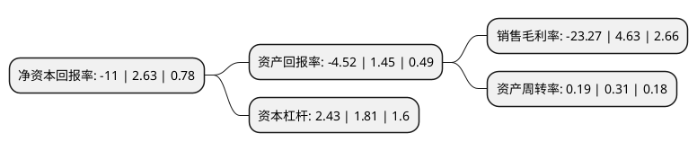

> 本页面由自动化程序生成于 2022年5月20日 01:03
> 内容可能存在错误，如有bug请提交issue至：https://github.com/Eroleice/doc-pi/issues
{.is-warning}

# 上市公司基本情况

## 基本资料

罗牛山股份有限公司（以下简称“罗牛山”）成立于1987年12月19日，海口市。于1997年06月11日在深交所主板上市。

罗牛山注册资本115,151.358万元，主要业务:以大农业为主，以房地产开发业务，教育产业为辅以下是详细信息：

- 公司名称: 罗牛山股份有限公司
- 股票代码: 000735.SZ
- 所在地: 海南 - 海口市
- 成立日期: 1987年12月19日
- 注册资本: 115,151.358万元
- 法定代表人: 徐自力
- 主营业务: 以大农业为主，以房地产开发业务，教育产业为辅
- 公司官网: www.luoniushan.com
- 公司介绍: 公司是中国首家“菜篮子”股份制上市企业，是以食品加工、冷链物流及畜牧养殖为主业，集房地产开发、教育、金融投资等板块的多元化企业集团，率先在全国实施资本化、品牌化、信息化和园区化战略。畜牧产业板块是公司传统主营板块，公司是海南省规模最大、配套产业体系最完备的畜牧业龙头企业，海南省最大的“菜篮子”工程保障基地，海南省最大的种猪繁育基地。其中，在建的罗牛山十万头现代化养猪场，是海南首个成套引进美式智能化生产线的超大型环保智能化规模养殖场。公司连续多年被农业部和海南省农业厅认定为农业产业化国家重点龙头企业、海南省农业龙头企业。公司正从“单一食品供应商”向“全类食品供应商”进行战略转型，食品加工及冷链物流产业板块是公司的核心板块。

## 股东及高管情况

上市公司第一大股东为罗牛山集团有限公司，持股197,412,938股，占比17.14%，**疑似为**上市公司实际控制人。

截至2022年03月31日，上市公司的前十大股东中，共有4名自然人股东，4名机构股东，1个产品账户，1个海外主体，其中5%以上大股东共有1名。上市公司前十大股东明细如下：

> 未能通过持股比例判定出上市公司实际控制人（持股30%以上）
> 可能存在通过间接持股、联合持股、协议控制等方式拥有实际控制权的主体，具体请参考上市公司定期公告！
{.is-warning}

> 截至2022年03月31日，上市公司前十大股东信息如下：

| 股东名称 | 持股数量（股） | 持股比例 |
| --- | --- | --- |
| 罗牛山集团有限公司 | 197,412,938 | 17.14% |
| 海口永盛畜牧机械工程有限公司 | 27,644,584 | 2.4% |
| 海南深兴贸易有限公司 | 14,450,000 | 1.25% |
| 香港中央结算有限公司(陆股通) | 8,546,841 | 0.74% |
| 海南冠翔贸易有限公司 | 7,225,000 | 0.63% |
| 浙商银行股份有限公司-国泰中证畜牧养殖交易型开放式指数证券投资基金 | 6,794,253 | 0.59% |
| 谭小燕 | 5,071,300 | 0.44% |
| 梁永智 | 4,334,900 | 0.38% |
| 谭小娟 | 4,112,200 | 0.36% |
| 王广军 | 3,828,300 | 0.33% |

## 利润表分析

上市公司2021年总收入为18.79亿元，净利润为-4.36亿元，**未实现盈利**。

## 杜邦分析

> 数据列示周期：2021年 | 2020年 | 2019年
{.is-info}

上市公司的净资产收益率在近一年有所下降，下降幅度为-518.25%，其变化情况分解如下：
- 上市公司的销售毛利率在近一年下降了-602.59%，可能是生产效率的下降、商品原材料价格上涨或商品价格的下跌所致。
- 上市公司的资产周转率在近一年下降了-38.71%，可能是源自于更慢的销售回款或库存管理效果下降。
- 上市公司的财务杠杆比率在近一年上升了34.25%，可能是增加负债扩大生产规模。

