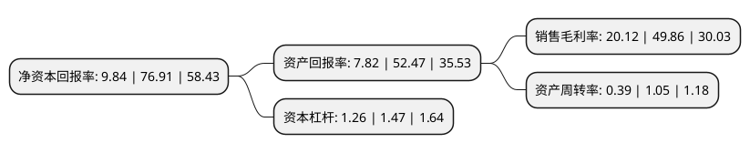

> 本页面由自动化程序生成于 2022年5月20日 01:05
> 内容可能存在错误，如有bug请提交issue至：https://github.com/Eroleice/doc-pi/issues
{.is-warning}

# 上市公司基本情况

## 基本资料

东瑞食品集团股份有限公司（以下简称“东瑞股份”）成立于2002年03月27日，河源市。于2021年04月28日在深交所主板上市。

东瑞股份注册资本17,733.8万元，公司主营业务为生猪的养殖和销售，主要产品为商品猪，仔猪，种猪等。此外，公司自行生产生猪养殖所需的饲料，并有部分饲料对外销售。以下是详细信息：

- 公司名称: 东瑞食品集团股份有限公司
- 股票代码: 001201.SZ
- 所在地: 广东 - 河源市
- 成立日期: 2002年03月27日
- 注册资本: 17,733.8万元
- 法定代表人: 袁建康
- 主营业务: 公司主营业务为生猪的养殖和销售，主要产品为商品猪，仔猪，种猪等此外，公司自行生产生猪养殖所需的饲料，并有部分饲料对外销售
- 公司官网: www.gdruichang.com
- 公司介绍: 公司采取“自育自繁自养一体化生态养殖”经营模式，形成了集饲料生产、生猪育种、种猪扩繁、商品猪饲养、活大猪供港及生猪内地销售于一体的完整生猪产业链；公司是内地供港活大猪前三大供应商之一和粤港澳大湾区“菜篮子”生产基地，在“非洲猪瘟”疫情造成我国生猪产能较大下降的情况下，为保障中国香港和广东省的生猪供应发挥了重要作用。公司被评定为农业产业化国家重点龙头企业、国家生猪核心育种场、广东出口活猪质量安全示范企业、广东省农产品出口示范基地、畜禽养殖废弃物资源化利用“种养结合示范基地”、农业部畜禽标准化示范场、农业部生猪标准化示范场、粤港澳大湾区“菜篮子”生产基地，并当选中国畜牧业协会猪业分会副会长单位、广东省养猪行业协会副会长单位，公司拥有的“东瑞”牌活肉猪被评为“广东十大名牌农产品——广东名猪”，荣获第十四届中国国际农产品交易会参展农产品金奖。此外，公司积极参与广东省、河源市“扶贫济困日”活动，2015-2019年度连续荣获广东扶贫济困“红棉杯铜杯”。

## 股东及高管情况

上市公司第一大股东为袁建康，持股35,773,640股，占比20.17%，**疑似为**上市公司实际控制人。

截至2022年03月31日，上市公司的前十大股东中，共有8名自然人股东，2名机构股东，其中5%以上大股东共有4名。上市公司前十大股东明细如下：

> 未能通过持股比例判定出上市公司实际控制人（持股30%以上）
> 可能存在通过间接持股、联合持股、协议控制等方式拥有实际控制权的主体，具体请参考上市公司定期公告！
{.is-warning}

> 截至2022年03月31日，上市公司前十大股东信息如下：

| 股东名称 | 持股数量（股） | 持股比例 |
| --- | --- | --- |
| 袁建康 | 35,773,640 | 20.17% |
| 东莞市东晖实业投资有限公司 | 21,883,820 | 12.34% |
| 东莞市安夏实业投资有限公司 | 12,207,720 | 6.88% |
| 曾东强 | 9,414,160 | 5.31% |
| 袁伟康 | 8,001,840 | 4.51% |
| 潘汝羲 | 6,590,080 | 3.72% |
| 漆良国 | 5,648,720 | 3.19% |
| 蒋荣彪 | 5,648,720 | 3.19% |
| 李应先 | 4,706,800 | 2.65% |
| 李珍泉 | 4,706,800 | 2.65% |

## 利润表分析

上市公司2021年总收入为10.51亿元，净利润为2.11亿元，实现盈利。

## 杜邦分析

> 数据列示周期：2021年 | 2020年 | 2019年
{.is-info}

上市公司的净资产收益率在近一年有所下降，下降幅度为-87.21%，其变化情况分解如下：
- 上市公司的销售毛利率在近一年下降了-59.65%，可能是生产效率的下降、商品原材料价格上涨或商品价格的下跌所致。
- 上市公司的资产周转率在近一年下降了-62.86%，可能是源自于更慢的销售回款或库存管理效果下降。
- 上市公司的财务杠杆比率在近一年下降了-14.29%，可能是减少负债降低财务费用。

