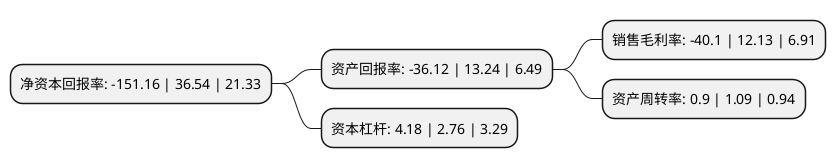

> 本页面由自动化程序生成于 2022年5月20日 01:06
> 内容可能存在错误，如有bug请提交issue至：https://github.com/Eroleice/doc-pi/issues
{.is-warning}

# 上市公司基本情况

## 基本资料

江西正邦科技股份有限公司（以下简称“正邦科技”）成立于1996年09月26日，南昌市。于2007年08月17日在深交所中小板上市。

正邦科技注册资本314,642.563万元，主营业务:猪饲料，禽饲料，水产料，其他料，种猪及商品猪。饲料生产及销售。以下是详细信息：

- 公司名称: 江西正邦科技股份有限公司
- 股票代码: 002157.SZ
- 所在地: 江西 - 南昌市
- 成立日期: 1996年09月26日
- 注册资本: 314,642.563万元
- 法定代表人: 林峰
- 主营业务: 主营业务:猪饲料，禽饲料，水产料，其他料，种猪及商品猪饲料生产及销售
- 公司官网: www.zhengbang.com
- 公司介绍: 公司是一家以农业为基础、在农业产业化领域内不断进行产业拓展经营的农牧企业，分设饲料、养殖、种植、物流、金融等产业集团，以种猪育种、商品猪养殖、种鸭繁育、农作物优良新品种选育、肉食品加工、饲料、兽药、生物农药、芳樟种植及芳樟产品加工、油茶种植及油茶产品加工、大米加工、相关产品的销售与技术服务以及基于农业产业链的贷款、担保、融资租赁、资产管理为主营业务。正邦饲料获得中国名牌称号，正邦商标荣获中国驰名商标。集团设立了国家博士后科研工作站、院士工作站、正邦农业科学院，拥有国家企业技术中心、省工程技术研究中心等技术研发平台，承担了包括国家“863计划”——生态福利养猪关键技术研究在内的国家及省市科研项目。

## 股东及高管情况

上市公司第一大股东为正邦集团有限公司，持股749,732,352股，占比23.83%，**疑似为**上市公司实际控制人。

截至2022年03月31日，上市公司的前十大股东中，共有7名机构股东，1个产品账户，2个海外主体，其中5%以上大股东共有7名。上市公司前十大股东明细如下：

> 未能通过持股比例判定出上市公司实际控制人（持股30%以上）
> 可能存在通过间接持股、联合持股、协议控制等方式拥有实际控制权的主体，具体请参考上市公司定期公告！
{.is-warning}

> 截至2022年03月31日，上市公司前十大股东信息如下：

| 股东名称 | 持股数量（股） | 持股比例 |
| --- | --- | --- |
| 正邦集团有限公司 | 749,732,352 | 23.83% |
| 正邦集团有限公司 | 729,238,222 | 23.1767% |
| 正邦集团有限公司 | 723,314,522 | 22.99% |
| 江西永联农业控股有限公司 | 692,912,702 | 22.0222% |
| 江西永联农业控股有限公司 | 684,223,267 | 21.746% |
| LIEW KENNETH THOW JIUN | 169,636,419 | 5.3914% |
| LIEW KENNETH THOW JIUN | 169,636,419 | 5.3914% |
| 共青城邦鼎投资有限公司 | 75,987,841 | 2.42% |
| 红塔红土基金-江西正邦科技股份有限公司第一期员工持股计划-红塔红土正邦科技第一期员工持股单一资产管理计划 | 12,027,140 | 0.38% |
| 烟台恒中企业管理有限公司 | 11,870,268 | 0.38% |

## 利润表分析

上市公司2021年总收入为476.7亿元，净利润为-191.15亿元，**未实现盈利**。

## 杜邦分析

> 数据列示周期：2021年 | 2020年 | 2019年
{.is-info}

上市公司的净资产收益率在近一年有所下降，下降幅度为-513.68%，其变化情况分解如下：
- 上市公司的销售毛利率在近一年下降了-430.59%，可能是生产效率的下降、商品原材料价格上涨或商品价格的下跌所致。
- 上市公司的资产周转率在近一年下降了-17.43%，可能是源自于更慢的销售回款或库存管理效果下降。
- 上市公司的财务杠杆比率在近一年上升了51.45%，可能是增加负债扩大生产规模。

