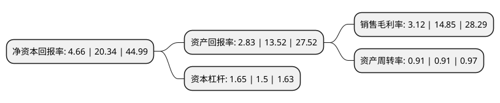

> 本页面由自动化程序生成于 2022年5月20日 01:07
> 内容可能存在错误，如有bug请提交issue至：https://github.com/Eroleice/doc-pi/issues
{.is-warning}

# 上市公司基本情况

## 基本资料

福建圣农发展股份有限公司（以下简称“圣农发展”）成立于1999年12月21日，南平市。于2009年10月21日在深交所中小板上市。

圣农发展注册资本124,397.34万元，肉鸡饲养和肉鸡屠宰加工，主要产品是鸡肉，并主要以分割冻鸡肉的产品形式，销售给肯德基等快餐企业，以及食品加工企业，批发市场等市场领域。以下是详细信息：

- 公司名称: 福建圣农发展股份有限公司
- 股票代码: 002299.SZ
- 所在地: 福建 - 南平市
- 成立日期: 1999年12月21日
- 注册资本: 124,397.34万元
- 法定代表人: 傅光明
- 主营业务: 肉鸡饲养和肉鸡屠宰加工，主要产品是鸡肉，并主要以分割冻鸡肉的产品形式，销售给肯德基等快餐企业，以及食品加工企业，批发市场等市场领域
- 公司官网: www.sunnercn.com
- 公司介绍: 公司专注于白羽鸡生产三十多年，是国内同行业现代化程度最高、品质最好、规模最大的集饲料加工、祖代与父母代种鸡养殖、种蛋孵化、肉鸡饲养、肉鸡屠宰加工为一体的联合型企业。公司凭借完整的一体化全产业链实现了食品安全的可追溯性，并依靠优良的品质和稳定的供应成为肯德基的长期战略合作伙伴，麦当劳唯一中国本土鸡肉供应商，以及双汇、太太乐、安井、海霸王、沃尔玛、麦德龙、华润万家、世纪联华、永辉等食品加工企业及大型超市重要鸡肉供应商。公司始终坚持科学的发展观，在发展过程中不断实现自我改进与自我转型，采用世界先进的生产设备和生产工艺，实现了产业链各个环节的规模化生产，并通过规模化、标准化和系统化运营，始终保持着国内肉鸡行业的领先地位。

## 股东及高管情况

上市公司第一大股东为福建圣农控股集团有限公司，持股543,269,848股，占比43.67%，为上市公司实际控制人。

截至2022年03月31日，上市公司的前十大股东中，共有2名自然人股东，3名机构股东，3个产品账户，2个海外主体，其中5%以上大股东共有2名。上市公司前十大股东明细如下：

> 截至2022年03月31日，上市公司前十大股东信息如下：

| 股东名称 | 持股数量（股） | 持股比例 |
| --- | --- | --- |
| 福建圣农控股集团有限公司 | 543,269,848 | 43.67% |
| 香港中央结算有限公司(陆股通) | 120,339,833 | 9.67% |
| 环胜信息技术(上海)有限公司 | 62,220,500 | 5% |
| 傅长玉 | 33,253,520 | 2.67% |
| 中国工商银行股份有限公司-中欧时代先锋股票型发起式证券投资基金 | 16,429,289 | 1.32% |
| 中国建设银行股份有限公司-中欧新蓝筹灵活配置混合型证券投资基金 | 15,055,316 | 1.21% |
| KKR Poultry Investment S.à r.l. | 14,967,078 | 1.2% |
| 光泽县新圣合食品合伙企业(有限合伙) | 11,135,073 | 0.9% |
| 傅芬芳 | 10,819,160 | 0.87% |
| 兴业银行股份有限公司-中欧新趋势股票型证券投资基金(LOF) | 9,286,076 | 0.75% |

## 杜邦分析

> 数据列示周期：2021年 | 2020年 | 2019年
{.is-info}

上市公司的净资产收益率在近一年有所下降，下降幅度为-77.09%，其变化情况分解如下：
- 上市公司的销售毛利率在近一年下降了-78.99%，可能是生产效率的下降、商品原材料价格上涨或商品价格的下跌所致。
- 上市公司的资产周转率在近一年下降了0%，可能是源自于更慢的销售回款或库存管理效果下降。
- 上市公司的财务杠杆比率在近一年上升了10%，可能是增加负债扩大生产规模。

