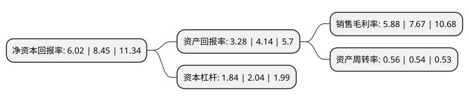

> 本页面由自动化程序生成于 2022年5月20日 01:11
> 内容可能存在错误，如有bug请提交issue至：https://github.com/Eroleice/doc-pi/issues
{.is-warning}

# 上市公司基本情况

## 基本资料

金河生物科技股份有限公司（以下简称“金河生物”）成立于1990年03月14日，呼和浩特市。于2012年07月13日在深交所中小板上市。

金河生物注册资本78,042.24万元，主要产品:饲用金霉素，盐酸金霉素以及盐霉素。主营业务:药物饲料添加剂的生产和销售。以下是详细信息：

- 公司名称: 金河生物科技股份有限公司
- 股票代码: 002688.SZ
- 所在地: 内蒙古 - 呼和浩特市
- 成立日期: 1990年03月14日
- 注册资本: 78,042.24万元
- 法定代表人: 王东晓
- 主营业务: 主要产品:饲用金霉素，盐酸金霉素以及盐霉素主营业务:药物饲料添加剂的生产和销售
- 公司官网: www.jinhe.com.cn
- 公司介绍: 公司是一家生产和销售饲用金霉素及动物保健品为主的民营控股企业，国家科委认定为“国家重点高新技术企业”，同时也是内蒙古自治区60家重点企业之一。主营业务为药物饲料添加剂的生产和销售。公司产品通过农业部兽药GMP认证，美国FDA、欧洲EDQM的审验，产品较早获准进入美国市场销售。公司产品销往全球20多个的国家和地区，在客户中形成了较高的知名度和美誉度，成为全球饲用金霉素生产规模最大的企业之一。“金河”商标被国家工商行政管理总局认定为驰名商标。公司是我国饲用金霉素使用标准的编制者，并被国家九部委认定为农业产业化国家重点龙头企业。

## 股东及高管情况

上市公司第一大股东为内蒙古金河控股有限公司，持股241,758,670股，占比30.98%，为上市公司实际控制人。

截至2022年04月29日，上市公司的前十大股东中，共有4名自然人股东，4名机构股东，2个产品账户，其中5%以上大股东共有1名。上市公司前十大股东明细如下：

> 截至2022年04月29日，上市公司前十大股东信息如下：

| 股东名称 | 持股数量（股） | 持股比例 |
| --- | --- | --- |
| 内蒙古金河控股有限公司 | 241,758,670 | 30.98% |
| 内蒙古金融资产管理有限公司 | 35,398,230 | 4.54% |
| 路牡丹 | 25,964,401 | 3.33% |
| 国信证券股份有限公司 | 8,849,557 | 1.13% |
| 路漫漫 | 7,599,645 | 0.97% |
| 中国光大银行股份有限公司-华夏磐益一年定期开放混合型证券投资基金 | 6,690,513 | 0.86% |
| 上海般胜私募基金管理有限公司-般胜大旭1号私募证券投资基金 | 6,040,000 | 0.77% |
| 章玉凤 | 5,992,250 | 0.77% |
| 呼和浩特昌福兴投资管理企业(有限合伙) | 4,613,943 | 0.59% |
| 李福忠 | 4,564,465 | 0.58% |

## 利润表分析

上市公司2021年总收入为20.77亿元，净利润为1.22亿元，实现盈利。

## 杜邦分析

> 数据列示周期：2021年 | 2020年 | 2019年
{.is-info}

上市公司的净资产收益率在近一年有所下降，下降幅度为-28.76%，其变化情况分解如下：
- 上市公司的销售毛利率在近一年下降了-23.34%，可能是生产效率的下降、商品原材料价格上涨或商品价格的下跌所致。
- 上市公司的资产周转率在近一年上升了3.7%，可能是源自于更快的销售回款或库存管理效果提升。
- 上市公司的财务杠杆比率在近一年下降了-9.8%，可能是减少负债降低财务费用。

