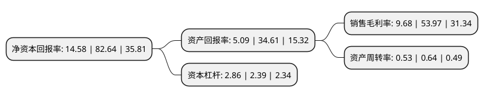

> 本页面由自动化程序生成于 2022年5月20日 01:11
> 内容可能存在错误，如有bug请提交issue至：https://github.com/Eroleice/doc-pi/issues
{.is-warning}

# 上市公司基本情况

## 基本资料

牧原食品股份有限公司（以下简称“牧原股份”）成立于2000年07月13日，南阳市。于2014年01月28日在深交所中小板上市。

牧原股份注册资本526,238.769万元，公司主营业务为生猪的养殖与销售，主要产品为仔猪，种猪，商品猪。以下是详细信息：

- 公司名称: 牧原食品股份有限公司
- 股票代码: 002714.SZ
- 所在地: 河南 - 南阳市
- 成立日期: 2000年07月13日
- 注册资本: 526,238.769万元
- 法定代表人: 秦英林
- 主营业务: 公司主营业务为生猪的养殖与销售，主要产品为仔猪，种猪，商品猪
- 公司官网: www.muyuanfoods.com
- 公司介绍: 公司是集饲料加工、生猪育种、种猪扩繁、商品猪饲养、屠宰加工为一体的农业产业化国家重点龙头企业，是我国最大的自育自繁自养大规模一体化的生猪养殖企业之一，也是我国最大的生猪育种企业之一。主营业务为种猪和商品猪的养殖与销售，主要产品为种猪、商品猪。公司拥有一条集饲料加工、生猪育种、种猪扩繁、商品猪饲养等多个环节于一体的完整生猪产业链，并拥有自动化水平较高的猪舍和饲喂系统、强大的生猪育种技术、独特的饲料配方技术。目前，公司是第一批国家生猪核心育种场、国家级星火计划项目证书、国家现代农业产业技术体系生猪产业综合实验站、国家生猪活体储备基地、国家级原种猪场、国家级青年文明号单位、国家生猪试验站。

## 股东及高管情况

上市公司第一大股东为秦英林，持股2,086,287,906股，占比39.2%，为上市公司实际控制人。

截至2022年03月31日，上市公司的前十大股东中，共有6名自然人股东，2名机构股东，1个产品账户，1个海外主体，其中5%以上大股东共有2名。上市公司前十大股东明细如下：

> 截至2022年03月31日，上市公司前十大股东信息如下：

| 股东名称 | 持股数量（股） | 持股比例 |
| --- | --- | --- |
| 秦英林 | 2,086,287,906 | 39.2% |
| 牧原实业集团有限公司 | 684,812,822 | 12.87% |
| 香港中央结算有限公司(陆股通) | 178,752,886 | 3.36% |
| 钱瑛 | 64,445,240 | 1.21% |
| 孙惠刚 | 58,314,606 | 1.1% |
| 牧原食品股份有限公司-第二期员工持股计划 | 56,443,800 | 1.06% |
| 海南鸿宝投资有限公司 | 46,025,260 | 0.86% |
| 李燕燕 | 33,756,730 | 0.63% |
| 蔡敏 | 29,967,793 | 0.56% |
| 钱运鹏 | 23,573,397 | 0.44% |

## 利润表分析

上市公司2021年总收入为788.89亿元，净利润为76.38亿元，实现盈利。

## 杜邦分析

> 数据列示周期：2021年 | 2020年 | 2019年
{.is-info}

上市公司的净资产收益率在近一年有所下降，下降幅度为-82.36%，其变化情况分解如下：
- 上市公司的销售毛利率在近一年下降了-82.06%，可能是生产效率的下降、商品原材料价格上涨或商品价格的下跌所致。
- 上市公司的资产周转率在近一年下降了-17.19%，可能是源自于更慢的销售回款或库存管理效果下降。
- 上市公司的财务杠杆比率在近一年上升了19.67%，可能是增加负债扩大生产规模。

