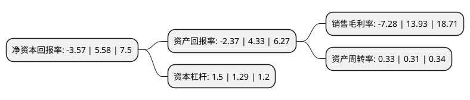

> 本页面由自动化程序生成于 2022年5月20日 01:12
> 内容可能存在错误，如有bug请提交issue至：https://github.com/Eroleice/doc-pi/issues
{.is-warning}

# 上市公司基本情况

## 基本资料

绿康生化股份有限公司（以下简称“绿康生化”）成立于2003年06月13日，南平市。于2017年05月03日在深交所中小板上市。

绿康生化注册资本15,541.584万元，公司是一家专注于兽药研发，生产和销售的高新技术企业，其业务范围涵盖兽用预混剂，兽用原料药，食品防腐剂等多个领域，生产产品包括杆菌肽类产品，硫酸黏菌素类产品，纳他霉素食品防腐剂等。以下是详细信息：

- 公司名称: 绿康生化股份有限公司
- 股票代码: 002868.SZ
- 所在地: 福建 - 南平市
- 成立日期: 2003年06月13日
- 注册资本: 15,541.584万元
- 法定代表人: 赖潭平
- 主营业务: 公司是一家专注于兽药研发，生产和销售的高新技术企业，其业务范围涵盖兽用预混剂，兽用原料药，食品防腐剂等多个领域，生产产品包括杆菌肽类产品，硫酸黏菌素类产品，纳他霉素食品防腐剂等
- 公司官网: www.pclifecome.com
- 公司介绍: 公司是一家专注于兽药研发、生产和销售的高新技术企业，其业务范围涵盖兽用预混剂、兽用原料药、食品防腐剂等多个领域，生产产品包括杆菌肽类产品、硫酸黏菌素类产品、纳他霉素食品防腐剂等。公司目前的主要产品为杆菌肽类产品，其主要包括杆菌肽锌预混剂(BZN)和亚甲基水杨酸杆菌肽预混剂(MDAB)，其以药物饲料添加剂的方式用于下游畜牧业及养殖业，对促进畜禽生长和预防动物肠道疾病有很好的作用。公司产品质量符合《中国兽药典》及USP、EP药典标准，通过了中国农业部兽药GMP验收、EU-GMP验收、澳大利亚兽药管理部门GMP验收、通过ISO14001环境管理体系认证和ISO18001职业健康安全管理体系认证；亚甲基水杨酸杆菌肽预混剂产品被中国农业部批准为五类新兽药；亚甲基水杨酸杆菌肽、亚甲基水杨酸杆菌肽可溶性粉被中国农业部批准为二类新兽药；亚甲基水杨酸杆菌肽生产线通过美国GMP现场检查；纳他霉素产品通过了ISO9001质量管理体系认证、食品安全管理体系认证(ISO22000)、国际清真认证(HALAL)以及国际犹太认证(KOSHER)等。

## 股东及高管情况

上市公司第一大股东为上海康怡投资有限公司，持股47,291,400股，占比30.43%，为上市公司实际控制人。

截至2022年03月31日，上市公司的前十大股东中，共有6名自然人股东，4名机构股东，其中5%以上大股东共有4名。上市公司前十大股东明细如下：

> 截至2022年03月31日，上市公司前十大股东信息如下：

| 股东名称 | 持股数量（股） | 持股比例 |
| --- | --- | --- |
| 上海康怡投资有限公司 | 47,291,400 | 30.43% |
| 合力(亚洲)投资有限公司 | 41,489,860 | 26.7% |
| 合力(亞洲)投資有限公司 | 41,489,860 | 26.7% |
| 富杰(平潭)投资有限公司 | 10,998,000 | 7.08% |
| 赖潭平 | 2,075,814 | 1.34% |
| 徐进一 | 1,067,100 | 0.69% |
| 徐春霖 | 1,055,106 | 0.68% |
| 郑炜 | 948,900 | 0.61% |
| 翁如山 | 680,420 | 0.44% |
| 田建伟 | 638,840 | 0.41% |

## 利润表分析

上市公司2021年总收入为3.63亿元，净利润为-0.27亿元，**未实现盈利**。

## 杜邦分析

> 数据列示周期：2021年 | 2020年 | 2019年
{.is-info}

上市公司的净资产收益率在近一年有所下降，下降幅度为-163.98%，其变化情况分解如下：
- 上市公司的销售毛利率在近一年下降了-152.26%，可能是生产效率的下降、商品原材料价格上涨或商品价格的下跌所致。
- 上市公司的资产周转率在近一年上升了6.45%，可能是源自于更快的销售回款或库存管理效果提升。
- 上市公司的财务杠杆比率在近一年上升了16.28%，可能是增加负债扩大生产规模。

