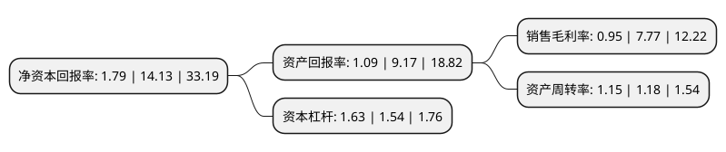

> 本页面由自动化程序生成于 2022年5月20日 01:13
> 内容可能存在错误，如有bug请提交issue至：https://github.com/Eroleice/doc-pi/issues
{.is-warning}

# 上市公司基本情况

## 基本资料

湖南湘佳牧业股份有限公司（以下简称“湘佳股份”）成立于2003年04月08日，常德市。于2020年04月24日在深交所中小板上市。

湘佳股份注册资本10,188万元，主营业务:种禽繁育，家禽饲养及销售，禽类屠宰加工及销售，饲料，生物肥生产及销售。以下是详细信息：

- 公司名称: 湖南湘佳牧业股份有限公司
- 股票代码: 002982.SZ
- 所在地: 湖南 - 常德市
- 成立日期: 2003年04月08日
- 注册资本: 10,188万元
- 法定代表人: 喻自文
- 主营业务: 主营业务:种禽繁育，家禽饲养及销售，禽类屠宰加工及销售，饲料，生物肥生产及销售
- 公司官网: www.xiangjiamuye.com
- 公司介绍: 公司是以“公司+农户+农贸市场”、“公司+基地+直营”为经营模式，以“五统一、一分散”为企业运营特征的优质鸡养殖企业，主营业务为种禽繁育，家禽饲养及销售，禽类屠宰加工及销售，饲料、生物肥生产及销售，经过十余年的市场积累和规模化、标准化养殖模式的实践，公司在行业内树立了养殖高标准化、生鲜及冷链物流行业领先、食品安全有保障的市场形象，与一系列客户建立了较为稳定的合作关系，在下游客户中享有良好的声誉。目前公司已发展成为饲料生产及销售、种禽繁育、家禽饲养及销售、禽类屠宰加工及销售、生物肥生产及销售的全产业链企业，公司先后获得“湘佳”商标获得“湖南省著名商标”并且“湘佳”商标被国家工商总局认定为“中国驰名商标”，通过了国家农业部无公害农产品认证和湖南省农业厅无公害农产品产地认证，国家级湘佳鸡标准化示范区项目成为第六批全国标准化示范项目，被农业部等8部委认定为“国家级农业产业化重点龙头企业”等多项荣誉。

## 股东及高管情况

上市公司第一大股东为喻自文，持股23,000,000股，占比22.58%，**疑似为**上市公司实际控制人。

截至2022年03月31日，上市公司的前十大股东中，共有6名自然人股东，1名机构股东，3个产品账户，其中5%以上大股东共有3名。上市公司前十大股东明细如下：

> 未能通过持股比例判定出上市公司实际控制人（持股30%以上）
> 可能存在通过间接持股、联合持股、协议控制等方式拥有实际控制权的主体，具体请参考上市公司定期公告！
{.is-warning}

> 截至2022年03月31日，上市公司前十大股东信息如下：

| 股东名称 | 持股数量（股） | 持股比例 |
| --- | --- | --- |
| 喻自文 | 23,000,000 | 22.58% |
| 邢卫民 | 23,000,000 | 22.58% |
| 湖南大靖双佳投资企业(有限合伙) | 9,000,450 | 8.83% |
| 喻薇融 | 2,000,000 | 1.96% |
| 邢成男 | 2,000,000 | 1.96% |
| 交通银行股份有限公司-工银瑞信互联网加股票型证券投资基金 | 1,507,657 | 1.48% |
| 龙洋 | 1,500,000 | 1.47% |
| 舒军 | 1,250,000 | 1.23% |
| 中国农业银行股份有限公司-工银瑞信信息产业混合型证券投资基金 | 1,136,700 | 1.12% |
| 中国农业银行股份有限公司-工银瑞信创新成长混合型证券投资基金 | 1,009,804 | 0.99% |

## 利润表分析

上市公司2021年总收入为30.05亿元，净利润为0.28亿元，实现盈利。

## 杜邦分析

> 数据列示周期：2021年 | 2020年 | 2019年
{.is-info}

上市公司的净资产收益率在近一年有所下降，下降幅度为-87.33%，其变化情况分解如下：
- 上市公司的销售毛利率在近一年下降了-87.77%，可能是生产效率的下降、商品原材料价格上涨或商品价格的下跌所致。
- 上市公司的资产周转率在近一年下降了-2.54%，可能是源自于更慢的销售回款或库存管理效果下降。
- 上市公司的财务杠杆比率在近一年上升了5.84%，可能是增加负债扩大生产规模。

