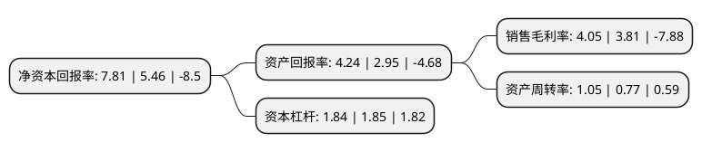

> 本页面由自动化程序生成于 2022年5月20日 01:15
> 内容可能存在错误，如有bug请提交issue至：https://github.com/Eroleice/doc-pi/issues
{.is-warning}

# 上市公司基本情况

## 基本资料

新疆西部牧业股份有限公司（以下简称“西部牧业”）成立于2003年06月18日，石河子市。于2010年08月20日在深交所创业板上市。

西部牧业注册资本21,133.231万元，本公司主营业务是以生鲜乳生产，收购与销售为主，乳制品加工与销售，种畜的养殖与销售和畜产品生产与销售，饲料的加工与销售，肉食品的加工与销售，牛羊肉分割销售，仓储，畜牧机械生产，畜牧技术咨询服务，牧草收割销售的畜牧型企业集团。主要产品:生鲜乳，乳制品，种畜销售，饲料，牛羊肉等，属畜牧业。以下是详细信息：

- 公司名称: 新疆西部牧业股份有限公司
- 股票代码: 300106.SZ
- 所在地: 新疆 - 石河子市
- 成立日期: 2003年06月18日
- 注册资本: 21,133.231万元
- 法定代表人: 李昌胜
- 主营业务: 本公司主营业务是以生鲜乳生产，收购与销售为主，乳制品加工与销售，种畜的养殖与销售和畜产品生产与销售，饲料的加工与销售，肉食品的加工与销售，牛羊肉分割销售，仓储，畜牧机械生产，畜牧技术咨询服务，牧草收割销售的畜牧型企业集团主要产品:生鲜乳，乳制品，种畜销售，饲料，牛羊肉等，属畜牧业
- 公司官网: www.xjxbmy.com
- 公司介绍: 公司是专业的优质生鲜乳供应商，新疆地区集奶牛集约化养殖、种畜繁育、优质生鲜乳供应于一体的畜牧业产业化龙头企业，拥有种畜良种繁育、饲料生产加工、奶牛集约养殖、牲畜屠宰加工、鲜奶收购及冷链配送等完整的畜牧经济产业链。公司主营乳制品加工与销售、自产生鲜乳生产与销售、外购生鲜乳收购与销售、种畜养殖与销售、分割肉加工与销售、饲料生产与销售、油脂生产与销售、生猪养殖与销售、牧草收割及机耕服务等。公司坚持以生物技术为先导，以种畜良种繁育为龙头，以现代化畜牧集约化养殖为基础，致力于将公司打造成“立足新疆、全国著名”的良种繁育、集约化养殖和现代畜牧龙头企业。

## 股东及高管情况

上市公司第一大股东为石河子国有资产经营(集团)有限公司，持股88,378,171股，占比41.82%，为上市公司实际控制人。

截至2022年03月31日，上市公司的前十大股东中，共有6名自然人股东，2名机构股东，2个海外主体，其中5%以上大股东共有1名。上市公司前十大股东明细如下：

> 截至2022年03月31日，上市公司前十大股东信息如下：

| 股东名称 | 持股数量（股） | 持股比例 |
| --- | --- | --- |
| 石河子国有资产经营(集团)有限公司 | 88,378,171 | 41.82% |
| MORGAN STANLEY & CO. INTERNATIONAL PLC. | 1,319,391 | 0.62% |
| UBS   AG | 1,127,124 | 0.53% |
| 华泰证券股份有限公司 | 619,125 | 0.29% |
| 吴卫峰 | 570,000 | 0.27% |
| 刘伯祥 | 557,200 | 0.26% |
| 唐燕军 | 478,100 | 0.23% |
| 胡龙 | 450,000 | 0.21% |
| 侯爱林 | 422,200 | 0.2% |
| 徐望辉 | 419,100 | 0.2% |

## 利润表分析

上市公司2021年总收入为11.27亿元，净利润为0.45亿元，实现盈利。

## 杜邦分析

> 数据列示周期：2021年 | 2020年 | 2019年
{.is-info}

上市公司的净资产收益率在近一年有所上升，上升幅度为43.04%，其变化情况分解如下：
- 上市公司的销售毛利率在近一年上升了6.3%，可能是生产效率的提升、商品原材料价格下跌或商品价格的上涨所致。
- 上市公司的资产周转率在近一年上升了36.36%，可能是源自于更快的销售回款或库存管理效果提升。
- 上市公司的财务杠杆比率在近一年下降了-0.54%，可能是减少负债降低财务费用。

