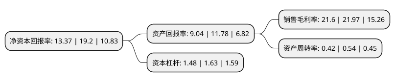

> 本页面由自动化程序生成于 2022年5月20日 01:15
> 内容可能存在错误，如有bug请提交issue至：https://github.com/Eroleice/doc-pi/issues
{.is-warning}

# 上市公司基本情况

## 基本资料

天津瑞普生物技术股份有限公司（以下简称“瑞普生物”）成立于2001年08月02日，天津市。于2010年09月17日在深交所创业板上市。

瑞普生物注册资本46,834.404万元，主营业务为兽用生物制品和兽用制剂研发，生产，销售和技术服务。主要产品包括兽用生物制品和兽用制剂两大类276个品种。以下是详细信息：

- 公司名称: 天津瑞普生物技术股份有限公司
- 股票代码: 300119.SZ
- 所在地: 天津 - 天津市
- 成立日期: 2001年08月02日
- 注册资本: 46,834.404万元
- 法定代表人: 李守军
- 主营业务: 主营业务为兽用生物制品和兽用制剂研发，生产，销售和技术服务主要产品包括兽用生物制品和兽用制剂两大类276个品种
- 公司官网: www.ringpu.com
- 公司介绍: 公司是一家服务于动物健康产业的高新技术企业，主要从事兽用生物制品和兽用制剂研发、生产、销售和技术服务，是一家具有原始创新能力，产品丰富、结构合理，为国内少数几家产品覆盖动物疫病预防、诊断、治疗、促生长以及调节免疫机制的兽药企业之一。公司为高新技术企业，科研能力强，“新型高效安全畜禽免疫增强剂-胞肽”获得“国家重点新产品”证书，“动物用冻干活疫苗耐热保护免疫增强剂及其制备方法”被中国发明协会授予“全国发明展览会金奖”等。公司还拥有“国家企业技术中心”、“全国重点实验室”以及三家省级“院士工作站”，公司申报的“农业部生物兽药创制重点实验室”获得批准，成为行业内仅有的以兽药开发和创新制作为研究方向的3家农业部重点实验室(企业)依托单位之一。

## 股东及高管情况

上市公司第一大股东为李守军，持股167,474,479股，占比35.76%，为上市公司实际控制人。

截至2022年03月31日，上市公司的前十大股东中，共有5名自然人股东，1名机构股东，2个产品账户，2个海外主体，其中5%以上大股东共有2名。上市公司前十大股东明细如下：

> 截至2022年03月31日，上市公司前十大股东信息如下：

| 股东名称 | 持股数量（股） | 持股比例 |
| --- | --- | --- |
| 李守军 | 167,474,479 | 35.76% |
| 梁武 | 23,716,898 | 5.06% |
| 高华-汇丰-GOLDMAN, SACHS & CO.LLC | 17,967,210 | 3.84% |
| 中国建设银行股份有限公司-广发价值领先混合型证券投资基金 | 12,308,998 | 2.63% |
| 鲍恩东 | 11,165,454 | 2.38% |
| 苏雅拉达来 | 10,977,595 | 2.34% |
| 盈科创新资产管理有限公司-青岛盈科价值创业投资合伙企业(有限合伙) | 8,809,874 | 1.88% |
| 香港中央结算有限公司(陆股通) | 7,332,987 | 1.57% |
| 上海磐耀资产管理有限公司-磐耀通享13号私募证券投资基金 | 6,742,000 | 1.44% |
| 周仲华 | 5,183,305 | 1.11% |

## 利润表分析

上市公司2021年总收入为20.07亿元，净利润为4.33亿元，实现盈利。

## 杜邦分析

> 数据列示周期：2021年 | 2020年 | 2019年
{.is-info}

上市公司的净资产收益率在近一年有所下降，下降幅度为-30.36%，其变化情况分解如下：
- 上市公司的销售毛利率在近一年下降了-1.68%，可能是生产效率的下降、商品原材料价格上涨或商品价格的下跌所致。
- 上市公司的资产周转率在近一年下降了-22.22%，可能是源自于更慢的销售回款或库存管理效果下降。
- 上市公司的财务杠杆比率在近一年下降了-9.2%，可能是减少负债降低财务费用。

