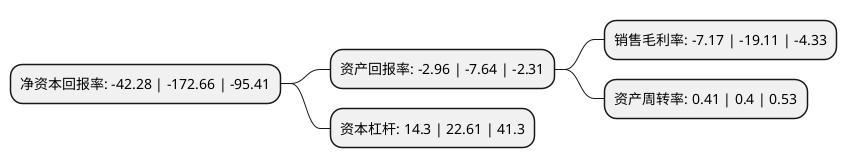

> 本页面由自动化程序生成于 2022年5月20日 01:16
> 内容可能存在错误，如有bug请提交issue至：https://github.com/Eroleice/doc-pi/issues
{.is-warning}

# 上市公司基本情况

## 基本资料

佳沃食品股份有限公司（以下简称“佳沃食品”）成立于2003年05月08日，常德市。于2011年09月27日在深交所创业板上市。

佳沃食品注册资本17,420万元，公司主要从事北极甜虾，狭鳕，格陵兰比目鱼，红鱼，阿根廷红虾，银鳕鱼，加拿大龙虾等中高档水产品的贸易，加工及销售。以下是详细信息：

- 公司名称: 佳沃食品股份有限公司
- 股票代码: 300268.SZ
- 所在地: 湖南 - 常德市
- 成立日期: 2003年05月08日
- 注册资本: 17,420万元
- 法定代表人: 陈绍鹏
- 主营业务: 公司主要从事北极甜虾，狭鳕，格陵兰比目鱼，红鱼，阿根廷红虾，银鳕鱼，加拿大龙虾等中高档水产品的贸易，加工及销售
- 公司官网: www.agrijoyvio.com
- 公司介绍: 公司从事水产品等高端动物蛋白的加工、销售、进出口贸易，以及牛羊肉及其副产品的渠道运营。公司定位于中高端动物蛋白产业战略发展平台，加速拓展现代农业业务，增加优质资产，将其做大做强，致力于成为合法合规经营，盈利能力不断提升，产业地位领先的上市公司。2017年8月佳沃股份完成国星股份收购，建立第一个重要阵地，成为海鲜领域具有持续成长潜力的领先企业。

## 股东及高管情况

上市公司第一大股东为佳沃集团有限公司，持股80,265,919股，占比46.08%，为上市公司实际控制人。

截至2022年03月31日，上市公司的前十大股东中，共有5名自然人股东，1名机构股东，4个产品账户，其中5%以上大股东共有1名。上市公司前十大股东明细如下：

> 截至2022年03月31日，上市公司前十大股东信息如下：

| 股东名称 | 持股数量（股） | 持股比例 |
| --- | --- | --- |
| 佳沃集团有限公司 | 80,265,919 | 46.08% |
| 杨荣华 | 6,590,000 | 3.78% |
| 中国工商银行股份有限公司-交银施罗德趋势优先混合型证券投资基金 | 3,598,066 | 2.07% |
| 魏一凡 | 1,460,000 | 0.84% |
| 黄海生 | 1,301,351 | 0.75% |
| 上海宏预资产管理有限公司-宏预资产-私募学院菁英279号私募基金 | 1,244,800 | 0.71% |
| 中国工商银行股份有限公司-嘉实主题新动力混合型证券投资基金 | 1,154,218 | 0.66% |
| 沈东涛 | 1,037,700 | 0.6% |
| 韩建新 | 936,300 | 0.54% |
| 中国工商银行股份有限公司-嘉实策略精选混合型证券投资基金 | 883,100 | 0.51% |

## 利润表分析

上市公司2021年总收入为45.97亿元，净利润为-3.3亿元，**未实现盈利**。

## 杜邦分析

> 数据列示周期：2021年 | 2020年 | 2019年
{.is-info}

上市公司的净资产收益率在近一年有所下降，下降幅度为-75.51%，其变化情况分解如下：
- 上市公司的销售毛利率在近一年下降了-62.48%，可能是生产效率的下降、商品原材料价格上涨或商品价格的下跌所致。
- 上市公司的资产周转率在近一年上升了2.5%，可能是源自于更快的销售回款或库存管理效果提升。
- 上市公司的财务杠杆比率在近一年下降了-36.75%，可能是减少负债降低财务费用。

