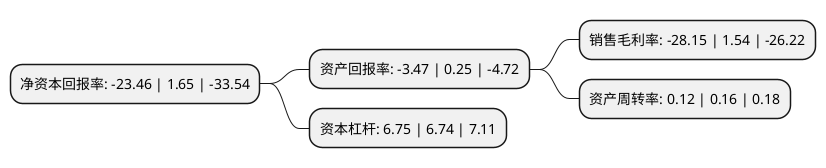

> 本页面由自动化程序生成于 2022年5月20日 01:16
> 内容可能存在错误，如有bug请提交issue至：https://github.com/Eroleice/doc-pi/issues
{.is-warning}

# 上市公司基本情况

## 基本资料

新疆天山畜牧生物工程股份有限公司（以下简称“ST天山”）成立于2003年06月18日，昌吉回族自治州。于2012年04月25日在深交所创业板上市。

ST天山注册资本31,297.74万元，公司的主营业务为牛的品种改良，依托生物遗传技术，为我国畜牧行业提供优质冻精，胚胎等遗传物质及相关服务，从而提高我国畜牧行业的良种繁育水平，并促进畜牧业，奶业的持续健康发展。公司主要产品为优质种公牛冻精，品种包括荷斯坦，褐牛，西门塔尔，夏洛来，安格斯等，包括奶牛，肉牛及乳肉兼用牛的主要品种。牛奶，犊牛等是公司从事良种繁育业务的副产品。以下是详细信息：

- 公司名称: 新疆天山畜牧生物工程股份有限公司
- 股票代码: 300313.SZ
- 所在地: 新疆 - 昌吉回族自治州
- 成立日期: 2003年06月18日
- 注册资本: 31,297.74万元
- 法定代表人: 马长水
- 主营业务: 公司的主营业务为牛的品种改良，依托生物遗传技术，为我国畜牧行业提供优质冻精，胚胎等遗传物质及相关服务，从而提高我国畜牧行业的良种繁育水平，并促进畜牧业，奶业的持续健康发展公司主要产品为优质种公牛冻精，品种包括荷斯坦，褐牛，西门塔尔，夏洛来，安格斯等，包括奶牛，肉牛及乳肉兼用牛的主要品种牛奶，犊牛等是公司从事良种繁育业务的副产品
- 公司官网: www.xjtssw.com
- 公司介绍: 公司是我国最大的牛品种改良产品及服务提供商之一。公司依托齐全的奶牛、肉牛及乳肉兼用牛的良种基因库，通过应用良种繁育体系研究成果及性控冻精、胚胎移植等前沿遗传生物技术与产品，为牛养殖户提供集品种改良、良种繁育、育种规划、饲养管理及疫病防治等服务的综合良种繁育服务。公司是国家级牛冷冻精液生产单位和国家级良种牛基地，是新疆唯一一家国家级冻精生产企业，国内良种繁育行业的龙头企业之一。公司多次承担国家和新疆自治区星火项目、重点科研及推广项目并多次获得奖励。2018年公司通过重大资产重组收购大象股份96.21%股权，公司新增户外广告业务逐步提升户外广告媒体的市场份额，并充分利用户外广告增强公司的品牌价值，更好的推进实施“大肉牛”战略，成功发挥双主营业务的协同效应，全面提升产品和服务的营销能力，提高整体盈利水平。

## 股东及高管情况

上市公司第一大股东为湖州皓辉企业管理咨询有限公司，持股69,211,312股，占比22.11%，**疑似为**上市公司实际控制人。

截至2022年04月07日，上市公司的前十大股东中，共有2名自然人股东，8名机构股东，其中5%以上大股东共有4名。上市公司前十大股东明细如下：

> 未能通过持股比例判定出上市公司实际控制人（持股30%以上）
> 可能存在通过间接持股、联合持股、协议控制等方式拥有实际控制权的主体，具体请参考上市公司定期公告！
{.is-warning}

> 截至2022年04月07日，上市公司前十大股东信息如下：

| 股东名称 | 持股数量（股） | 持股比例 |
| --- | --- | --- |
| 湖州皓辉企业管理咨询有限公司 | 69,211,312 | 22.11% |
| 湖州皓辉企业管理咨询有限公司 | 69,211,312 | 22.11% |
| 陈德宏 | 37,279,083 | 11.91% |
| 新疆畜牧业集团有限公司 | 33,025,998 | 10.55% |
| 芜湖华融渝稳投资中心(有限合伙) | 13,631,462 | 4.36% |
| 华融天泽投资有限公司 | 11,335,123 | 3.62% |
| 华中(天津)企业管理中心(有限合伙) | 6,705,800 | 2.14% |
| 武汉泰德鑫创业投资中心(有限合伙) | 6,088,524 | 1.95% |
| 烟台汉富满达投资中心(有限合伙) | 3,676,586 | 1.17% |
| 巫阳新 | 3,600,000 | 1.15% |

## 利润表分析

上市公司2021年总收入为1.07亿元，净利润为-0.31亿元，**未实现盈利**。

## 杜邦分析

> 数据列示周期：2021年 | 2020年 | 2019年
{.is-info}

上市公司的净资产收益率在近一年有所下降，下降幅度为-1521.82%，其变化情况分解如下：
- 上市公司的销售毛利率在近一年下降了-1927.92%，可能是生产效率的下降、商品原材料价格上涨或商品价格的下跌所致。
- 上市公司的资产周转率在近一年下降了-25%，可能是源自于更慢的销售回款或库存管理效果下降。
- 上市公司的财务杠杆比率在近一年上升了0.15%，可能是增加负债扩大生产规模。

