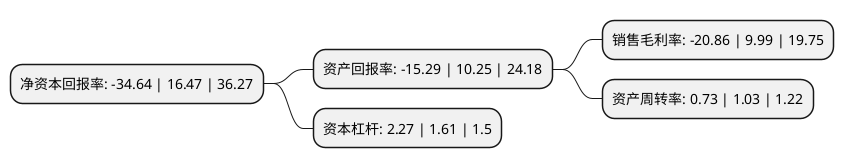

> 本页面由自动化程序生成于 2022年5月20日 01:18
> 内容可能存在错误，如有bug请提交issue至：https://github.com/Eroleice/doc-pi/issues
{.is-warning}

# 上市公司基本情况

## 基本资料

温氏食品集团股份有限公司（以下简称“温氏股份”）成立于1993年07月26日，云浮市。于2015年11月02日在深交所创业板上市。

温氏股份注册资本635,181.434万元，主营业务:畜禽养殖。主要产品:肉猪，肉鸡养殖为主，以奶牛，肉鸭养殖为辅，以食品加工，农牧设备制造为配套产业链。以下是详细信息：

- 公司名称: 温氏食品集团股份有限公司
- 股票代码: 300498.SZ
- 所在地: 广东 - 云浮市
- 成立日期: 1993年07月26日
- 注册资本: 635,181.434万元
- 法定代表人: 温志芬
- 主营业务: 主营业务:畜禽养殖主要产品:肉猪，肉鸡养殖为主，以奶牛，肉鸭养殖为辅，以食品加工，农牧设备制造为配套产业链
- 公司官网: www.wens.com.cn
- 公司介绍: 公司创立于1983年，现已发展成一家以畜禽养殖为主业、配套相关业务的跨地区现代农牧企业集团。公司现为农业产业化国家重点龙头企业、国家级创新型企业，组建有国家生猪种业工程技术研究中心、国家企业技术中心、博士后科研工作站、农业部重点实验室等重要科研平台。公司研发掌握了畜禽育种、饲料营养、疫病防治等方面的系列关键核心技术，成立“广东省畜禽废弃物处理与资源化工程中心”、获批枯草芽孢杆菌饲料添加剂生产许可证，构建了完善的饲料品控体系，保障了饲料的质量安全和畜禽产品的安全，建立了完善的疫病防控管理体系。

## 股东及高管情况

上市公司第一大股东为温鹏程，持股259,963,578股，占比4.09%，**疑似为**上市公司实际控制人。

截至2022年03月31日，上市公司的前十大股东中，共有9名自然人股东，1个海外主体。上市公司前十大股东明细如下：

> 未能通过持股比例判定出上市公司实际控制人（持股30%以上）
> 可能存在通过间接持股、联合持股、协议控制等方式拥有实际控制权的主体，具体请参考上市公司定期公告！
{.is-warning}

> 上市公司第一大股东持股不超过10%，请检查是否存在公司控制权风险！
{.is-danger}

> 截至2022年03月31日，上市公司前十大股东信息如下：

| 股东名称 | 持股数量（股） | 持股比例 |
| --- | --- | --- |
| 温鹏程 | 259,963,578 | 4.09% |
| 严居然 | 178,654,658 | 2.81% |
| 梁焕珍 | 171,407,953 | 2.7% |
| 温均生 | 167,789,100 | 2.64% |
| 香港中央结算有限公司(陆股通) | 162,277,169 | 2.55% |
| 黎沃灿 | 157,222,482 | 2.48% |
| 温小琼 | 155,087,256 | 2.44% |
| 温志芬 | 151,450,602 | 2.38% |
| 黄伯昌 | 130,531,199 | 2.06% |
| 严居能 | 127,531,768 | 2.01% |

## 利润表分析

上市公司2021年总收入为649.64亿元，净利润为-135.48亿元，**未实现盈利**。

## 杜邦分析

> 数据列示周期：2021年 | 2020年 | 2019年
{.is-info}

上市公司的净资产收益率在近一年有所下降，下降幅度为-310.32%，其变化情况分解如下：
- 上市公司的销售毛利率在近一年下降了-308.81%，可能是生产效率的下降、商品原材料价格上涨或商品价格的下跌所致。
- 上市公司的资产周转率在近一年下降了-29.13%，可能是源自于更慢的销售回款或库存管理效果下降。
- 上市公司的财务杠杆比率在近一年上升了40.99%，可能是增加负债扩大生产规模。

