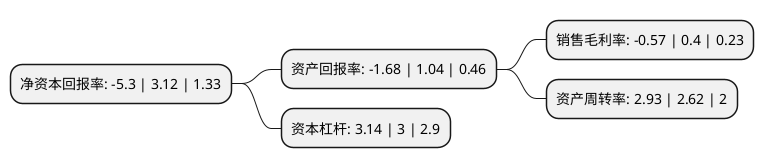

> 本页面由自动化程序生成于 2022年5月20日 01:24
> 内容可能存在错误，如有bug请提交issue至：https://github.com/Eroleice/doc-pi/issues
{.is-warning}

# 上市公司基本情况

## 基本资料

金健米业股份有限公司（以下简称“金健米业”）成立于1998年04月27日，常德市。于1998年05月06日在上交所主板上市。

金健米业注册资本64,178.322万元，主要产品:大米，面粉，面条，食用油。以下是详细信息：

- 公司名称: 金健米业股份有限公司
- 股票代码: 600127.SH
- 所在地: 湖南 - 常德市
- 成立日期: 1998年04月27日
- 注册资本: 64,178.322万元
- 法定代表人: 陈伟
- 主营业务: 主要产品:大米，面粉，面条，食用油
- 公司官网: www.jjmy.cn
- 公司介绍: 公司是我国粮食系统的第一家上市公司，是首批农业产业化国家重点龙头企业，国家水稻工程优质米示范基地。公司以优质粮油、新型健康食品和药品开发、生产、销售为发展方向，坚持农、工、科、贸一体化的现代农业产业化经营模式，主要产品有大米、面粉、面条、植物油、米粉、牛奶、糖果、果冻、药品等。公司的主导产品有“金健”牌系列精米、专用面粉、面条、食用油、乳品及“小背篓”鲜湿米粉。公司拥有“博士后科研工作站”、“国家稻谷加工技术研发专业分中心”、“省级技术中心”和“湖南省稻米深加工工程技术研究中心”等科研平台，与国内多家科研院所、大学开展产学研合作，先后承担了几十项国家级“九五”至“十三五”科研项目及863计划项目，取得系列重要成果，在稻米深加工领域处于国际领先水平，获得多项“国家科技进步二等奖”。

## 股东及高管情况

上市公司第一大股东为湖南粮食集团有限责任公司，持股136,932,251股，占比21.34%，**疑似为**上市公司实际控制人。

截至2022年03月31日，上市公司的前十大股东中，共有8名自然人股东，1名机构股东，1个海外主体，其中5%以上大股东共有1名。上市公司前十大股东明细如下：

> 未能通过持股比例判定出上市公司实际控制人（持股30%以上）
> 可能存在通过间接持股、联合持股、协议控制等方式拥有实际控制权的主体，具体请参考上市公司定期公告！
{.is-warning}

> 截至2022年03月31日，上市公司前十大股东信息如下：

| 股东名称 | 持股数量（股） | 持股比例 |
| --- | --- | --- |
| 湖南粮食集团有限责任公司 | 136,932,251 | 21.34% |
| 张晓夏 | 3,000,000 | 0.47% |
| 骆太祥 | 2,249,500 | 0.35% |
| UBS  AG | 2,110,633 | 0.33% |
| 周德华 | 1,767,001 | 0.28% |
| 张文貌 | 1,270,000 | 0.2% |
| 徐文星 | 889,043 | 0.14% |
| 赵刚 | 879,100 | 0.14% |
| 温长青 | 800,000 | 0.12% |
| 刘玉鹏 | 785,200 | 0.12% |

## 利润表分析

上市公司2021年总收入为67.06亿元，净利润为-0.39亿元，**未实现盈利**。

## 杜邦分析

> 数据列示周期：2021年 | 2020年 | 2019年
{.is-info}

上市公司的净资产收益率在近一年有所下降，下降幅度为-269.87%，其变化情况分解如下：
- 上市公司的销售毛利率在近一年下降了-242.5%，可能是生产效率的下降、商品原材料价格上涨或商品价格的下跌所致。
- 上市公司的资产周转率在近一年上升了11.83%，可能是源自于更快的销售回款或库存管理效果提升。
- 上市公司的财务杠杆比率在近一年上升了4.67%，可能是增加负债扩大生产规模。

