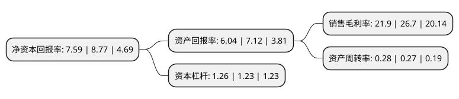

> 本页面由自动化程序生成于 2022年5月20日 01:25
> 内容可能存在错误，如有bug请提交issue至：https://github.com/Eroleice/doc-pi/issues
{.is-warning}

# 上市公司基本情况

## 基本资料

金宇生物技术股份有限公司（以下简称“生物股份”）成立于1993年03月13日，呼和浩特市。于1999年01月15日在上交所主板上市。

生物股份注册资本112,620.224万元，主要产品为生物药品。以下是详细信息：

- 公司名称: 金宇生物技术股份有限公司
- 股票代码: 600201.SH
- 所在地: 内蒙古 - 呼和浩特市
- 成立日期: 1993年03月13日
- 注册资本: 112,620.224万元
- 法定代表人: 张翀宇
- 主营业务: 主要产品为生物药品
- 公司官网: www.jinyu.com.cn
- 公司介绍: 公司(原内蒙古金宇集团股份有限公司)成立于1993年3月，1999年1月在上海证券交易所上市，是A股生物制药板块绩优上市公司。公司主要从事兽用生物制品的研发、生产与销售，产品种类涵盖猪、禽、宠物和反刍类四大系列100余种动物疫苗。公司拥有口蹄疫和高致病性禽流感两大强制免疫疫苗农业部的定点生产资质，工艺技术和产品质量保持国内领先水平。同时，依托兽用疫苗国家工程实验室研发平台，凭借完善的销售渠道和全方位的技术服务，进而为养殖客户提供动物疫病防控整体解决方案。公司是国内首家采用悬浮培养和纯化浓缩技术生产口蹄疫疫苗的厂家，并牵头制定了口蹄疫疫苗抗原含量、杂蛋白含量和抗原杂蛋白检测三项行业新标准，公司拥有兽用疫苗国家工程实验室、农业部反刍动物生物制品重点实验室和国家高级别生物安全实验室三个国家级创新平台，并设有博士后科研工作站联合培养实验室，成为动物疫苗行业研发的制高点和技术创新平台。

## 股东及高管情况

上市公司第一大股东为内蒙古金宇生物控股有限公司，持股122,304,000股，占比10.86%，**疑似为**上市公司实际控制人。

截至2022年04月07日，上市公司的前十大股东中，共有2名自然人股东，2名机构股东，4个产品账户，1个海外主体，1名其他股东，其中5%以上大股东共有2名。上市公司前十大股东明细如下：

> 未能通过持股比例判定出上市公司实际控制人（持股30%以上）
> 可能存在通过间接持股、联合持股、协议控制等方式拥有实际控制权的主体，具体请参考上市公司定期公告！
{.is-warning}

> 截至2022年04月07日，上市公司前十大股东信息如下：

| 股东名称 | 持股数量（股） | 持股比例 |
| --- | --- | --- |
| 内蒙古金宇生物控股有限公司 | 122,304,000 | 10.86% |
| 香港中央结算有限公司(陆股通) | 64,662,339 | 5.74% |
| 上海淳韬投资管理有限公司-淳韵价值一号证券投资私募基金 | 38,954,274 | 3.46% |
| 乌鲁木齐东鹏创动股权投资管理合伙企业(有限合伙)-宁波梅山保税港区星棋道和股权投资合伙企业(有限合伙) | 30,179,509 | 2.68% |
| 张翀宇 | 18,538,226 | 1.65% |
| 中国银行股份有限公司-招商国证生物医药指数分级证券投资基金 | 16,819,658 | 1.49% |
| 阿布达比投资局 | 14,048,544 | 1.25% |
| 招商银行股份有限公司-睿远均衡价值三年持有期混合型证券投资基金 | 13,700,000 | 1.22% |
| 全国社保基金四一八组合 | 11,112,200 | 0.99% |
| 鲁丹丹 | 9,468,440 | 0.84% |

## 利润表分析

上市公司2021年总收入为17.76亿元，净利润为3.89亿元，实现盈利。

## 杜邦分析

> 数据列示周期：2021年 | 2020年 | 2019年
{.is-info}

上市公司的净资产收益率在近一年有所下降，下降幅度为-13.45%，其变化情况分解如下：
- 上市公司的销售毛利率在近一年下降了-17.98%，可能是生产效率的下降、商品原材料价格上涨或商品价格的下跌所致。
- 上市公司的资产周转率在近一年上升了3.7%，可能是源自于更快的销售回款或库存管理效果提升。
- 上市公司的财务杠杆比率在近一年上升了2.44%，可能是增加负债扩大生产规模。

