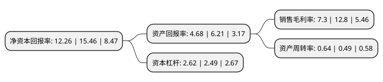

> 本页面由自动化程序生成于 2022年5月20日 01:25
> 内容可能存在错误，如有bug请提交issue至：https://github.com/Eroleice/doc-pi/issues
{.is-warning}

# 上市公司基本情况

## 基本资料

新疆冠农果茸股份有限公司（以下简称“冠农股份”）成立于1999年12月30日，铁门关市。于2003年06月09日在上交所主板上市。

冠农股份注册资本78,143.128万元，主要产品及提供的劳务:果蔬制品，皮棉，白砂糖。主营业务:白砂糖，酒精，番茄浓缩酱，棉花，干果产品的加工和销售以及仓储业务。以下是详细信息：

- 公司名称: 新疆冠农果茸股份有限公司
- 股票代码: 600251.SH
- 所在地: 新疆 - 铁门关市
- 成立日期: 1999年12月30日
- 注册资本: 78,143.128万元
- 法定代表人: 刘中海
- 主营业务: 主要产品及提供的劳务:果蔬制品，皮棉，白砂糖主营业务:白砂糖，酒精，番茄浓缩酱，棉花，干果产品的加工和销售以及仓储业务
- 公司官网: www.gngf.cn
- 公司介绍: 公司是集番茄制品、制糖、有机农业、棉花加工、果品仓储、名优特干果等农产品深加工、销售及国投罗钾、国电开都河水电、电子商务、大数据智慧产业园等对外项目投资于一体的集团化上市公司，已形成了产业多元发展、“主业+投资”双轮驱动的发展格局。冠农番茄制品是目前拥有国内单体产能最大的工厂，日处理番茄原料能力达到8,750吨，品质稳定，是本地生产规模最大、技术力量和产业带动能力最强、成品出口率最佳的番茄深加工及其制品制造企业。公司已通过出口食品企业卫生注册登记、ISO9000质量管理体系认证、HACCP食品安全控制体系认证、犹太认证和绿色食品质量认证等。公司拥有自己的研发机构－技术中心，在确保雄厚的技术力量支持的前提下，获得“兵团首批科技创新试点企业”、“自治区级企业技术中心”等称号。近年来，公司通过自主开发和联合开发的番茄丁、番茄汁等果蔬制品已形成产业化规模生产；公司的立式连续结晶罐技术专利，可实现甜菜制糖结晶工艺的连续化和自动化，解决了甜菜制糖的结晶过程无法连续化的问题，技术性能指标达到国内先进水平。

## 股东及高管情况

上市公司第一大股东为新疆冠农集团有限责任公司，持股320,932,708股，占比41.07%，为上市公司实际控制人。

截至2022年03月31日，上市公司的前十大股东中，共有5名自然人股东，4名机构股东，1个产品账户，其中5%以上大股东共有1名。上市公司前十大股东明细如下：

> 截至2022年03月31日，上市公司前十大股东信息如下：

| 股东名称 | 持股数量（股） | 持股比例 |
| --- | --- | --- |
| 新疆冠农集团有限责任公司 | 320,932,708 | 41.07% |
| 新疆绿原鑫融贸易有限公司 | 25,202,160 | 3.23% |
| 北京鼎盛新元环保装饰技术开发有限公司 | 12,698,756 | 1.63% |
| 张玉明 | 10,000,000 | 1.28% |
| 姚婧 | 8,007,948 | 1.02% |
| 新疆铁门关市金汇源资产管理有限公司 | 7,461,049 | 0.95% |
| 金国新 | 4,177,032 | 0.53% |
| 李玮 | 3,805,900 | 0.49% |
| 孙芳芳 | 3,780,500 | 0.48% |
| 招商银行股份有限公司-兴业兴睿两年持有期混合型证券投资基金 | 3,300,000 | 0.42% |

## 利润表分析

上市公司2021年总收入为43.37亿元，净利润为3.16亿元，实现盈利。

## 杜邦分析

> 数据列示周期：2021年 | 2020年 | 2019年
{.is-info}

上市公司的净资产收益率在近一年有所下降，下降幅度为-20.7%，其变化情况分解如下：
- 上市公司的销售毛利率在近一年下降了-42.97%，可能是生产效率的下降、商品原材料价格上涨或商品价格的下跌所致。
- 上市公司的资产周转率在近一年上升了30.61%，可能是源自于更快的销售回款或库存管理效果提升。
- 上市公司的财务杠杆比率在近一年上升了5.22%，可能是增加负债扩大生产规模。

