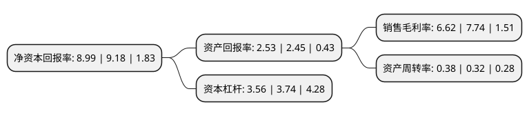

> 本页面由自动化程序生成于 2022年5月20日 01:26
> 内容可能存在错误，如有bug请提交issue至：https://github.com/Eroleice/doc-pi/issues
{.is-warning}

# 上市公司基本情况

## 基本资料

新疆塔里木农业综合开发股份有限公司（以下简称“新农开发”）成立于1999年04月23日，阿拉尔市。于1999年04月29日在上交所主板上市。

新农开发注册资本38,151.282万元，主要产品:棉花。以下是详细信息：

- 公司名称: 新疆塔里木农业综合开发股份有限公司
- 股票代码: 600359.SH
- 所在地: 新疆 - 阿拉尔市
- 成立日期: 1999年04月23日
- 注册资本: 38,151.282万元
- 法定代表人: 唐建国
- 主营业务: 主要产品:棉花
- 公司官网: www.xnkf.com
- 公司介绍: 公司是一家以棉花种植及加工为基础，集棉浆化纤、畜牧乳业、甘草制药、房地产开发为一体的上市公司，是国家级商品棉生产基地、国家良种奶牛养殖示范基地和全国最大的甘草浸膏生产基地，主要产品有“新农牌”棉花、棉纺织品、棉浆化纤制品、乳制品、甘草制品、节水器材等，产品远销日本、美国、德国等众多国家，发展前景非常广阔。近年来，公司分别被国家农业部、科技部认定为“农业产业化国家重点龙头企业”、“国家第一批龙头企业技术创新中心”，并先后荣获“全国优秀企业”、“新疆最具有成长力企业前十强”等荣誉称号。

## 股东及高管情况

上市公司第一大股东为阿拉尔统众国有资产经营有限责任公司，持股153,815,575股，占比40.32%，为上市公司实际控制人。

截至2022年03月31日，上市公司的前十大股东中，共有5名自然人股东，5名机构股东，其中5%以上大股东共有1名。上市公司前十大股东明细如下：

> 截至2022年03月31日，上市公司前十大股东信息如下：

| 股东名称 | 持股数量（股） | 持股比例 |
| --- | --- | --- |
| 阿拉尔统众国有资产经营有限责任公司 | 153,815,575 | 40.32% |
| 华泰证券股份有限公司 | 1,345,030 | 0.35% |
| 上海广迅现代物流科技有限公司 | 1,100,000 | 0.29% |
| 巫耀中 | 1,000,000 | 0.26% |
| 王颖实 | 860,002 | 0.23% |
| 上海广迅国际贸易有限公司 | 663,900 | 0.17% |
| 李红伟 | 650,000 | 0.17% |
| 王燕 | 534,400 | 0.14% |
| 吕荣荣 | 516,300 | 0.14% |
| 中国国际金融香港资产管理有限公司-CICCFT2(R) | 494,900 | 0.13% |

## 利润表分析

上市公司2021年总收入为6.85亿元，净利润为0.45亿元，实现盈利。

## 杜邦分析

> 数据列示周期：2021年 | 2020年 | 2019年
{.is-info}

上市公司的净资产收益率在近一年有所下降，下降幅度为-2.07%，其变化情况分解如下：
- 上市公司的销售毛利率在近一年下降了-14.47%，可能是生产效率的下降、商品原材料价格上涨或商品价格的下跌所致。
- 上市公司的资产周转率在近一年上升了18.75%，可能是源自于更快的销售回款或库存管理效果提升。
- 上市公司的财务杠杆比率在近一年下降了-4.81%，可能是减少负债降低财务费用。

