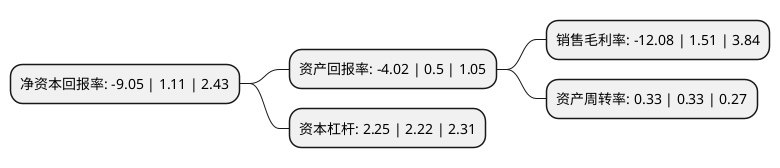

> 本页面由自动化程序生成于 2022年5月20日 01:29
> 内容可能存在错误，如有bug请提交issue至：https://github.com/Eroleice/doc-pi/issues
{.is-warning}

# 上市公司基本情况

## 基本资料

东方集团股份有限公司（以下简称“东方集团”）成立于1989年08月16日，哈尔滨市。于1994年01月06日在上交所主板上市。

东方集团注册资本371,457.612万元，主要业务:建材流通，加工制造。以下是详细信息：

- 公司名称: 东方集团股份有限公司
- 股票代码: 600811.SH
- 所在地: 黑龙江 - 哈尔滨市
- 成立日期: 1989年08月16日
- 注册资本: 371,457.612万元
- 法定代表人: 孙明涛
- 主营业务: 建材流通，加工制造
- 公司官网: www.china-orient.com
- 公司介绍: 公司是一家大型投资控股型企业集团，原主营投资和经营：金融保险业、建材流通业、其他产业等，是中国民生银行、新华人寿保险股份有限公司、海通证券有限公司的大股东之一。2013年，公司通过股权收购大成饭店70%股权，主营业务变更为粮油食品业、加工业、金融业、港口交通业、酒店置业。经过产业结构调整，公司农业板块完善了园区功能建设，加大了粮食贸易经营量，开展了营销推广活动，拓展了仓储基地业务。目前主要投资和经营的产业有：银行、证券等金融产业、现代农业、港口交通产业、新型城镇化开发产业、信息产业。

## 股东及高管情况

上市公司第一大股东为西藏东方润澜投资有限公司，持股608,854,587股，占比16.39%，**疑似为**上市公司实际控制人。

截至2022年03月31日，上市公司的前十大股东中，共有5名机构股东，5个产品账户，其中5%以上大股东共有2名。上市公司前十大股东明细如下：

> 未能通过持股比例判定出上市公司实际控制人（持股30%以上）
> 可能存在通过间接持股、联合持股、协议控制等方式拥有实际控制权的主体，具体请参考上市公司定期公告！
{.is-warning}

> 截至2022年03月31日，上市公司前十大股东信息如下：

| 股东名称 | 持股数量（股） | 持股比例 |
| --- | --- | --- |
| 西藏东方润澜投资有限公司 | 608,854,587 | 16.39% |
| 东方集团有限公司 | 492,822,091 | 13.27% |
| 西藏祥滨商贸有限公司 | 139,397,561 | 3.75% |
| 西藏耀凌企业管理服务有限公司 | 98,570,574 | 2.65% |
| 深圳重器资产管理有限公司-重器文弘一号私募证券投资基金 | 58,261,939 | 1.57% |
| 深圳市大华信安资产管理企业(有限合伙)-大华永诚一号私募证券投资基金 | 43,304,600 | 1.17% |
| 联储证券有限责任公司 | 43,247,949 | 1.16% |
| 深圳市大华信安资产管理企业(有限合伙)-信安进取二期私募证券投资基金 | 42,270,423 | 1.14% |
| 北京弈衡私募基金管理有限公司-弈衡启星2号私募证券投资基金 | 40,494,630 | 1.09% |
| 北京弈衡私募基金管理有限公司-弈衡旭日5号私募证券投资基金 | 40,482,396 | 1.09% |

## 利润表分析

上市公司2021年总收入为151.87亿元，净利润为-18.34亿元，**未实现盈利**。

## 杜邦分析

> 数据列示周期：2021年 | 2020年 | 2019年
{.is-info}

上市公司的净资产收益率在近一年有所下降，下降幅度为-915.32%，其变化情况分解如下：
- 上市公司的销售毛利率在近一年下降了-900%，可能是生产效率的下降、商品原材料价格上涨或商品价格的下跌所致。
- 上市公司的资产周转率在近一年下降了0%，可能是源自于更慢的销售回款或库存管理效果下降。
- 上市公司的财务杠杆比率在近一年上升了1.35%，可能是增加负债扩大生产规模。

