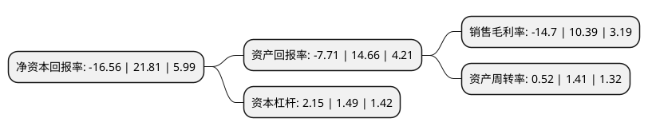

> 本页面由自动化程序生成于 2022年5月20日 01:30
> 内容可能存在错误，如有bug请提交issue至：https://github.com/Eroleice/doc-pi/issues
{.is-warning}

# 上市公司基本情况

## 基本资料

湖南新五丰股份有限公司（以下简称“新五丰”）成立于2001年06月26日，长沙市。于2004年06月09日在上交所主板上市。

新五丰注册资本80,504.097万元，活大猪，种猪，饲料以下是详细信息：

- 公司名称: 湖南新五丰股份有限公司
- 股票代码: 600975.SH
- 所在地: 湖南 - 长沙市
- 成立日期: 2001年06月26日
- 注册资本: 80,504.097万元
- 法定代表人: 何军
- 主营业务: 活大猪，种猪，饲料
- 公司官网: www.newwf.com
- 公司介绍: 公司成立于2001年6月28日，自成立以来，一直从事供港澳活大猪业务，是内地口岸公司中最大的活猪出口商之一，全国最大活体储备和湖南最大冻肉储备商，被湖南省发改委纳入省战略性新兴产业百强企业之一。公司以生猪产业经营为主业，涵盖饲料、原料贸易、种猪、商品猪、屠宰、冷链、物流、生猪交易、冷鲜肉品加工及销售、养殖设备等生猪全产业链。公司系农业产业化国家重点龙头企业。公司为中国畜牧业协会副会长单位。

## 股东及高管情况

上市公司第一大股东为湖南省粮油食品进出口集团有限公司，持股206,334,936股，占比25.63%，**疑似为**上市公司实际控制人。

截至2022年04月15日，上市公司的前十大股东中，共有6名机构股东，3个产品账户，1个海外主体，其中5%以上大股东共有3名。上市公司前十大股东明细如下：

> 未能通过持股比例判定出上市公司实际控制人（持股30%以上）
> 可能存在通过间接持股、联合持股、协议控制等方式拥有实际控制权的主体，具体请参考上市公司定期公告！
{.is-warning}

> 截至2022年04月15日，上市公司前十大股东信息如下：

| 股东名称 | 持股数量（股） | 持股比例 |
| --- | --- | --- |
| 湖南省粮油食品进出口集团有限公司 | 206,334,936 | 25.63% |
| 湖南省现代农业产业控股集团有限公司 | 88,075,390 | 10.94% |
| 湖南兴湘投资控股集团有限公司 | 44,378,698 | 5.51% |
| 湖南建工集团有限公司 | 29,585,798 | 3.68% |
| 中国工商银行股份有限公司-前海开源新经济灵活配置混合型证券投资基金 | 14,176,200 | 1.76% |
| 中国农业银行股份有限公司-中邮核心成长混合型证券投资基金 | 13,800,041 | 1.71% |
| 香港中央结算有限公司(陆股通) | 9,179,026 | 1.14% |
| 中国农业银行股份有限公司-中邮核心优选混合型证券投资基金 | 8,200,046 | 1.02% |
| 湖南高新创投财富管理有限公司 | 7,634,949 | 0.95% |
| 工银安盛人寿保险有限公司-短期分红2 | 7,292,100 | 0.91% |

## 利润表分析

上市公司2021年总收入为20.02亿元，净利润为-2.95亿元，**未实现盈利**。

## 杜邦分析

> 数据列示周期：2021年 | 2020年 | 2019年
{.is-info}

上市公司的净资产收益率在近一年有所下降，下降幅度为-175.93%，其变化情况分解如下：
- 上市公司的销售毛利率在近一年下降了-241.48%，可能是生产效率的下降、商品原材料价格上涨或商品价格的下跌所致。
- 上市公司的资产周转率在近一年下降了-63.12%，可能是源自于更慢的销售回款或库存管理效果下降。
- 上市公司的财务杠杆比率在近一年上升了44.3%，可能是增加负债扩大生产规模。

