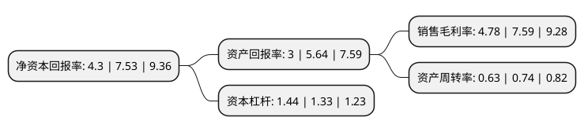

> 本页面由自动化程序生成于 2022年5月20日 01:33
> 内容可能存在错误，如有bug请提交issue至：https://github.com/Eroleice/doc-pi/issues
{.is-warning}

# 上市公司基本情况

## 基本资料

宏辉果蔬股份有限公司（以下简称“宏辉果蔬”）成立于1992年12月10日，汕头市。于2016年11月24日在上交所主板上市。

宏辉果蔬注册资本43,867.992万元，主营业务:果蔬产品的种植管理，采后收购，产地预冷，冷冻仓储，预选分级，加工包装，冷链配送。主要产品包括约46个品类的水果，约43个品类的蔬菜以及部分品类的水产品，品种涵盖全国南北及进口的各式特色果蔬。以下是详细信息：

- 公司名称: 宏辉果蔬股份有限公司
- 股票代码: 603336.SH
- 所在地: 广东 - 汕头市
- 成立日期: 1992年12月10日
- 注册资本: 43,867.992万元
- 法定代表人: 黄俊辉
- 主营业务: 主营业务:果蔬产品的种植管理，采后收购，产地预冷，冷冻仓储，预选分级，加工包装，冷链配送主要产品包括约46个品类的水果，约43个品类的蔬菜以及部分品类的水产品，品种涵盖全国南北及进口的各式特色果蔬
- 公司官网: www.greatsunfoods.com
- 公司介绍: 公司是一家集果蔬产品的种植管理、采后收购、产地预冷、冷冻仓储、预选分级、加工包装、冷链配送于一体的专业农产品服务商，主要产品包括约数十个品类的水果以及蔬菜，品种涵盖全国南北及进口的各式特色果蔬，品种涵盖全国南北各式特色果蔬。目前公司分别在山东烟台、上海、广东广州、广东汕头、福建诏安、天津、江西赣州和中国香港设立了多家全资子公司,合作的种植基地已覆盖山东、广东、福建、新疆、云南、江西、陕西等农业优势产区，针对果蔬产品具有季节性和区域性的特点，通过国内果蔬主产区的加工配送基地的布局和相互调配，以及冷链物流服务，有效解决果蔬供需之间的需求。

## 股东及高管情况

上市公司第一大股东为黄俊辉，持股202,647,308股，占比46.19%，为上市公司实际控制人。

截至2022年03月31日，上市公司的前十大股东中，共有10名自然人股东，其中5%以上大股东共有2名。上市公司前十大股东明细如下：

> 截至2022年03月31日，上市公司前十大股东信息如下：

| 股东名称 | 持股数量（股） | 持股比例 |
| --- | --- | --- |
| 黄俊辉 | 202,647,308 | 46.19% |
| 黄俊辉 | 201,890,708 | 46.0175% |
| 郑幼文 | 19,042,195 | 4.34% |
| 林瑞华 | 9,155,490 | 2.09% |
| 于承芳 | 1,110,528 | 0.25% |
| 许楚娇 | 960,094 | 0.22% |
| 倪润新 | 936,506 | 0.21% |
| 叶继坚 | 900,000 | 0.21% |
| 郑文杰 | 805,000 | 0.18% |
| 林光按 | 725,620 | 0.17% |

## 利润表分析

上市公司2021年总收入为9.74亿元，净利润为0.46亿元，实现盈利。

## 杜邦分析

> 数据列示周期：2021年 | 2020年 | 2019年
{.is-info}

上市公司的净资产收益率在近一年有所下降，下降幅度为-42.9%，其变化情况分解如下：
- 上市公司的销售毛利率在近一年下降了-37.02%，可能是生产效率的下降、商品原材料价格上涨或商品价格的下跌所致。
- 上市公司的资产周转率在近一年下降了-14.86%，可能是源自于更慢的销售回款或库存管理效果下降。
- 上市公司的财务杠杆比率在近一年上升了8.27%，可能是增加负债扩大生产规模。

