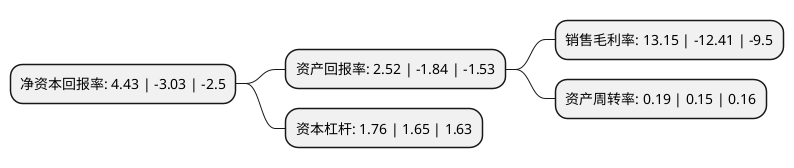

> 本页面由自动化程序生成于 2022年5月20日 01:35
> 内容可能存在错误，如有bug请提交issue至：https://github.com/Eroleice/doc-pi/issues
{.is-warning}

# 上市公司基本情况

## 基本资料

上海海利生物技术股份有限公司（以下简称“海利生物”）成立于1981年07月18日，上海市。于2015年05月15日在上交所主板上市。

海利生物注册资本64,400万元，主营业务为畜用，禽用动物疫苗的研发，生产和销售。产品主要为畜用，禽用动物疫苗。以下是详细信息：

- 公司名称: 上海海利生物技术股份有限公司
- 股票代码: 603718.SH
- 所在地: 上海 - 上海市
- 成立日期: 1981年07月18日
- 注册资本: 64,400万元
- 法定代表人: 张悦
- 主营业务: 主营业务为畜用，禽用动物疫苗的研发，生产和销售产品主要为畜用，禽用动物疫苗
- 公司官网: www.hile-bio.com
- 公司介绍: 公司是一家集研发、生产、销售、服务于一体的专业化兽用生物制品生产企业。公司成立于1981年，其前身为上海松江生物药品厂。公司是农业部在上海批准生产兽用生物制品的定点企业及农业部在上海设立的动物重大疫情防治生产基地，公司产品线齐全，产品结构完善，拥有家禽、家畜、宠物三大类共计44个产品，具备全方位服务的产品基础和能力。公司是上海市高新技术企业、国家火炬计划重点高新技术企业、上海市农业产业化重点龙头企业、上海市文明单位、上海市守合同重信用企业，企业研发中心被认定为上海市企业技术中心、上海兽用生物制品工程技术研究中心、上海市兽用疫苗制造工艺专业技术服务平台，公司的猪疫苗产品荣获“上海名牌”称号；公司拥有兽药GMP证书、兽药生产许可证、实验动物许可证、兽药经营许可证等生产经营资质证书，拥有11条GMP生产线，自主生产家畜、家禽两大系列疫苗产品。

## 股东及高管情况

上市公司第一大股东为上海豪园创业投资发展有限公司，持股226,197,938股，占比35.12%，为上市公司实际控制人。

截至2022年03月31日，上市公司的前十大股东中，共有9名自然人股东，1名机构股东，其中5%以上大股东共有1名。上市公司前十大股东明细如下：

> 截至2022年03月31日，上市公司前十大股东信息如下：

| 股东名称 | 持股数量（股） | 持股比例 |
| --- | --- | --- |
| 上海豪园创业投资发展有限公司 | 226,197,938 | 35.12% |
| 章建平 | 32,113,249 | 4.99% |
| 方章乐 | 29,433,351 | 4.57% |
| 方文艳 | 26,992,417 | 4.19% |
| 方德基 | 20,894,403 | 3.24% |
| 王荣 | 12,519,700 | 1.94% |
| 张海明 | 12,486,250 | 1.94% |
| 冯翔 | 11,880,000 | 1.84% |
| 张悦 | 8,452,500 | 1.31% |
| 郝洛 | 7,403,500 | 1.15% |

## 利润表分析

上市公司2021年总收入为3.47亿元，净利润为0.45亿元，实现盈利。

## 杜邦分析

> 数据列示周期：2021年 | 2020年 | 2019年
{.is-info}

上市公司的净资产收益率在近一年有所下降，下降幅度为-246.2%，其变化情况分解如下：
- 上市公司的销售毛利率在近一年下降了-205.96%，可能是生产效率的下降、商品原材料价格上涨或商品价格的下跌所致。
- 上市公司的资产周转率在近一年上升了26.67%，可能是源自于更快的销售回款或库存管理效果提升。
- 上市公司的财务杠杆比率在近一年上升了6.67%，可能是增加负债扩大生产规模。

