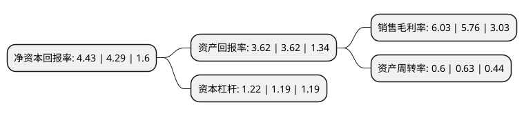

> 本页面由自动化程序生成于 2022年5月20日 01:13
> 内容可能存在错误，如有bug请提交issue至：https://github.com/Eroleice/doc-pi/issues
{.is-warning}

# 上市公司基本情况

## 基本资料

山东弘宇农机股份有限公司（以下简称“弘宇股份”）成立于1999年01月20日，烟台市。于2017年08月02日在深交所中小板上市。

弘宇股份注册资本9,333.8万元，主要产品:中，大马力拖拉机液压提升器总成，液压油缸，分配阀等拖拉机液压提升器系列产品;主营业务:拖拉机液压提升器的研发，生产和销售。以下是详细信息：

- 公司名称: 山东弘宇农机股份有限公司
- 股票代码: 002890.SZ
- 所在地: 山东 - 烟台市
- 成立日期: 1999年01月20日
- 注册资本: 9,333.8万元
- 法定代表人: 柳秋杰
- 主营业务: 主要产品:中，大马力拖拉机液压提升器总成，液压油缸，分配阀等拖拉机液压提升器系列产品;主营业务:拖拉机液压提升器的研发，生产和销售
- 公司官网: www.sdhynj.net
- 公司介绍: 公司主要从事拖拉机液压提升器的研发、生产和销售，主要产品为中、大马力拖拉机液压提升器系列产品。本公司研制生产的液压提升器，曾先后多次获得山东省科技进步奖和国家级新产品奖；本公司技术中心是烟台市工程技术研究中心、山东省级企业技术中心；本公司产品被评定为“山东省名牌产品”、“弘宇”牌商标被评定为“山东省著名商标”；本公司高端技术研发团队，形成了产品技术的核心竞争力，促进了本公司产品的转型升级。

## 股东及高管情况

上市公司第一大股东为于晓卿，持股15,009,337股，占比16.08%，**疑似为**上市公司实际控制人。

截至2022年03月31日，上市公司的前十大股东中，共有10名自然人股东，其中5%以上大股东共有4名。上市公司前十大股东明细如下：

> 未能通过持股比例判定出上市公司实际控制人（持股30%以上）
> 可能存在通过间接持股、联合持股、协议控制等方式拥有实际控制权的主体，具体请参考上市公司定期公告！
{.is-warning}

> 截至2022年03月31日，上市公司前十大股东信息如下：

| 股东名称 | 持股数量（股） | 持股比例 |
| --- | --- | --- |
| 于晓卿 | 15,009,337 | 16.08% |
| 辛军 | 11,673,928 | 12.51% |
| 李玉功 | 9,730,000 | 10.42% |
| 吕健 | 5,558,000 | 5.95% |
| 李俊 | 2,827,680 | 3.03% |
| 柳秋杰 | 2,796,998 | 3% |
| 姜洪兴 | 2,605,058 | 2.79% |
| 刘志鸿 | 2,362,433 | 2.53% |
| 季俊生 | 2,236,605 | 2.4% |
| 陈川 | 1,217,720 | 1.3% |

## 利润表分析

上市公司2021年总收入为4.1亿元，净利润为0.24亿元，实现盈利。

## 杜邦分析

> 数据列示周期：2021年 | 2020年 | 2019年
{.is-info}

上市公司的净资产收益率在近一年有所上升，上升幅度为3.26%，其变化情况分解如下：
- 上市公司的销售毛利率在近一年上升了4.69%，可能是生产效率的提升、商品原材料价格下跌或商品价格的上涨所致。
- 上市公司的资产周转率在近一年下降了-4.76%，可能是源自于更慢的销售回款或库存管理效果下降。
- 上市公司的财务杠杆比率在近一年上升了2.52%，可能是增加负债扩大生产规模。

