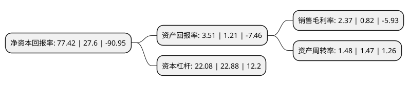

> 本页面由自动化程序生成于 2022年5月20日 01:14
> 内容可能存在错误，如有bug请提交issue至：https://github.com/Eroleice/doc-pi/issues
{.is-warning}

# 上市公司基本情况

## 基本资料

吉峰三农科技服务股份有限公司（以下简称“吉峰科技”）成立于1994年12月08日，成都市。于2009年10月30日在深交所创业板上市。

吉峰科技注册资本38,024.038万元，主营业务:农(牧，林果，蔬菜)业机械(单台或成套)设备，农用轻型载货汽车，农村通用机电等销售与服务以下是详细信息：

- 公司名称: 吉峰三农科技服务股份有限公司
- 股票代码: 300022.SZ
- 所在地: 四川 - 成都市
- 成立日期: 1994年12月08日
- 注册资本: 38,024.038万元
- 法定代表人: 汪辉君
- 主营业务: 主营业务:农(牧，林果，蔬菜)业机械(单台或成套)设备，农用轻型载货汽车，农村通用机电等销售与服务
- 公司官网: www.gifore.com
- 公司介绍: 公司是目前国内最大的农机连锁企业之一，销售国内外名优现代农业装备及相关农村机电产品。主营业务为农(牧、林果、蔬菜)业机械(单台或成套)设备、农用轻型载货汽车、农村通用机电等销售与服务，通过为用户提供产品与服务，提高生产效率，加快农(牧、林果、蔬菜)业现代化的步伐。结合上市公司吉峰科技的渠道优势、人才优势、资金优势、服务优势、品牌优势等，构建基于线上线下一体化的农机与三农在线科技综合服务平台。公司致力于海外业务拓展。在响应国家“一带一路”、“走出去”战略号召，公司先后在苏丹、乌干达、缅甸、塔吉克斯坦、俄罗斯等国开展农业及新能源领域的各类业务。公司以“服务创造新价值”为经营理念，具备对各类国内外农业机械的技术咨询、培训、维修服务、配件供应能力，并可根据当地使用环境有针对性的对机具配置和使用提出改进方案，系农业生产全程机械化整体解决方案提供商。

## 股东及高管情况

上市公司第一大股东为王新明，持股42,840,191股，占比11.27%，**疑似为**上市公司实际控制人。

截至2022年03月31日，上市公司的前十大股东中，共有8名自然人股东，2名机构股东，其中5%以上大股东共有2名。上市公司前十大股东明细如下：

> 未能通过持股比例判定出上市公司实际控制人（持股30%以上）
> 可能存在通过间接持股、联合持股、协议控制等方式拥有实际控制权的主体，具体请参考上市公司定期公告！
{.is-warning}

> 截至2022年03月31日，上市公司前十大股东信息如下：

| 股东名称 | 持股数量（股） | 持股比例 |
| --- | --- | --- |
| 王新明 | 42,840,191 | 11.27% |
| 王红艳 | 32,838,000 | 8.64% |
| 四川特驱教育管理有限公司 | 7,604,808 | 2% |
| 西藏山南神宇创业投资管理合伙企业(有限合伙) | 7,429,596 | 1.95% |
| 王海名 | 3,974,900 | 1.05% |
| 王道渠 | 3,577,500 | 0.94% |
| 李顺志 | 2,100,000 | 0.55% |
| 季红 | 2,016,000 | 0.53% |
| 王骥宇 | 2,000,100 | 0.53% |
| 朱海昆 | 1,946,200 | 0.51% |

## 利润表分析

上市公司2021年总收入为23.86亿元，净利润为0.56亿元，实现盈利。

## 杜邦分析

> 数据列示周期：2021年 | 2020年 | 2019年
{.is-info}

上市公司的净资产收益率在近一年有所上升，上升幅度为180.51%，其变化情况分解如下：
- 上市公司的销售毛利率在近一年上升了189.02%，可能是生产效率的提升、商品原材料价格下跌或商品价格的上涨所致。
- 上市公司的资产周转率在近一年上升了0.68%，可能是源自于更快的销售回款或库存管理效果提升。
- 上市公司的财务杠杆比率在近一年下降了-3.5%，可能是减少负债降低财务费用。

