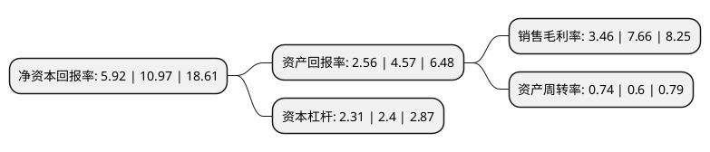

> 本页面由自动化程序生成于 2022年5月20日 01:21
> 内容可能存在错误，如有bug请提交issue至：https://github.com/Eroleice/doc-pi/issues
{.is-warning}

# 上市公司基本情况

## 基本资料

宁波大叶园林设备股份有限公司（以下简称“大叶股份”）成立于2006年02月17日，宁波市。于2020年09月01日在深交所创业板上市。

大叶股份注册资本16,000万元，主要从事割草机，打草机/割灌机，其他动力机械及配件的研发设计，生产制造和销售。以下是详细信息：

- 公司名称: 宁波大叶园林设备股份有限公司
- 股票代码: 300879.SZ
- 所在地: 浙江 - 宁波市
- 成立日期: 2006年02月17日
- 注册资本: 16,000万元
- 法定代表人: 叶晓波
- 主营业务: 主要从事割草机，打草机/割灌机，其他动力机械及配件的研发设计，生产制造和销售
- 公司官网: www.dayepower.com
- 公司介绍: 公司是国内园林机械行业领先企业，割草机龙头企业，是中国电器工业协会电动工具分会副理事长单位，是浙江省安监局认可的安全生产标准化二级企业(机械)，是中国内燃机工业协会公布的中国内燃机及零部件行业排头兵企业，获得过国际环保署颁发的低碳制造计划铂金奖证书。自2009年起被评为高新技术企业，拥有浙江省企业技术中心、省级工业设计中心，公司实验室为德国TUV南德集团授权认可的目击电气测试实验室。公司的“自走式高效环保园林汽油割草机”和“低排放低噪音轻型化二冲程汽油割灌机”被列入国家火炬计划产业化示范项目，割草机产品是中国林业机械协会“向社会推荐产品”。以自主研发实力和产品质量为基础，公司还致力于推动行业规范健康发展，负责制定或参加起草国家和行业标准8项，是中国林业机械标准化技术委员会委员单位。公司已经成为国际园林机械行业中具有较高知名度的ODM生产商，在生产技术、产品品质、制造规模等方面具有较高的市场地位，产品销往德国、法国、波兰、荷兰、俄罗斯、英国、加拿大、澳大利亚等全球50多个国家和地区，积累了一批优质客户资源，主要客户包括安达屋集团、牧田、富世华集团、翠丰集团、HECHT、百力通等。

## 股东及高管情况

上市公司第一大股东为浙江金大叶控股有限公司，持股52,800,000股，占比33%，为上市公司实际控制人。

截至2022年03月31日，上市公司的前十大股东中，共有3名自然人股东，7名机构股东，其中5%以上大股东共有4名。上市公司前十大股东明细如下：

> 截至2022年03月31日，上市公司前十大股东信息如下：

| 股东名称 | 持股数量（股） | 持股比例 |
| --- | --- | --- |
| 浙江金大叶控股有限公司 | 52,800,000 | 33% |
| 香港谷泰国际有限公司 | 28,800,000 | 18% |
| 香港金德国际控股有限公司 | 14,400,000 | 9% |
| 余姚德创骏博投资合伙企业(有限合伙) | 9,000,000 | 5.63% |
| 宁波梅山保税港区恒丰众创投资合伙企业(有限合伙) | 3,447,000 | 2.15% |
| 安吉德彼金企业管理合伙企业(有限合伙) | 1,474,000 | 0.92% |
| 李建幸 | 560,000 | 0.35% |
| 杭州恒丰节能技术有限公司 | 361,100 | 0.23% |
| 李兴蓝 | 319,400 | 0.2% |
| 孙晓虹 | 270,000 | 0.17% |

## 利润表分析

上市公司2021年总收入为16.07亿元，净利润为0.55亿元，实现盈利。

## 杜邦分析

> 数据列示周期：2021年 | 2020年 | 2019年
{.is-info}

上市公司的净资产收益率在近一年有所下降，下降幅度为-46.03%，其变化情况分解如下：
- 上市公司的销售毛利率在近一年下降了-54.83%，可能是生产效率的下降、商品原材料价格上涨或商品价格的下跌所致。
- 上市公司的资产周转率在近一年上升了23.33%，可能是源自于更快的销售回款或库存管理效果提升。
- 上市公司的财务杠杆比率在近一年下降了-3.75%，可能是减少负债降低财务费用。

