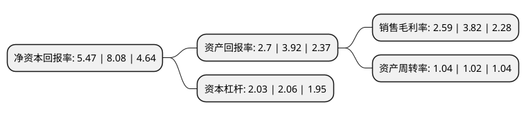

> 本页面由自动化程序生成于 2022年5月20日 01:25
> 内容可能存在错误，如有bug请提交issue至：https://github.com/Eroleice/doc-pi/issues
{.is-warning}

# 上市公司基本情况

## 基本资料

安徽全柴动力股份有限公司（以下简称“全柴动力”）成立于1998年11月24日，滁州市。于1998年12月03日在上交所主板上市。

全柴动力注册资本43,559.992万元，主要产品:柴油机，新型化学建材。以下是详细信息：

- 公司名称: 安徽全柴动力股份有限公司
- 股票代码: 600218.SH
- 所在地: 安徽 - 滁州市
- 成立日期: 1998年11月24日
- 注册资本: 43,559.992万元
- 法定代表人: 谢力
- 主营业务: 主要产品:柴油机，新型化学建材
- 公司官网: www.quanchai.com.cn
- 公司介绍: 公司是我国柴油机行业的龙头企业，主要生产为农机配套的单缸机和为轻卡配套的四缸机，并涉足新型化学建材开发、生产和销售。“全柴”牌产品已发展为单、多缸并重，有五大系列六十余个品种，是北汽福田、一汽红塔、江淮汽车等国内知名厂商的特约供应商。公司还是全国重点机电产品出口企业，产品出口到东南亚、南亚、非洲、南美、欧美等地市场。公司先后通过了ISO9001：2008和ISO/TS16949：2009等质量体系认证。通过质量管理体系的建立和完善，公司严格保证了柴油机产品的质量。同时，公司引进了柴油机AUDIT质量评审体系，通过站在用户立场上，以用户的眼光和要求对产品质量进行检查和评审，有效提升了柴油机整体质量水平。

## 股东及高管情况

上市公司第一大股东为安徽全柴集团有限公司，持股149,483,676股，占比34.32%，为上市公司实际控制人。

截至2022年03月31日，上市公司的前十大股东中，共有8名自然人股东，2名机构股东，其中5%以上大股东共有1名。上市公司前十大股东明细如下：

> 截至2022年03月31日，上市公司前十大股东信息如下：

| 股东名称 | 持股数量（股） | 持股比例 |
| --- | --- | --- |
| 安徽全柴集团有限公司 | 149,483,676 | 34.32% |
| 俞韵 | 2,848,500 | 0.65% |
| 深圳瑞和新治投资合伙企业(有限合伙) | 2,406,576 | 0.55% |
| 曹红光 | 2,139,037 | 0.49% |
| 张宝祥 | 2,096,300 | 0.48% |
| 刘育滨 | 1,687,300 | 0.39% |
| 陶燕新 | 1,486,647 | 0.34% |
| 胡玉枚 | 1,381,100 | 0.32% |
| 张德华 | 1,350,000 | 0.31% |
| 樊菲 | 1,310,075 | 0.3% |

## 利润表分析

上市公司2021年总收入为55.08亿元，净利润为1.42亿元，实现盈利。

## 杜邦分析

> 数据列示周期：2021年 | 2020年 | 2019年
{.is-info}

上市公司的净资产收益率在近一年有所下降，下降幅度为-32.3%，其变化情况分解如下：
- 上市公司的销售毛利率在近一年下降了-32.2%，可能是生产效率的下降、商品原材料价格上涨或商品价格的下跌所致。
- 上市公司的资产周转率在近一年上升了1.96%，可能是源自于更快的销售回款或库存管理效果提升。
- 上市公司的财务杠杆比率在近一年下降了-1.46%，可能是减少负债降低财务费用。

