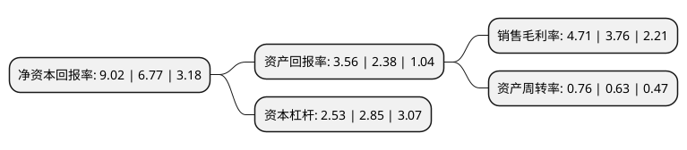

> 本页面由自动化程序生成于 2022年5月20日 01:30
> 内容可能存在错误，如有bug请提交issue至：https://github.com/Eroleice/doc-pi/issues
{.is-warning}

# 上市公司基本情况

## 基本资料

第一拖拉机股份有限公司（以下简称“一拖股份”）成立于1998年12月28日，洛阳市。于2012年08月08日在上交所主板上市。

一拖股份注册资本98,585万元，主要产品:本公司主要产品包括大，中，小系列轮式拖拉机，履带式拖拉机，柴油机及拖拉机其他配件，叉车和矿用卡车等。公司的主营业务为制造，销售农业机械和动力机械，主要产品包括大，中，小系列轮式拖拉机，履带式拖拉机，柴油机及拖拉机其他配件，叉车和矿用卡车等。以下是详细信息：

- 公司名称: 第一拖拉机股份有限公司
- 股票代码: 601038.SH
- 所在地: 河南 - 洛阳市
- 成立日期: 1998年12月28日
- 注册资本: 98,585万元
- 法定代表人: 黎晓煜
- 主营业务: 主要产品:本公司主要产品包括大，中，小系列轮式拖拉机，履带式拖拉机，柴油机及拖拉机其他配件，叉车和矿用卡车等公司的主营业务为制造，销售农业机械和动力机械，主要产品包括大，中，小系列轮式拖拉机，履带式拖拉机，柴油机及拖拉机其他配件，叉车和矿用卡车等
- 公司官网: www.first-tractor.com.cn
- 公司介绍: 公司拥有强大的锻件、机械加工、装配和测试的全套生产能力，流水生产线近百条，公司主导产品涵盖“东方红”系列履带拖拉机、轮式拖拉机和柴油机共计100余个品种。公司凭借产品优势、技术优势一直保持着大轮拖、非道路动力机械产品国内市场第一位势，并成功销往全球140多个国家和地区，为中国农机工业、农业机械化和新农村建设做出了突出的贡献。四个专业化拖拉机装配厂，分别生产履带拖拉机及变型产品、大中小型轮式拖拉机，拖拉机产品功率覆盖范围17～380马力。公司坚持科学发展观念，以“聚核铸强”战略发展思路为指导，聚集核心资源、聚力核心业务、聚焦核心市场，以提升自主创新能力、提升市场营销能力、提升人才强企能力、提升国际化经营能力为重点，不断提升公司创新和运营能力。做强拖拉机、柴油机核心业务、做强零部件黄金供应链体系、做强国内国外两个市场。充分利用上市公司的资源，有效整合相关资源，创造更好的发展空间。全面完善提升以农业装备为主、适度多元的产业链整体竞争力，成为农业装备的领跑者。

## 股东及高管情况

上市公司第一大股东为中国一拖集团有限公司，持股548,485,853股，占比48.81%，为上市公司实际控制人。

截至2022年03月31日，上市公司的前十大股东中，共有5名自然人股东，1名机构股东，2个产品账户，2个海外主体，其中5%以上大股东共有2名。上市公司前十大股东明细如下：

> 截至2022年03月31日，上市公司前十大股东信息如下：

| 股东名称 | 持股数量（股） | 持股比例 |
| --- | --- | --- |
| 中国一拖集团有限公司 | 548,485,853 | 48.81% |
| 香港中央结算(代理人)有限公司 | 388,193,319 | 34.55% |
| 香港中央结算有限公司(陆股通) | 4,352,227 | 0.39% |
| 深圳市前海火蓝资产管理有限公司-火蓝远方1号私募证券投资基金 | 2,348,200 | 0.21% |
| 焦延峰 | 944,000 | 0.08% |
| 韩玉婕 | 797,200 | 0.07% |
| 孙金龙 | 778,600 | 0.07% |
| 秦涛 | 774,400 | 0.07% |
| 杭州银行股份有限公司-招商瑞泰1年持有期混合型证券投资基金 | 772,000 | 0.07% |
| 沈嘉 | 767,790 | 0.07% |

## 利润表分析

上市公司2021年总收入为93.33亿元，净利润为4.33亿元，实现盈利。

## 杜邦分析

> 数据列示周期：2021年 | 2020年 | 2019年
{.is-info}

上市公司的净资产收益率在近一年有所上升，上升幅度为33.23%，其变化情况分解如下：
- 上市公司的销售毛利率在近一年上升了25.27%，可能是生产效率的提升、商品原材料价格下跌或商品价格的上涨所致。
- 上市公司的资产周转率在近一年上升了20.63%，可能是源自于更快的销售回款或库存管理效果提升。
- 上市公司的财务杠杆比率在近一年下降了-11.23%，可能是减少负债降低财务费用。

