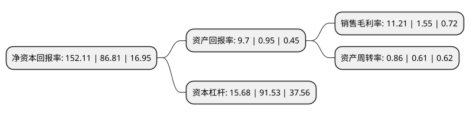

> 本页面由自动化程序生成于 2022年5月20日 01:01
> 内容可能存在错误，如有bug请提交issue至：https://github.com/Eroleice/doc-pi/issues
{.is-warning}

# 上市公司基本情况

## 基本资料

湖北宜化化工股份有限公司（以下简称“湖北宜化”）成立于1993年09月06日，宜昌市。于1996年08月15日在深交所主板上市。

湖北宜化注册资本89,786.671万元，主要业务:化肥化工产品的制造与销售。主要产品:尿素，季戊四醇，甲醇，甲醛，聚氯乙烯，烧碱等。以下是详细信息：

- 公司名称: 湖北宜化化工股份有限公司
- 股票代码: 000422.SZ
- 所在地: 湖北 - 宜昌市
- 成立日期: 1993年09月06日
- 注册资本: 89,786.671万元
- 法定代表人: 卞平官
- 主营业务: 化肥化工产品的制造与销售主要产品:尿素，季戊四醇，甲醇，甲醛，聚氯乙烯，烧碱等
- 公司官网: www.hbyh.cn
- 公司介绍: 公司位于湖北省宜昌市，是湖北省重要的支农骨干企业，是宜昌市发展现代化工业的重要基地。主要经营化肥、化工产品的生产与销售。公司产品涵盖化肥、化工、热电3大领域10余个品种，具备年产330万吨尿素、130万吨磷酸二铵、114万吨聚氯乙烯、10万吨季戊四醇、10万吨保险粉、13亿度火力发电的主导产品生产能力，具备130万吨/年磷矿、200万吨/年煤矿开采能力。宜化牌尿素为国家免检产品，多次出口到美国、新加坡等国。

## 股东及高管情况

上市公司第一大股东为湖北宜化集团有限责任公司，持股153,326,189股，占比17.08%，**疑似为**上市公司实际控制人。

截至2022年03月31日，上市公司的前十大股东中，共有3名自然人股东，2名机构股东，4个产品账户，1个海外主体，其中5%以上大股东共有1名。上市公司前十大股东明细如下：

> 未能通过持股比例判定出上市公司实际控制人（持股30%以上）
> 可能存在通过间接持股、联合持股、协议控制等方式拥有实际控制权的主体，具体请参考上市公司定期公告！
{.is-warning}

> 截至2022年03月31日，上市公司前十大股东信息如下：

| 股东名称 | 持股数量（股） | 持股比例 |
| --- | --- | --- |
| 湖北宜化集团有限责任公司 | 153,326,189 | 17.08% |
| 湖北恒信盈加投资合伙企业(有限合伙) | 44,936,491 | 5% |
| 伍文彬 | 44,857,152 | 5% |
| 代德明 | 44,850,005 | 5% |
| 香港中央结算有限公司(陆股通) | 12,493,413 | 1.39% |
| 中国建设银行股份有限公司-信达澳银新能源产业股票型证券投资基金 | 7,567,167 | 0.84% |
| 全国社保基金六零二组合 | 5,701,400 | 0.63% |
| 杭州金蟾蜍投资管理有限公司-金蟾蜍十号私募证券投资基金 | 3,105,000 | 0.35% |
| 袁建良 | 2,930,000 | 0.33% |
| 中国工商银行股份有限公司-信达澳银智远三年持有期混合型证券投资基金 | 2,574,994 | 0.29% |

## 利润表分析

上市公司2021年总收入为185.44亿元，净利润为20.79亿元，实现盈利。

## 杜邦分析

> 数据列示周期：2021年 | 2020年 | 2019年
{.is-info}

上市公司的净资产收益率在近一年有所上升，上升幅度为75.22%，其变化情况分解如下：
- 上市公司的销售毛利率在近一年上升了623.23%，可能是生产效率的提升、商品原材料价格下跌或商品价格的上涨所致。
- 上市公司的资产周转率在近一年上升了40.98%，可能是源自于更快的销售回款或库存管理效果提升。
- 上市公司的财务杠杆比率在近一年下降了-82.87%，可能是减少负债降低财务费用。

