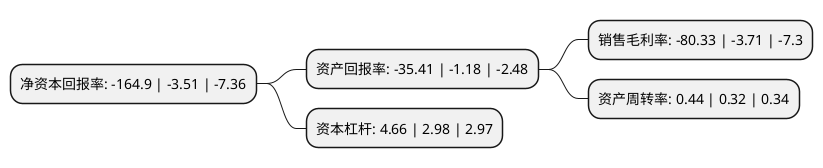

> 本页面由自动化程序生成于 2022年5月20日 01:02
> 内容可能存在错误，如有bug请提交issue至：https://github.com/Eroleice/doc-pi/issues
{.is-warning}

# 上市公司基本情况

## 基本资料

南京红太阳股份有限公司（以下简称“ST红太阳”）成立于1991年06月13日，南京市。于1993年10月28日在深交所主板上市。

ST红太阳注册资本58,077.287万元，主要产品:农药，化肥。以下是详细信息：

- 公司名称: 南京红太阳股份有限公司
- 股票代码: 000525.SZ
- 所在地: 江苏 - 南京市
- 成立日期: 1991年06月13日
- 注册资本: 58,077.287万元
- 法定代表人: 杨秀
- 主营业务: 主要产品:农药，化肥
- 公司官网: www.chinaredsun.com
- 公司介绍: 公司是一家上下游一体化、以农药、三药及及三药中间体业务为主体的企业，主营环保农药、三药及三药中间体、精细化工产品、生物医药的生产销售和农药产品包装物制造经营。公司所属的红太阳集团是国内最大、世界十五强的农业生命科学企业，连续第五年蝉联中国农药行业生产、销售第一位。公司通过实施自主创新、立足“三农”，围绕绿色环保型、无公害农药为重点，利用生物工程、信息工程、环保工程等前沿科技，先后开发了填补国内空白、替代高毒、替代进口、拥有自主知识产权和国家高新技术产业化、国家级新产品、国债项目多项。红太阳商标被国家确认为“中国驰名商标”、“最具市场竞争力品牌”；红太阳主导产品荣膺四大“中国名牌”，位居中国企业名牌总数第一；红太阳产品被国家确认为“国家免检产品”。

## 股东及高管情况

上市公司第一大股东为南京第一农药集团有限公司，持股182,924,731股，占比31.5%，为上市公司实际控制人。

截至2022年03月31日，上市公司的前十大股东中，共有8名自然人股东，2名机构股东，其中5%以上大股东共有1名。上市公司前十大股东明细如下：

> 截至2022年03月31日，上市公司前十大股东信息如下：

| 股东名称 | 持股数量（股） | 持股比例 |
| --- | --- | --- |
| 南京第一农药集团有限公司 | 182,924,731 | 31.5% |
| 红太阳集团有限公司 | 23,036,863 | 3.97% |
| 杨寿海 | 8,136,454 | 1.4% |
| 鲁力力 | 6,459,400 | 1.11% |
| 叶诗琳 | 5,389,437 | 0.93% |
| 孙杰 | 3,050,000 | 0.53% |
| 林翠曼 | 2,500,000 | 0.43% |
| 蒋小华 | 2,500,000 | 0.43% |
| 夏世勇 | 2,251,300 | 0.39% |
| 王菅 | 2,244,800 | 0.39% |

## 利润表分析

上市公司2021年总收入为46.83亿元，净利润为-37.62亿元，**未实现盈利**。

## 杜邦分析

> 数据列示周期：2021年 | 2020年 | 2019年
{.is-info}

上市公司的净资产收益率在近一年有所上升，上升幅度为4598.01%，其变化情况分解如下：
- 上市公司的销售毛利率在近一年上升了2065.23%，可能是生产效率的提升、商品原材料价格下跌或商品价格的上涨所致。
- 上市公司的资产周转率在近一年上升了37.5%，可能是源自于更快的销售回款或库存管理效果提升。
- 上市公司的财务杠杆比率在近一年上升了56.38%，可能是增加负债扩大生产规模。

