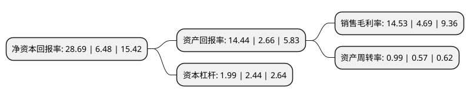

> 本页面由自动化程序生成于 2022年5月20日 01:04
> 内容可能存在错误，如有bug请提交issue至：https://github.com/Eroleice/doc-pi/issues
{.is-warning}

# 上市公司基本情况

## 基本资料

鲁西化工集团股份有限公司（以下简称“鲁西化工”）成立于1998年06月11日，聊城市。于1998年08月07日在深交所主板上市。

鲁西化工注册资本190,431.901万元，主要业务:化肥的生产与销售。主要产品:尿素，复合肥。以下是详细信息：

- 公司名称: 鲁西化工集团股份有限公司
- 股票代码: 000830.SZ
- 所在地: 山东 - 聊城市
- 成立日期: 1998年06月11日
- 注册资本: 190,431.901万元
- 法定代表人: 张金成
- 主营业务: 化肥的生产与销售主要产品:尿素，复合肥
- 公司官网: www.luxichemical.com
- 公司介绍: 公司是集化工、化肥、装备制造及科技研发于一体的综合性化工企业。产品涵盖化工和化肥两大领域、五大系列七十多个品种。公司主导产品化肥产销量曾连续多年全国排名第一，连续多年列入中国石油和化工行业综合效益百强、销售收入百强和中国化学肥料制造业销售收入百强企业。未来几年，鲁西化工将进一步解放思想，坚定信心，真抓实干，抢抓机遇，坚持科学发展、安全发展、绿色发展、集约循环发展的原则，做优、做强主业，拉长煤、盐、氟硅化工产业链，发展化工新材料；积极培植新的经济增长点，加快推进国际化进程，实施国际化战略；提升科技研发、工程设计、化工装备制造安装能力，完善园区一体化功能，全力建设化工新材料产业园区。

## 股东及高管情况

上市公司第一大股东为鲁西集团有限公司，持股492,248,464股，占比25.85%，**疑似为**上市公司实际控制人。

截至2022年04月15日，上市公司的前十大股东中，共有1名自然人股东，2名机构股东，6个产品账户，1个海外主体，其中5%以上大股东共有2名。上市公司前十大股东明细如下：

> 未能通过持股比例判定出上市公司实际控制人（持股30%以上）
> 可能存在通过间接持股、联合持股、协议控制等方式拥有实际控制权的主体，具体请参考上市公司定期公告！
{.is-warning}

> 截至2022年04月15日，上市公司前十大股东信息如下：

| 股东名称 | 持股数量（股） | 持股比例 |
| --- | --- | --- |
| 鲁西集团有限公司 | 492,248,464 | 25.85% |
| 中化投资发展有限公司 | 439,458,233 | 23.08% |
| 华泰证券股份有限公司-中庚价值领航混合型证券投资基金 | 42,524,032 | 2.23% |
| 香港中央结算有限公司(陆股通) | 42,062,869 | 2.21% |
| 平安银行股份有限公司-中庚价值品质一年持有期混合型证券投资基金 | 33,296,300 | 1.75% |
| 广发证券股份有限公司-中庚小盘价值股票型证券投资基金 | 21,615,324 | 1.14% |
| 光大永明资管-兴业银行-光大永明资产聚财121号定向资产管理产品 | 19,683,194 | 1.03% |
| 薛春良 | 10,066,100 | 0.53% |
| 全国社保基金四一三组合 | 9,906,300 | 0.52% |
| 平安银行股份有限公司-中庚价值灵动灵活配置混合型证券投资基金 | 9,586,700 | 0.5% |

## 利润表分析

上市公司2021年总收入为317.94亿元，净利润为46.19亿元，实现盈利。

## 杜邦分析

> 数据列示周期：2021年 | 2020年 | 2019年
{.is-info}

上市公司的净资产收益率在近一年有所上升，上升幅度为342.75%，其变化情况分解如下：
- 上市公司的销售毛利率在近一年上升了209.81%，可能是生产效率的提升、商品原材料价格下跌或商品价格的上涨所致。
- 上市公司的资产周转率在近一年上升了73.68%，可能是源自于更快的销售回款或库存管理效果提升。
- 上市公司的财务杠杆比率在近一年下降了-18.44%，可能是减少负债降低财务费用。

