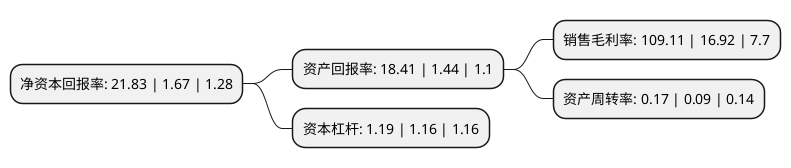

> 本页面由自动化程序生成于 2022年5月20日 01:04
> 内容可能存在错误，如有bug请提交issue至：https://github.com/Eroleice/doc-pi/issues
{.is-warning}

# 上市公司基本情况

## 基本资料

亚钾国际投资(广州)股份有限公司（以下简称“亚钾国际”）成立于1998年10月27日，广州市。于1998年12月24日在深交所主板上市。

亚钾国际注册资本75,690.327万元，主营业务:大豆加工，食用油销售。以下是详细信息：

- 公司名称: 亚钾国际投资(广州)股份有限公司
- 股票代码: 000893.SZ
- 所在地: 广东 - 广州市
- 成立日期: 1998年10月27日
- 注册资本: 75,690.327万元
- 法定代表人: 郭柏春
- 主营业务: 主营业务:大豆加工，食用油销售
- 公司官网: www.asia-potash.com
- 公司介绍: 公司业务范围包括谷物贸易、国际船务及基础货运、钾盐开采、钾肥生产及销售等。公司秉承“诚信为本、厚德载物”的核心价值理念，历经十余载自强不息、艰苦奋斗、传承创新和厚积薄发，赢得了良好的社会知名度和市场美誉度，塑造出自身独特的核心竞争优势。公司拥有与国际主流粮食生产商、贸易商多年合作和沟通交流经验，熟悉国际贸易规则，远洋运输组织协调经验丰富，与海关、码头长期合作关系良好，在组织大规模批量谷物进口和货运成本控制上具有明显优势。同时，公司利用南沙自贸区提供的政策便利，借助天时、地利、人和，顺势而为，整合资源，加强创新，积极开展合资、合作，在大宗商品进口贸易上取得显著成效，为促进南沙自贸区发展做出了有力贡献。

## 股东及高管情况

上市公司第一大股东为中国农业生产资料集团公司，持股144,913,793股，占比19.15%，**疑似为**上市公司实际控制人。

截至2022年04月27日，上市公司的前十大股东中，共有10名机构股东，其中5%以上大股东共有10名。上市公司前十大股东明细如下：

> 未能通过持股比例判定出上市公司实际控制人（持股30%以上）
> 可能存在通过间接持股、联合持股、协议控制等方式拥有实际控制权的主体，具体请参考上市公司定期公告！
{.is-warning}

> 截至2022年04月27日，上市公司前十大股东信息如下：

| 股东名称 | 持股数量（股） | 持股比例 |
| --- | --- | --- |
| 中国农业生产资料集团公司 | 144,913,793 | 19.15% |
| 中国农业生产资料集团公司 | 144,913,793 | 19.15% |
| 牡丹江国富投资中心(有限合伙) | 83,649,277 | 11.05% |
| 牡丹江国富投资中心(有限合伙) | 83,649,277 | 11.05% |
| 新疆江之源股权投资合伙企业(有限合伙) | 60,086,206 | 7.94% |
| 新疆江之源股权投资合伙企业(有限合伙) | 60,086,206 | 7.94% |
| 上海劲邦劲德股权投资合伙企业(有限合伙) | 56,551,724 | 7.47% |
| 上海劲邦劲德股权投资合伙企业(有限合伙) | 56,551,724 | 7.47% |
| 广州东凌实业投资集团有限公司 | 51,000,000 | 6.738% |
| 广州东凌实业投资集团有限公司 | 50,860,000 | 6.72% |

## 利润表分析

上市公司2021年总收入为8.32亿元，净利润为9.08亿元，实现盈利。

## 杜邦分析

> 数据列示周期：2021年 | 2020年 | 2019年
{.is-info}

上市公司的净资产收益率在近一年有所上升，上升幅度为1207.19%，其变化情况分解如下：
- 上市公司的销售毛利率在近一年上升了544.86%，可能是生产效率的提升、商品原材料价格下跌或商品价格的上涨所致。
- 上市公司的资产周转率在近一年上升了88.89%，可能是源自于更快的销售回款或库存管理效果提升。
- 上市公司的财务杠杆比率在近一年上升了2.59%，可能是增加负债扩大生产规模。

