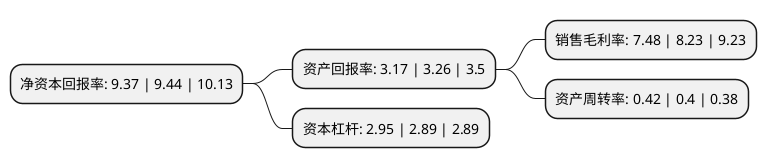

> 本页面由自动化程序生成于 2022年5月20日 01:05
> 内容可能存在错误，如有bug请提交issue至：https://github.com/Eroleice/doc-pi/issues
{.is-warning}

# 上市公司基本情况

## 基本资料

华邦生命健康股份有限公司（以下简称“华邦健康”）成立于1992年03月11日，重庆市。于2004年06月25日在深交所中小板上市。

华邦健康注册资本197,991.919万元，主营业务主要为医药，农药和原料药。主要产品为迪银片，三蕊胶囊，力克肺疾。以下是详细信息：

- 公司名称: 华邦生命健康股份有限公司
- 股票代码: 002004.SZ
- 所在地: 重庆 - 重庆市
- 成立日期: 1992年03月11日
- 注册资本: 197,991.919万元
- 法定代表人: 张松山
- 主营业务: 主营业务主要为医药，农药和原料药主要产品为迪银片，三蕊胶囊，力克肺疾
- 公司官网: www.huapont.com.cn
- 公司介绍: 公司是集农药、医药、原料药出口等为一体的跨区域公司，主营业务主要为农药和医药。医药方面，公司研发中心拥有高学历的研发队伍，博士、硕士及以上学历或高级职称研究人员超过40%。涵盖合成、制剂、分析、药理、临床、注册等学科，已具备顺利完成一类新药的选题立项、研究开发、注册申报等所有关键环节的能力。农化方面,公司在农药研发、市场开发与销售渠道、注册登记、质量控制、EHS(安全保障、环保、职业健康)管理体系等方面均有明显的优势，自主开发了符合国际国内未来环保型、无公害、超高效农药高科技产品多项，并参与制定行业标准，是成为快速发展的重要动力。

## 股东及高管情况

上市公司第一大股东为西藏汇邦科技有限公司，持股370,449,804股，占比18.71%，**疑似为**上市公司实际控制人。

截至2022年03月31日，上市公司的前十大股东中，共有7名自然人股东，2名机构股东，1个海外主体，其中5%以上大股东共有2名。上市公司前十大股东明细如下：

> 未能通过持股比例判定出上市公司实际控制人（持股30%以上）
> 可能存在通过间接持股、联合持股、协议控制等方式拥有实际控制权的主体，具体请参考上市公司定期公告！
{.is-warning}

> 截至2022年03月31日，上市公司前十大股东信息如下：

| 股东名称 | 持股数量（股） | 持股比例 |
| --- | --- | --- |
| 西藏汇邦科技有限公司 | 370,449,804 | 18.71% |
| 张松山 | 117,095,583 | 5.91% |
| 董晓明 | 73,656,588 | 3.72% |
| 张一卓 | 55,060,000 | 2.78% |
| 陈小发 | 35,696,889 | 1.8% |
| 于俊田 | 33,000,000 | 1.67% |
| 姜雪萍 | 28,889,900 | 1.46% |
| 王加荣 | 25,440,108 | 1.28% |
| 香港中央结算有限公司(陆股通) | 19,051,618 | 0.96% |
| 西安投资控股有限公司 | 15,625,000 | 0.79% |

## 利润表分析

上市公司2021年总收入为123.59亿元，净利润为9.24亿元，实现盈利。

## 杜邦分析

> 数据列示周期：2021年 | 2020年 | 2019年
{.is-info}

上市公司的净资产收益率在近一年有所下降，下降幅度为-0.74%，其变化情况分解如下：
- 上市公司的销售毛利率在近一年下降了-9.11%，可能是生产效率的下降、商品原材料价格上涨或商品价格的下跌所致。
- 上市公司的资产周转率在近一年上升了5%，可能是源自于更快的销售回款或库存管理效果提升。
- 上市公司的财务杠杆比率在近一年上升了2.08%，可能是增加负债扩大生产规模。

