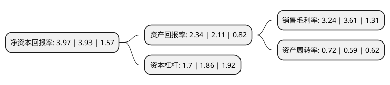

> 本页面由自动化程序生成于 2022年5月20日 01:06
> 内容可能存在错误，如有bug请提交issue至：https://github.com/Eroleice/doc-pi/issues
{.is-warning}

# 上市公司基本情况

## 基本资料

深圳市芭田生态工程股份有限公司（以下简称“芭田股份”）成立于1989年07月21日，深圳市。于2007年09月19日在深交所中小板上市。

芭田股份注册资本88,686.263万元，主要产品:无机复合肥，有机复合肥，控释肥等。主营业务:复合肥产品的研发，生产和销售。以下是详细信息：

- 公司名称: 深圳市芭田生态工程股份有限公司
- 股票代码: 002170.SZ
- 所在地: 广东 - 深圳市
- 成立日期: 1989年07月21日
- 注册资本: 88,686.263万元
- 法定代表人: 黄培钊
- 主营业务: 主要产品:无机复合肥，有机复合肥，控释肥等主营业务:复合肥产品的研发，生产和销售
- 公司官网: www.batian.com.cn
- 公司介绍: 公司是集科研、生产、销售、终端服务为一体的国家级高新技术企业，总部位于深圳市科技创新孵化基地—南山高新技术园；公司主营生产绿色生态复合肥，是中国复合肥行业里第一家上市公司。公司拥有行业领先的复合肥高效技术、灌溉施肥技术、包膜包裹控释技术、农用聚磷酸铵技术、中微量元素有机螯合技术、有机碳肥技术、快速腐熟发酵等多项技术，被科技部授予“国家科技创新型新火龙头企业”，先后被评为“中国最有价值商500强企业”、“中国土壤肥料行业十大影响力品牌”、“中国土壤肥料业60年最具影响力企业”等殊荣；荣获广东省民营百强企业、深圳市民营企业50强和深圳市自主创新行业龙头企业等荣誉称号。公司以深圳松岗、江苏徐州、广西贵港、贵州瓮安、湖北钟祥、辽宁沈阳全国六大生产基地为依托，打造芭田优势产业链，生产出科技、生态、环保的新型肥料，为农作物提供全面均衡的营养，为农民提供完善技术支持和售后服务，让农民种植出营养、安全、健康的农产品，赢得了广大农民朋友的信赖。

## 股东及高管情况

上市公司第一大股东为黄培钊，持股237,927,851股，占比26.83%，**疑似为**上市公司实际控制人。

截至2022年03月31日，上市公司的前十大股东中，共有8名自然人股东，1名机构股东，1个产品账户，其中5%以上大股东共有3名。上市公司前十大股东明细如下：

> 未能通过持股比例判定出上市公司实际控制人（持股30%以上）
> 可能存在通过间接持股、联合持股、协议控制等方式拥有实际控制权的主体，具体请参考上市公司定期公告！
{.is-warning}

> 截至2022年03月31日，上市公司前十大股东信息如下：

| 股东名称 | 持股数量（股） | 持股比例 |
| --- | --- | --- |
| 黄培钊 | 237,927,851 | 26.83% |
| 叶锡如 | 54,456,742 | 6.14% |
| 项延灶 | 45,510,010 | 5.13% |
| 四川锦天福泽农业有限公司 | 16,000,000 | 1.8% |
| 黄林华 | 10,148,162 | 1.14% |
| 上海韫然投资管理有限公司-新兴成长五期私募证券投资基金 | 4,400,000 | 0.5% |
| 杨立成 | 3,843,700 | 0.43% |
| 邓艾 | 3,760,000 | 0.42% |
| 刘巧玲 | 3,686,401 | 0.42% |
| 钱卫东 | 3,588,500 | 0.4% |

## 利润表分析

上市公司2021年总收入为24.85亿元，净利润为0.8亿元，实现盈利。

## 杜邦分析

> 数据列示周期：2021年 | 2020年 | 2019年
{.is-info}

上市公司的净资产收益率在近一年有所上升，上升幅度为1.02%，其变化情况分解如下：
- 上市公司的销售毛利率在近一年下降了-10.25%，可能是生产效率的下降、商品原材料价格上涨或商品价格的下跌所致。
- 上市公司的资产周转率在近一年上升了22.03%，可能是源自于更快的销售回款或库存管理效果提升。
- 上市公司的财务杠杆比率在近一年下降了-8.6%，可能是减少负债降低财务费用。

