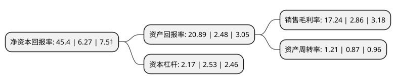

> 本页面由自动化程序生成于 2022年5月20日 01:07
> 内容可能存在错误，如有bug请提交issue至：https://github.com/Eroleice/doc-pi/issues
{.is-warning}

# 上市公司基本情况

## 基本资料

江苏华昌化工股份有限公司（以下简称“华昌化工”）成立于1979年12月15日，苏州市。于2008年09月25日在深交所中小板上市。

华昌化工注册资本95,236.465万元，合成氨，尿素，纯碱，复合(混)肥，甲醇等以下是详细信息：

- 公司名称: 江苏华昌化工股份有限公司
- 股票代码: 002274.SZ
- 所在地: 江苏 - 苏州市
- 成立日期: 1979年12月15日
- 注册资本: 95,236.465万元
- 法定代表人: 朱郁健
- 主营业务: 合成氨，尿素，纯碱，复合(混)肥，甲醇等
- 公司官网: www.huachangchem.cn
- 公司介绍: 公司主营化工原料、化工产品、化肥等,品牌知名度日益提高。公司陆续通过了质量管理体系认证、环境管理体系认证和职业健康安全管理体系认证，公司主要产品纯碱获苏州市“名牌产品”称号，复合肥获苏州市、江苏省“质量信得过产品”与“国家免检产品”的称号。“全国农化服务中心”、全国氮肥行业合成氨产量、尿素产量、行业主营业收入50强。多年来，公司各项主要技经指标均居全国同行业前列，在行业中享有较高的声誉。公司商标“金字”为省著名商标，“金”为苏州知名商标。“金字及图”为肥料、化学肥料商品上的驰名商标。

## 股东及高管情况

上市公司第一大股东为苏州华纳投资股份有限公司，持股275,059,519股，占比28.88%，**疑似为**上市公司实际控制人。

截至2022年03月31日，上市公司的前十大股东中，共有5名自然人股东，2名机构股东，2个产品账户，1个海外主体，其中5%以上大股东共有2名。上市公司前十大股东明细如下：

> 未能通过持股比例判定出上市公司实际控制人（持股30%以上）
> 可能存在通过间接持股、联合持股、协议控制等方式拥有实际控制权的主体，具体请参考上市公司定期公告！
{.is-warning}

> 截至2022年03月31日，上市公司前十大股东信息如下：

| 股东名称 | 持股数量（股） | 持股比例 |
| --- | --- | --- |
| 苏州华纳投资股份有限公司 | 275,059,519 | 28.88% |
| 江苏华昌(集团)有限公司 | 114,209,198 | 11.99% |
| 香港中央结算有限公司(陆股通) | 24,229,877 | 2.54% |
| 江苏华昌化工股份有限公司回购专用证券账户 | 9,904,936 | 1.04% |
| 周柒梅 | 5,000,000 | 0.53% |
| 中国建设银行股份有限公司-浙商丰利增强债券型证券投资基金 | 4,000,000 | 0.42% |
| 颜斌 | 3,265,042 | 0.34% |
| 贺颂钧 | 2,048,004 | 0.22% |
| 周伯文 | 1,858,117 | 0.2% |
| 翁进锋 | 1,836,100 | 0.19% |

## 利润表分析

上市公司2021年总收入为94.13亿元，净利润为16.22亿元，实现盈利。

## 杜邦分析

> 数据列示周期：2021年 | 2020年 | 2019年
{.is-info}

上市公司的净资产收益率在近一年有所上升，上升幅度为624.08%，其变化情况分解如下：
- 上市公司的销售毛利率在近一年上升了502.8%，可能是生产效率的提升、商品原材料价格下跌或商品价格的上涨所致。
- 上市公司的资产周转率在近一年上升了39.08%，可能是源自于更快的销售回款或库存管理效果提升。
- 上市公司的财务杠杆比率在近一年下降了-14.23%，可能是减少负债降低财务费用。

