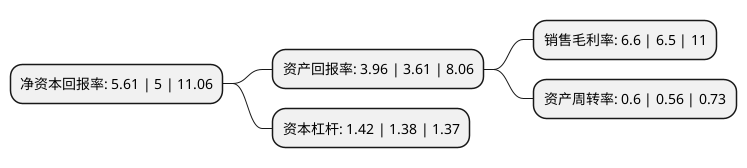

> 本页面由自动化程序生成于 2022年5月20日 01:08
> 内容可能存在错误，如有bug请提交issue至：https://github.com/Eroleice/doc-pi/issues
{.is-warning}

# 上市公司基本情况

## 基本资料

江苏长青农化股份有限公司（以下简称“长青股份”）成立于2001年01月04日，扬州市。于2010年04月16日在深交所中小板上市。

长青股份注册资本65,390.455万元，主要产品:除草剂，杀虫剂，杀菌剂等三大系列共20种原药，61种制剂，是国内主要农药生产商之一。发行人主要产品均为“高效，低毒，低残留”农药产品，包括除草剂，杀虫剂，杀菌剂等三大系列。主营业务:化学农药的生产，销售。以下是详细信息：

- 公司名称: 江苏长青农化股份有限公司
- 股票代码: 002391.SZ
- 所在地: 江苏 - 扬州市
- 成立日期: 2001年01月04日
- 注册资本: 65,390.455万元
- 法定代表人: 于国权
- 主营业务: 主要产品:除草剂，杀虫剂，杀菌剂等三大系列共20种原药，61种制剂，是国内主要农药生产商之一发行人主要产品均为“高效，低毒，低残留”农药产品，包括除草剂，杀虫剂，杀菌剂等三大系列主营业务:化学农药的生产，销售
- 公司官网: www.jscq.com
- 公司介绍: 公司是国内主要农药生产商之一，产品包括除草剂、杀虫剂、杀菌剂等三大系列，均为“高效、低毒、低残留”农药产品。公司主要产品原药合成收率均已达到或接近国际著名农药公司的水平，在国内处于领先地位,新产品“乙羧氟草醚”及“烯酰吗啉”均为国内首家研制成功。吡虫啉原药产品为江苏省质量信得过产品，获中国名牌产品称号。其创新工艺技术达到国际水平，已取得国家发明专利证书。公司是国内最大的二苯醚类除草剂生产商和出口基地，是国际农药生产巨头先正达公司在亚太地区唯一授予HSE进步奖的生产企业，先后与国际农药巨头先正达、拜耳和陶氏益农建立了合作关系，使公司在拓展国内外市场方面具有明显的市场先行优势。

## 股东及高管情况

上市公司第一大股东为于国权，持股165,013,503股，占比25.24%，**疑似为**上市公司实际控制人。

截至2022年03月31日，上市公司的前十大股东中，共有8名自然人股东，1名机构股东，1个产品账户，其中5%以上大股东共有2名。上市公司前十大股东明细如下：

> 未能通过持股比例判定出上市公司实际控制人（持股30%以上）
> 可能存在通过间接持股、联合持股、协议控制等方式拥有实际控制权的主体，具体请参考上市公司定期公告！
{.is-warning}

> 截至2022年03月31日，上市公司前十大股东信息如下：

| 股东名称 | 持股数量（股） | 持股比例 |
| --- | --- | --- |
| 于国权 | 165,013,503 | 25.24% |
| 黄南章 | 37,013,472 | 5.66% |
| 周汝祥 | 24,675,648 | 3.77% |
| 周秀来 | 24,675,648 | 3.77% |
| 于国庆 | 24,675,648 | 3.77% |
| 吉志扬 | 15,047,280 | 2.3% |
| 刘长法 | 10,667,400 | 1.63% |
| 周治金 | 9,836,362 | 1.5% |
| 泰康人寿保险有限责任公司-传统-普通保险产品-019L-CT001深 | 7,842,050 | 1.2% |
| 泰康人寿保险有限责任公司-分红-个人分红-019L-FH002深 | 6,574,700 | 1.01% |

## 利润表分析

上市公司2021年总收入为37.64亿元，净利润为2.48亿元，实现盈利。

## 杜邦分析

> 数据列示周期：2021年 | 2020年 | 2019年
{.is-info}

上市公司的净资产收益率在近一年有所上升，上升幅度为12.2%，其变化情况分解如下：
- 上市公司的销售毛利率在近一年上升了1.54%，可能是生产效率的提升、商品原材料价格下跌或商品价格的上涨所致。
- 上市公司的资产周转率在近一年上升了7.14%，可能是源自于更快的销售回款或库存管理效果提升。
- 上市公司的财务杠杆比率在近一年上升了2.9%，可能是增加负债扩大生产规模。

