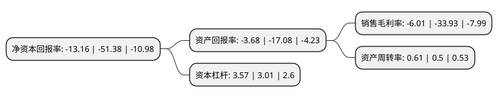

> 本页面由自动化程序生成于 2022年5月20日 01:09
> 内容可能存在错误，如有bug请提交issue至：https://github.com/Eroleice/doc-pi/issues
{.is-warning}

# 上市公司基本情况

## 基本资料

金正大生态工程集团股份有限公司（以下简称“ST金正”）成立于1998年08月26日，临沂市。于2010年09月08日在深交所中小板上市。

ST金正注册资本328,602.774万元，本公司目前的主要业务是复合肥，控释肥的研发，生产和销售。本公司目前主要产品为复合肥，控释肥。以下是详细信息：

- 公司名称: 金正大生态工程集团股份有限公司
- 股票代码: 002470.SZ
- 所在地: 山东 - 临沂市
- 成立日期: 1998年08月26日
- 注册资本: 328,602.774万元
- 法定代表人: 高义武
- 主营业务: 本公司目前的主要业务是复合肥，控释肥的研发，生产和销售本公司目前主要产品为复合肥，控释肥
- 公司官网: www.kingenta.com
- 公司介绍: 公司主营复合肥、缓控释肥、水溶肥、生物肥、土壤调理剂等土壤所需的全系产品及为种植户提供相关的种植业解决方案服务。公司连续多年复合肥行业销量居首位,是国家创新型企业、国家重点高新技术企业、国家技术创新示范企业。公司是国家重点高新技术企业和国家创新型企业、缓控释肥料行业、国家与国际标准起草单位，先后在山东临沭、山东菏泽、安徽长丰、河南郸城、河南驻马店、辽宁铁岭、贵州瓮安、云南晋宁、山东德州、广东英德、新疆阿克苏、湖北潜江、新疆阜康等地建有生产基地，并在美国、澳大利亚、印度、西班牙、挪威、以色列、德国、荷兰、越南、新加坡、中国香港等地设有分支机构。

## 股东及高管情况

上市公司第一大股东为临沂金正大投资控股有限公司，持股1,117,274,529股，占比34%，为上市公司实际控制人。

截至2022年03月31日，上市公司的前十大股东中，共有3名自然人股东，2名机构股东，5个产品账户，其中5%以上大股东共有1名。上市公司前十大股东明细如下：

> 截至2022年03月31日，上市公司前十大股东信息如下：

| 股东名称 | 持股数量（股） | 持股比例 |
| --- | --- | --- |
| 临沂金正大投资控股有限公司 | 1,117,274,529 | 34% |
| 万连步 | 157,300,000 | 4.79% |
| 中国农业产业发展基金有限公司 | 49,794,238 | 1.52% |
| 北京东富汇通投资管理中心(有限合伙)-东富和通(天津)股权投资基金合伙企业(有限合伙) | 47,944,238 | 1.46% |
| 汕头汇晟投资有限公司 | 25,570,000 | 0.78% |
| 鑫牛润瀛(天津)股权投资基金管理有限公司-北京京粮鑫牛润瀛股权投资基金(有限合伙) | 16,598,079 | 0.51% |
| 深圳市云古投资有限公司-云古湛卢1号私募证券投资基金 | 13,549,200 | 0.41% |
| 何意菊 | 11,921,000 | 0.36% |
| 杨锋 | 11,119,600 | 0.34% |
| 现代种业发展基金有限公司 | 9,958,847 | 0.3% |

## 杜邦分析

> 数据列示周期：2021年 | 2020年 | 2019年
{.is-info}

上市公司的净资产收益率在近一年有所下降，下降幅度为-74.39%，其变化情况分解如下：
- 上市公司的销售毛利率在近一年下降了-82.29%，可能是生产效率的下降、商品原材料价格上涨或商品价格的下跌所致。
- 上市公司的资产周转率在近一年上升了22%，可能是源自于更快的销售回款或库存管理效果提升。
- 上市公司的财务杠杆比率在近一年上升了18.6%，可能是增加负债扩大生产规模。

